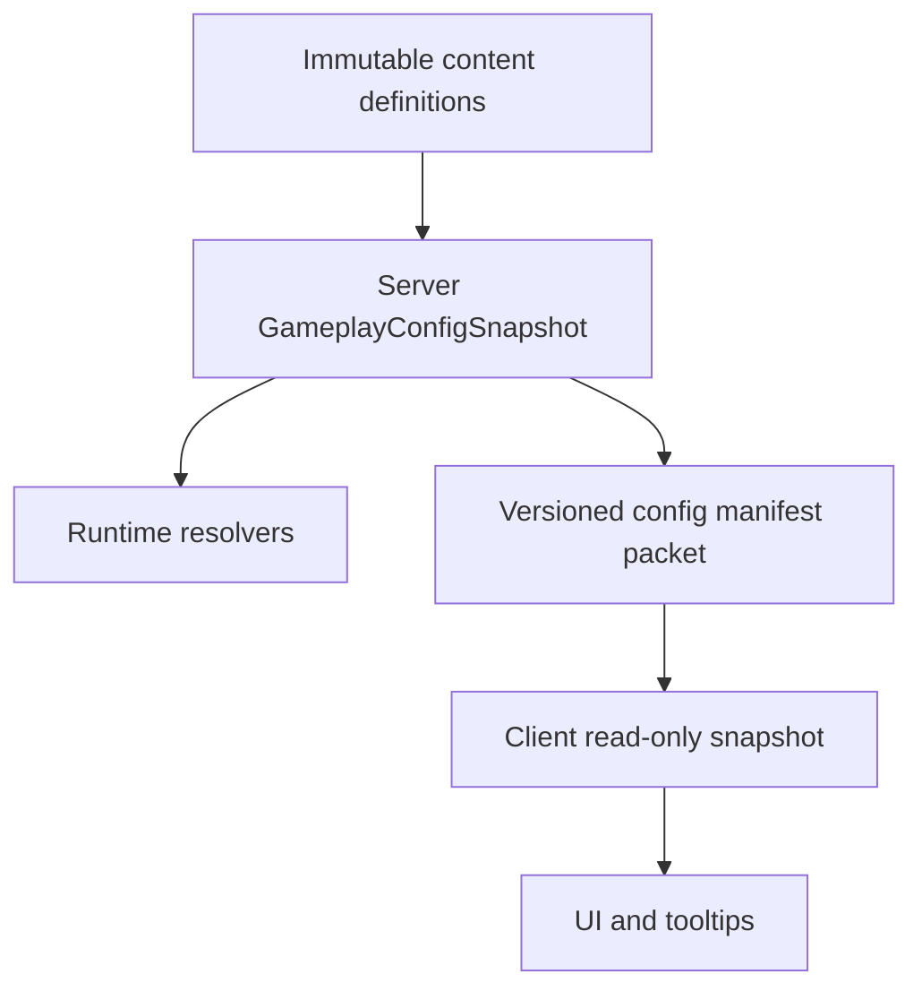
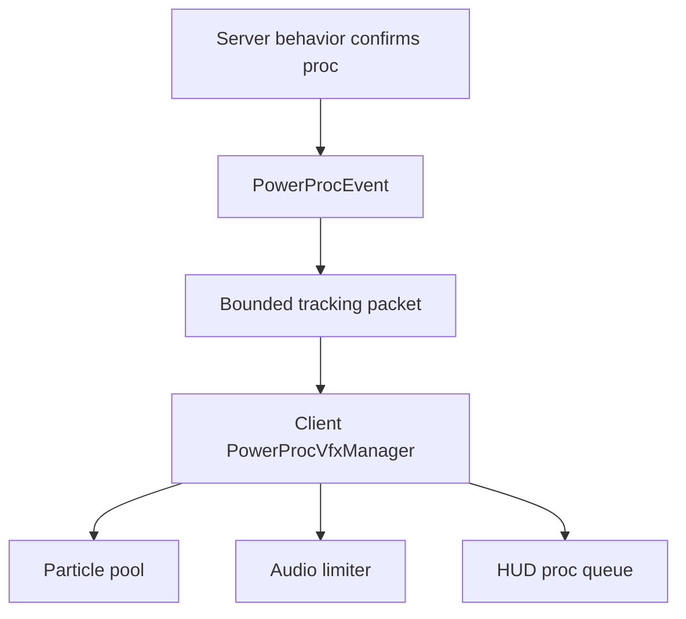

# Runic Skills: stability, optimization, functionality, and VFX audit

> Implementation specification for the next Runic Skills update  
> Audit date: 2026-08-25  
> Repository: <https://github.com/otectus/runic-skills>  
> Audited branch: `master`  
> Audited commit: [`a1d89d942e49f5d399ecac3ccc50905b3084b25b`](https://github.com/otectus/runic-skills/commit/a1d89d942e49f5d399ecac3ccc50905b3084b25b)  
> Source version: `1.9.0`  
> Recommended next version: `1.10.0` with network protocol `10` and capability data version `2`

## Executive verdict

**Do not release the audited `master` snapshot as-is.** It contains a clean-build input gap, player attribute modifiers that can remain serialized after their granting integration is disabled, a server/client configuration model that cannot reliably apply most live reloads, and a large amount of visible content with no runtime effect.

The codebase is substantially safer than its older audit history suggests. It now has atomic config writes, orphan-data retention, packet admission control, capability lookup memoization, bounded Power slots, idempotent core attribute reconciliation, source-side linting, a dedicated-server CI job, and 138 unit/static test methods. Those improvements should be preserved. The remaining problems are concentrated in lifecycle boundaries and in features whose public surface grew faster than their implementation.

The release-blocking work is:

1. Restore a reproducible fresh-clone build and make CI prove it without a warm dependency cache.
2. Convert every player-owned Runic Skills attribute modifier to transient state and migrate all legacy UUIDs.
3. add real GameTests for death/respawn, End return, and dimension clone paths before trusting the `1.9.0` progression-wipe fix.
4. Replace the partially synchronized, constructor-captured configuration model with one server-authoritative runtime snapshot.
5. Hide or disable every inert/partial perk and Power by default until its described behavior is covered by a behavioral test.

## How a coding agent should use this document

- Treat **P0** as release-blocking, **P1** as required for a stable update, **P2** as important hardening/polish, and **P3** as maintainability or housekeeping.
- Each finding contains evidence, a required change, and acceptance criteria. Do not close a finding on code shape alone; satisfy its behavioral acceptance criteria.
- Paths and line numbers refer to the pinned audit commit above. Prefer the linked permalink when `master` has moved.
- Keep fixes in the phased PR order near the end of this document. In particular, land persistence migrations before changing content IDs, and bump the protocol only once after the packet model is final.
- `Confirmed` means direct source/repository evidence. `Runtime-risk` means the code path is clear but must be reproduced in Forge/Minecraft before assigning a user-visible regression label.

## Audit scope and limitations

The audit covered repository history and releases, Gradle and GitHub Actions, all production Java source, tests, capabilities/NBT, network packets, commands, configuration and reload paths, registries, mixins, optional integrations, UI/HUD code, sounds, textures, JSON resources, translations, and the Powers/VFX design document.

Validation performed:

- Inspected all `225` production Java files (`36,426` lines) and `26` test files (`2,179` lines).
- Parsed every tracked JSON resource and checked for duplicate object keys.
- Validated all `552` shipped PNG textures as readable images and checked for fully transparent files.
- Compared all locale keysets to `en_us`.
- Enumerated registered perks, passives, Powers, and source-level behavior references.
- Exercised Gradle 8.10 configuration successfully with `gradle tasks`.
- Attempted `clean build`; this environment could not finish downloading the Forge/Minecraft dependency graph. An offline retry failed during ForgeGradle configuration because the cache was incomplete. Consequently, **compilation, JUnit execution, reobfuscation, a live client, a live dedicated server, and optional-mod combinations were not executed in this audit environment**.
- Independently confirmed a repository-local clean-build defect: the build requests a Legendary Tabs 2.0 flat-directory artifact which is not tracked, while the README still requests the removed 1.x artifact.

Static inspection cannot prove event order, mixin compatibility, rendering appearance, TPS impact, or behavior against every optional-mod version. The test and profiling plan below is part of the required work, not optional follow-up.

## Repository baseline

| Measure | Audited value | Interpretation |
|---|---:|---|
| Tracked files | 1,282 | Large asset- and documentation-heavy repository |
| Production Java | 225 files / 36,426 lines | Significant integration and event surface |
| Test Java | 26 files / 2,179 lines | 138 `@Test` methods, mostly pure math/config/source-scanning |
| Forge GameTests | 0 | No behavioral lifecycle or gameplay coverage |
| Skills | 10 | Static custom Forge registry |
| Passives | 38 | Static custom Forge registry |
| Perks | 462 | 129 explicitly allowlisted as having no effect |
| Powers | 75 | 44 have no source reference outside registration |
| Network protocol | 9 | README separately claims 7 and 5 |
| Common-config public fields | 1,133 | Very broad server-authoritative surface |
| Config names present in common/dynamic sync packets | 128 | Syntactic name comparison; 1,005 are absent |
| Language files | 17 | `en_us` is current; the other 16 share a stale 558-key baseline |
| `en_us` keys | 2,291 | Reference locale |
| Keys missing from each non-English locale | 1,743 | English fallback works, but translation coverage is ~24% |
| Shipped PNG textures | 552 | 541 are 16×16; all decoded successfully |
| Root `icons/` PNGs | 399 / 1.7 MiB | No byte-identical match to a shipped texture; unclear source of truth |
| Registered sounds | 2 | `mortal_strike`, `gain_title`; Powers have no distinct audio |
| Open/closed GitHub issues observed | 0 / 0 | Absence of reports is not runtime evidence |
| Git tags observed | none | `VERSION` is not backed by a source tag |
| GitHub releases observed | only `v1.1.0` | Release channel is far behind source `1.9.0` |

### Good foundations to preserve

- `ConfigHolder` preserves invalid input, retains unknown keys, writes through a sibling temporary file, flushes, and attempts an atomic replace.
- `SkillCapability` retains unknown NBT keys and has a data-version/migration hook.
- Packet rate limiting runs before `enqueueWork`, avoiding main-thread task floods.
- Server-bound state mutations revalidate registry objects, requirements, disabled state, and player capability rather than trusting the UI.
- Core modifiers in `RegistryAttributes.RegisterAttribute` are idempotent and transient.
- Disabled content accepts bare paths and full IDs and is synced for the portions included in `CommonConfigSyncCP`.
- Power slot lists are deduplicated and bounded on load.
- UI list logic has already removed a historical quadratic-copy regression.
- CI includes a dedicated-server boot job and a sided-import lint.
- Static tests explicitly expose the no-effect perk backlog instead of allowing new silent entries.

## Release decision matrix

| ID | Priority | Finding | Confidence | Release gate |
|---|---|---|---|---|
| RS10-001 | P0 | Fresh-clone build lacks Legendary Tabs 2.0 input | Confirmed | `clean build` succeeds in empty cache |
| RS10-002 | P0 | Integration modifiers are still permanent and survive their owners | Confirmed | UUID migration + transient-only tests pass |
| RS10-003 | P0 | Death-clone fix has no runtime behavioral coverage | Confirmed gap | GameTests pass for every clone path |
| RS10-004 | P0 | 129 perks and 44 Powers are unreferenced but exposed by default | Confirmed | Inert content default-hidden/disabled or implemented |
| RS10-005 | P0 | Runtime config, frozen registries, and client sync disagree | Confirmed | One versioned server snapshot drives behavior and UI |
| RS10-006 | P1 | Power prerequisites/budget/ISS separation are incomplete | Confirmed | Design gates and vanilla dispatcher implemented |
| RS10-007 | P1 | Passive bulk click sends packets the limiter drops | Confirmed | One atomic bounded batch packet |
| RS10-008 | P1 | `MixLivingEntity` replaces global effect-add behavior | Confirmed risk | Narrow event/mixin preserves full effect state |
| RS10-009 | P1 | Magic Resist treats indirect damage as magic and can go negative | Confirmed | Damage tag + finite cap + tests |
| RS10-010 | P1 | Title sync ignores custom-name toggle and overwrites other mods | Confirmed | Component-safe prefixing with no owned custom name |
| RS10-011 | P1 | Integration toggles do not actually reload live | Confirmed | Both toggle directions take effect without restart |
| RS10-012 | P1 | Disabled/hidden perks still consume the active-perk budget | Confirmed | Budget counts effective selectable ranks only |
| RS10-013 | P1 | Admin skill mutation bypasses central reconciliation and bounds | Confirmed | One progression mutation service |
| RS10-014 | P1 | Crafting lock clears result after vanilla synchronization | Runtime-risk | Server take/craft enforcement + explicit sync |
| RS10-015 | P1 | Enchant discount repeatedly mutates stored menu costs | Confirmed | Derived cost, no state compounding |
| RS10-016 | P1 | Advertised KubeJS registration does not register content | Confirmed | Real startup registry builders or docs removed |
| RS10-017 | P1 | Capability load accepts corrupt/unbounded progression maps | Confirmed | Data-version 2 sanitizer and bounded maps |
| RS10-018 | P2 | Update checker URL/version comparison are wrong | Confirmed | Forge update JSON or checker removal |
| RS10-019 | P2 | Optional dependency metadata is incomplete | Confirmed | Direct-API integrations get compatible ranges |
| RS10-020 | P2 | Server-bound string fields accept 32,767 characters | Confirmed | Tight decode limits + malformed-packet tests |
| RS10-021 | P2 | UI/HUD performs avoidable per-frame work and double-ticks overlays | Confirmed | Versioned caches + one END-phase clock |
| RS10-022 | P2 | Locale sets are 1,743 keys behind English | Confirmed | Parity CI + explicit fallback policy |
| RS10-023 | P2 | Build/release inputs are not reproducible or fully pinned | Confirmed | checksums, locks, normalized jars, SHA actions |
| RS10-024 | P2 | README, metadata, releases, and implementation contradict | Confirmed | generated version facts + release checklist |
| RS10-025 | P3 | Repository contains stale duplicate audit/icon sources | Confirmed | archive/delete with a declared source-of-truth policy |

---

## Detailed findings and required changes

### RS10-001 — Fresh-clone build is not self-contained

**Priority:** P0  
**Domain:** build, CI, release engineering  
**Effort:** small to medium  
**Status:** confirmed

Evidence:

- [`build.gradle` lines 186–215](https://github.com/otectus/runic-skills/blob/a1d89d942e49f5d399ecac3ccc50905b3084b25b/build.gradle#L186-L215) defines `libs` as a flat directory and compiles against `sfiomn.legendarytabs:legendarytabs:1.20.1-2.0`, explicitly instructing the developer to drop in `libs/legendarytabs-1.20.1-2.0.jar`.
- The only tracked file in `libs/` is `l2tabs-0.3.3.jar`.
- The audited commit deletes `libs/legendarytabs-1.20.1-1.1.3.1.jar` and does not add its 2.0 replacement.
- [`README.md` lines 271–275](https://github.com/otectus/runic-skills/blob/a1d89d942e49f5d399ecac3ccc50905b3084b25b/README.md#L271-L275) still tells builders to install the removed `1.1.3.1` jar, which cannot compile the new 2.0 API.
- The GitHub Actions workflow checks out a clean tree and immediately runs `./gradlew build`; it has no step that supplies the 2.0 jar.

Impact: a contributor or CI runner cannot reproduce the intended build from repository state and documentation. This invalidates all downstream compile/test/reobf confidence.

Required change:

1. Prefer eliminating the hard compile dependency: put the Legendary Tabs adapter behind reflection or a tiny optional bridge whose public boundary uses only Runic Skills/Minecraft types.
2. If a public Maven exists, use the publisher's authoritative coordinate and pin the exact version.
3. If legal redistribution permits vendoring, commit the exact API jar with license/source attribution and a SHA-256 manifest. Do not rely on an undocumented local workstation file.
4. Update the README to one source of truth and delete the stale 1.x instruction.
5. Add a `fresh-clone-build` CI job with an empty Gradle cache. The normal cached job may remain for speed, but only the fresh job is the release gate.

Acceptance criteria:

- On a new checkout containing no `~/.gradle` and no manually supplied files, `./gradlew --no-daemon clean build` succeeds.
- `./gradlew dependencies --configuration compileClasspath` contains exactly the intended Legendary Tabs API or no direct dependency.
- CI proves both “Legendary Tabs absent” and “Legendary Tabs 2.x present” client boot paths.
- README, `mods.toml`, build coordinates, and tested version agree.

### RS10-002 — Optional integrations still serialize permanent player modifiers

**Priority:** P0  
**Domain:** persistence, attributes, integrations  
**Effort:** medium  
**Status:** confirmed

Evidence:

- Core reconciliation correctly uses `addTransientModifier` in [`RegistryAttributes` lines 138–190](https://github.com/otectus/runic-skills/blob/a1d89d942e49f5d399ecac3ccc50905b3084b25b/src/main/java/com/otectus/runicskills/registry/RegistryAttributes.java#L138-L190).
- [`IronsSpellbooksIntegration` lines 389–467](https://github.com/otectus/runic-skills/blob/a1d89d942e49f5d399ecac3ccc50905b3084b25b/src/main/java/com/otectus/runicskills/integration/IronsSpellbooksIntegration.java#L389-L467) still calls `addPermanentModifier` for Wellspring, Quickening, Reservoir, Tempo, Mana Surge, and later school/cross-mod modifiers.
- [`ApothicAttributesPerksIntegration` lines 28–66](https://github.com/otectus/runic-skills/blob/a1d89d942e49f5d399ecac3ccc50905b3084b25b/src/main/java/com/otectus/runicskills/integration/ApothicAttributesPerksIntegration.java#L28-L66) does the same for its attribute perks.
- The one-shot migration in [`RegistryAttributes` lines 101–136](https://github.com/otectus/runic-skills/blob/a1d89d942e49f5d399ecac3ccc50905b3084b25b/src/main/java/com/otectus/runicskills/registry/RegistryAttributes.java#L101-L136) removes only modifiers whose name is exactly `runicskills`. Integration modifiers are named `runicskills:wellspring`, `runicskills:apoth_crit_chance`, and similar, so that sweep misses them.
- Integration handlers are conditionally registered at startup. If an integration is disabled or its mod is removed, no handler remains to remove its serialized modifiers.

Impact: players can permanently retain mana, spell power, cooldown, crit, dodge, lifesteal, armor-pierce, healing, and related bonuses after disabling the perk/integration or removing the dependency. It also creates double-application risk when another migration re-adds the intended transient value.

Required change:

1. Create a central `RunicAttributeModifiers` owner registry containing every player modifier UUID, expected attribute, operation, and owner feature.
2. Make every derived player modifier transient. The permanent max-health modifier on an owned summon may remain only if its entity lifecycle requires it; document that exception and never pass a player to that path.
3. In capability data migration `1 -> 2`, remove every legacy player modifier by UUID, not by display name. Do this before writing the migration marker.
4. Replace the existing boolean marker or version it (`rs_attr_migration_version = 2`) so players for whom the incomplete migration already ran are repaired.
5. Reconcile current transient modifiers after migration and on login, perk/rank change, config reload, and integration-state change.

Acceptance criteria:

- Serialize and deserialize a player with every owned modifier, disable every granting feature, and verify no owned UUID remains.
- Re-enable features and verify exactly one transient modifier per UUID with the expected amount/operation.
- Remove Iron's Spells or AttributesLib between saves and verify the player loads without the old bonus.
- A migration test covers a save whose old `rs_attr_transient_migrated` flag is already true.
- No player-targeting source call to `addPermanentModifier` remains.

### RS10-003 — The progression-wipe fix needs behavioral lifecycle tests

**Priority:** P0  
**Domain:** capability lifecycle, data safety  
**Effort:** medium  
**Status:** confirmed coverage gap; the `1.9.0` fix is source-plausible

Evidence:

- The audited commit explains that the old `LazyOptional` was irreversibly invalidated before `PlayerEvent.Clone`, causing `copyFrom` not to execute and blank progression to overwrite real data.
- [`PlayerLifecycleHandler` lines 109–155](https://github.com/otectus/runic-skills/blob/a1d89d942e49f5d399ecac3ccc50905b3084b25b/src/main/java/com/otectus/runicskills/registry/events/PlayerLifecycleHandler.java#L109-L155) attaches an invalidation listener, calls `reviveCaps`, copies, and invalidates again.
- `LazySkillCapabilityInvariantTest` is explicitly a source-scanning test; its own comment states that a `PlayerCloneGameTest` is still needed.
- The release commit states “Not verified in a running game.”

Required change:

Add Forge GameTests or an equivalent headless integration harness that creates real player entities and drives the actual lifecycle. Use a capability fixture containing non-default values for all structures: ten skills, all passive/rank forms, title unlock/selection, perk cooldowns, Power slots, Power cooldowns/windows, and orphan tags.

Required scenarios:

| Scenario | Required assertion |
|---|---|
| Death with `keepInventory=false` | All Runic progression survives exactly; vanilla inventory behavior remains vanilla |
| Death with `keepInventory=true` | Same Runic state and no duplicate modifier |
| Overworld → Nether → Overworld | Capability remains stable; no stale `LazyOptional` resolves |
| Enter End → return through exit portal | Same state after clone/respawn path |
| Logout → login | NBT round-trip is exact after sanitation |
| Old entity reference after clone | Its previously issued optional is invalid |
| New entity reference | Capability is present and independently mutable |
| FakePlayer | No player capability is attached |

Acceptance criteria:

- Tests fail when the `1.9.0` `LazySkillCapability` renewal is reverted.
- Tests assert deep equality, not just one skill integer.
- Server boot CI executes these GameTests on every PR.
- A manual smoke test performs at least one real client death and End exit before release.

### RS10-004 — Visible content materially overstates implemented functionality

**Priority:** P0  
**Domain:** functionality, game design, player trust  
**Effort:** small for honest gating; very large for full implementation  
**Status:** confirmed

Evidence:

- `462` perk constants are registered.
- `src/test/resources/perk_no_effect_allowlist.txt` explicitly records `129` registered perks with no runtime effect reference (`27.9%`). The test calls this a “transparent backlog,” but `disabledPerks` is empty and `hideDisabledPerks` is false by default.
- `75` Powers are registered. A source-reference comparison finds `31` referenced outside `RegistryPowers` and `44` with no reference at all. A reference is only an upper bound: it does not prove the implementation matches the description.
- `disabledPowers` is also empty and `hideDisabledPowers` is false by default.
- Several referenced Power paths contain comments that behavior is deferred or only partially approximated.

Representative description-to-runtime mismatches found in `PerkEffectsHandler` and `PowerEventDispatcher`:

| Feature | Described intent | Audited runtime approximation |
|---|---|---|
| Fire Proof | reduce fire duration | reduces fire damage |
| Mystic Shield | reduce magical projectile damage | reduces the vanilla `magic` damage type |
| Poison Resistance | resist poison | reduces the vanilla `magic` damage type |
| Mana Shield | spend/require mana for mitigation | flat reduction with no mana interaction |
| Wind Runner | movement bonus on paths | unconditional movement speed |
| War Tactician | benefit allies | self attack speed |
| Lucky Explorer / Adventurer's Luck | structure/dungeon loot | unconditional vanilla Luck |
| Brewing Apparatus | brew speed | beneficial-effect duration attribute |
| Potion Splash | splash area | beneficial-effect duration attribute |
| Unbreakable / Unbreaking Mastery | reduce durability loss | periodically repairs an equipped item |
| Enlightenment / Quick Learner | skill XP | vanilla mob XP |
| Sharpshooter | headshots | all ranged damage |
| Step Between Power | post-teleport cast-time reward | next-spell damage bonus because the API lacks the requested mutator |
| Glacial Sovereign Power | doubled Chilled accumulation plus Ice Tomb death denial | periodic Chilled duration extension; the other portions are deferred |

These substitutions may be acceptable design choices, but only after the text and balance are deliberately updated. Keeping an aspirational tooltip on a materially different generic bonus is functionally indistinguishable from a bug to a player.

Impact: a player can spend scarce ranks/slots on a feature whose tooltip promises behavior but whose implementation does nothing. This is a release-quality functionality defect, not merely backlog.

Required change for `1.10.0`:

1. Add an explicit status to every perk and Power definition: `FULL`, `PARTIAL`, `APPROXIMATE`, `INERT`, or `UNAVAILABLE_DEPENDENCY`.
2. Only `FULL` content may be enabled and selectable by default in production builds.
3. `PARTIAL`/`APPROXIMATE` content must have accurate text that describes what the code actually does, not the aspirational design.
4. `INERT` content should be retained by ID for save compatibility but hidden and non-selectable unless a developer config explicitly exposes experimental content.
5. Replace the loose “constant appears somewhere” check with behavior bindings: every enabled definition must declare one or more handler IDs, and tests must ensure those handlers exist.
6. Add focused behavioral tests for each promoted feature. Do not remove an allowlist line because a constant appears in a tooltip, test, or unrelated branch.

Acceptance criteria:

- A default client cannot spend a perk rank or Power slot on any inert definition.
- Existing saved inert selections are retained as inactive data and do not consume budgets/slots.
- The UI labels experimental/approximate content when explicitly enabled.
- CI fails if a default-enabled content definition lacks a bound behavior and behavior test.
- The complete inert lists in Appendix A and Appendix B are either implemented or gated.

### RS10-005 — Configuration reload and custom-registry state are not authoritative or coherent

**Priority:** P0  
**Domain:** config, networking, registries, multiplayer  
**Effort:** large  
**Status:** confirmed

Evidence:

- `HandlerCommonConfig` exposes `1,133` public fields. Only `128` distinct field names appear in `CommonConfigSyncCP` plus `DynamicConfigSyncCP`; `1,005` do not.
- [`DynamicConfigSyncCP` lines 20–63](https://github.com/otectus/runic-skills/blob/a1d89d942e49f5d399ecac3ccc50905b3084b25b/src/main/java/com/otectus/runicskills/network/packet/client/DynamicConfigSyncCP#L20-L63) includes 16 passive requirement arrays and only 24 early perk-level fields.
- [`RegistryPerks`](https://github.com/otectus/runic-skills/blob/a1d89d942e49f5d399ecac3ccc50905b3084b25b/src/main/java/com/otectus/runicskills/registry/RegistryPerks.java), `RegistryPassives`, `RegistrySkills`, `RegistryTitles`, and `RegistryPowers` disable Forge registry synchronization and construct entries from local config.
- `Perk` captures final requirement arrays and `Value` objects and may cache primitive values; `Passive` captures final `attributeValue` and `levelsRequired`. `Configuration.reloadAll()` replaces config POJOs but does not rebuild the frozen registry objects.
- A server can therefore reload values that event code reads live while the registered metadata, client UI, eligibility checks, and tooltip values still reflect constructor-time or client-local values.
- Disabling content through negative registration requirements can produce different catalog membership on server and client before the custom packets arrive.

Impact: `/skillsreload` has undefined scope. Operators cannot know which values are live, clients can render incorrect requirements, and server/client catalogs can disagree even while the network protocol matches.

Required architecture:



1. Registry objects should contain immutable identity and presentation defaults only: ID, owning skill, texture, tier/school, and behavior binding.
2. Put every tunable requirement/value/enable state in an immutable `GameplayConfigSnapshot`, keyed by full `ResourceLocation` and published through an `AtomicReference`.
3. Runtime code must resolve values from that snapshot at the moment of use. Do not capture mutable config wrappers in registry objects.
4. Generate a versioned config manifest from schema metadata rather than hand-writing 1,133 fields into packets. Include a schema version and content/config hash.
5. Clients must use only the received server snapshot while connected. Local values are allowed for singleplayer setup screens before a world opens, not for connected gameplay.
6. Explicitly classify fields as `LIVE_SERVER`, `LIVE_CLIENT`, or `RESTART_REQUIRED`. `/skillsreload` must report counts and list restart-required changes it could not apply.
7. Keep IDs registered across disable operations. “Disabled” should be runtime state, not conditional registry membership.

Acceptance criteria:

- For every `LIVE_SERVER` field, change it on a running dedicated server, execute `/skillsreload`, and observe matching enforcement and UI without reconnecting.
- A generated parity test proves every gameplay field is either synced or explicitly server-only/client-only/restart-required.
- Joining with intentionally different client config produces the server's values and content visibility.
- Snapshot replacement is atomic; no event can observe a half-updated set.
- Packet schema mismatch disconnects with a clear protocol error.

### RS10-006 — Powers are a partial subsystem with missing design gates

**Priority:** P1  
**Domain:** Powers, gameplay, architecture  
**Effort:** large  
**Status:** confirmed

Evidence:

- [`RegistryPowers` lines 35–38](https://github.com/otectus/runic-skills/blob/a1d89d942e49f5d399ecac3ccc50905b3084b25b/src/main/java/com/otectus/runicskills/registry/RegistryPowers.java#L35-L38) acknowledges the design says 90 while the registry contains 75.
- [`PowerTier` lines 3–24](https://github.com/otectus/runic-skills/blob/a1d89d942e49f5d399ecac3ccc50905b3084b25b/src/main/java/com/otectus/runicskills/registry/powers/PowerTier.java#L3-L24) says Seal/Crown prerequisites and a Power Point budget are checked server-side. [`PowerEquipSP` lines 69–102](https://github.com/otectus/runic-skills/blob/a1d89d942e49f5d399ecac3ccc50905b3084b25b/src/main/java/com/otectus/runicskills/network/packet/common/PowerEquipSP.java#L69-L102) only checks disabled state, required mod, governing skill level, duplicate, and slot capacity.
- The design also requires Seal secondary skill ≥40, Crown total skill ≥500, same-school Mark/Seal prerequisites, and a 14-point budget. None is enforced.
- `PowerEventDispatcher.isEquipped` checks registry presence, disabled state, and stored slot only. If an operator lowers a skill or raises a requirement, the effect continues firing.
- ISS-school Powers are omitted when Iron's Spells is absent, but all 30 cross-cutting Powers always register. The entire dispatcher is registered only when Iron's Spells is loaded, so cross-cutting Powers are necessarily inert without it.
- Unknown saved Power IDs are deliberately retained in live slot lists. They consume a slot, but `PowerEquipSP` cannot resolve them and therefore cannot unequip them; only a full respec clears them.

Required change:

1. Split `VanillaPowerEventDispatcher` from `IronsSpellbooksPowerEventDispatcher`; load the vanilla half unconditionally.
2. Centralize `PowerEligibility.evaluate(player, power, snapshot)` and call it on equip **and every proc**. It must return structured reasons for UI/tooltips.
3. Implement or deliberately revise the design rules. If the fixed 5/3/1 slots intentionally make the 14-point budget redundant, remove PP claims everywhere; otherwise implement an explicit budget.
4. On snapshot/skill changes, reconcile stored selections into active and retained-inactive sets. Do not delete unknown IDs, but do not let them consume active slots.
5. Add `/powers unequip <raw-id>` and a UI “clear unavailable slot” action.
6. Resolve the 75-versus-90 design decision. Never advertise 90 while registering 75.

Acceptance criteria:

- A Seal cannot equip without its skill/secondary gate and a same-school Mark; a Crown cannot equip without its total-skill gate and same-school/category Seal, if those remain the approved rules.
- Lowering eligibility immediately stops effects and shows the reason without deleting selection data.
- Cross-cutting implemented Powers work in a vanilla-only instance with no Iron's Spells classes loaded.
- Unknown IDs survive an addon reinstall but are freely clearable and consume no active slot.
- Every default-selectable Power has at least one behavioral GameTest or integration test.

### RS10-007 — Passive bulk leveling conflicts with packet admission control

**Priority:** P1  
**Domain:** networking, UI, functionality  
**Effort:** small  
**Status:** confirmed

Evidence:

- [`RunicSkillsScreen` lines 183–194 and 986–1010](https://github.com/otectus/runic-skills/blob/a1d89d942e49f5d399ecac3ccc50905b3084b25b/src/main/java/com/otectus/runicskills/client/screen/RunicSkillsScreen.java#L183-L194) computes Shift=5, Ctrl=10, Alt=remaining and loops, sending one packet per level.
- `PassiveLevelUpSP` and `PassiveLevelDownSP` admit only one packet of their type every two server ticks. All remaining packets generated in the same click are silently discarded.

Impact: the advertised bulk action usually changes only one level and gives no rejection feedback.

Required change:

- Replace both packets with `AdjustPassiveSP { passiveId, signedAmount }`.
- Decode `passiveId` with a tight length cap and bound `abs(amount)` to the maximum legal passive levels.
- On the server, calculate the maximum legal final level against the current snapshot and player skill, fire a cancellable batch event (or well-defined per-level events), apply once, reconcile attributes/titles/quests once, and send one capability sync.
- Return an explicit result/reason if nothing changed.
- Bump protocol 9 → 10 once with the other packet work.

Acceptance criteria:

- Plain, Shift, Ctrl, and Alt clicks produce 1/5/10/max legal changes on a dedicated server.
- A malicious amount of `Integer.MAX_VALUE` performs bounded work and cannot overflow.
- A canceled batch is atomic; no partial levels remain unless the public event contract explicitly defines per-level commits.
- Exactly one capability sync and one attribute reconciliation occur per accepted click.

### RS10-008 — `MixLivingEntity` globally replaces effect-add semantics

**Priority:** P1  
**Domain:** mixins, mod compatibility, status effects  
**Effort:** medium  
**Status:** confirmed compatibility risk

Evidence:

- [`MixLivingEntity` lines 69–183](https://github.com/otectus/runic-skills/blob/a1d89d942e49f5d399ecac3ccc50905b3084b25b/src/main/java/com/otectus/runicskills/mixin/MixLivingEntity.java#L69-L183) cancels both public `addEffect` paths for every player and reimplements vanilla's effect map/event/callback logic.
- It rebuilds the incoming instance with a three-argument constructor. Ambient state, particle visibility, icon visibility, hidden-effect chains, and any custom curative metadata are not preserved.
- It passes the affected player as the effect source rather than retaining the original source entity.
- Full cancellation prevents future Forge/vanilla changes and other mixins later in the method from participating normally.

Required change:

1. Prefer Forge effect events for Lion Heart and potion-specific adjustments.
2. If a mixin is unavoidable, use a narrow argument modification/wrap operation at the merge point and clone the full `MobEffectInstance` state. Do not cancel and reproduce the method.
3. Preserve original source, ambient flag, visibility, icon flag, hidden effect, and extension data.
4. Constrain potion amplification to the actual consumed item/effect context rather than `player.isUsingItem()` during any effect addition.

Acceptance criteria:

- Tests cover beacon ambient effects, hidden effect promotion, splash/lingering potions from another entity, milk/curatives, icon-hidden effects, and another mod's `MobEffectEvent.Added` subscriber.
- The original source entity reaches Forge events.
- With both perks off, byte-for-byte observable behavior matches vanilla/Forge.

### RS10-009 — Magic Resist is neither a magic classifier nor safely bounded

**Priority:** P1  
**Domain:** combat math, config safety  
**Effort:** small to medium  
**Status:** confirmed

Evidence:

- [`MixLivingEntity` lines 51–67](https://github.com/otectus/runic-skills/blob/a1d89d942e49f5d399ecac3ccc50905b3084b25b/src/main/java/com/otectus/runicskills/mixin/MixLivingEntity.java#L51-L67) applies resistance when `DamageSource.isIndirect()` is true. That includes mundane arrows/tridents and is not equivalent to magic damage; direct magic sources can be missed.
- The Forge config permits `magicResistValue` up to `10000.0`. The runtime formula is `damage - damage * resist`, so any value above 1 makes damage negative.

Required change:

- Define a Runic damage-type tag such as `runicskills:affected_by_magic_resistance` and populate it with approved vanilla/Forge sources. Let integrations extend the tag or adapt their spell damage source.
- Clamp the **effective** resistance at the point of use to a design maximum, recommended `0.80` for normal configuration and never greater than `0.95`.
- Reject or normalize NaN/infinite values and change the schema bound to a percentage-appropriate range.
- Apply the modifier at a damage event/stage where it cannot turn damage negative or create healing.

Acceptance criteria:

- Unit/GameTests cover arrow, trident, potion, evoker fangs, dragon breath, direct spell, indirect spell projectile, bypass-resistance source, negative, >100%, NaN, and infinity cases.
- Final damage is finite and non-negative.
- Tooltip wording exactly matches the damage tag.

### RS10-010 — Title synchronization overwrites names even when disabled

**Priority:** P1  
**Domain:** multiplayer compatibility, UI  
**Effort:** medium  
**Status:** confirmed

Evidence:

- `SetPlayerTitleSP` checks `titlesUseCustomName` before calling `setCustomName`.
- [`RegistryTitles.syncTitles` lines 176–183](https://github.com/otectus/runic-skills/blob/a1d89d942e49f5d399ecac3ccc50905b3084b25b/src/main/java/com/otectus/runicskills/registry/RegistryTitles.java#L176-L183) unconditionally calls `setCustomName` and is invoked on join, clone, passive changes, and every 200 ticks.
- [`PlayerLifecycleHandler` lines 35–53](https://github.com/otectus/runic-skills/blob/a1d89d942e49f5d399ecac3ccc50905b3084b25b/src/main/java/com/otectus/runicskills/registry/events/PlayerLifecycleHandler.java#L35-L53) flattens the existing styled/translated component with `getString()` and rebuilds it with `String.format`.

Impact: `titlesUseCustomName=false` does not work; nickname, chat, team, and tab-list mods can be overwritten every ten seconds. Component style, hover, click, and translation structure are lost.

Required change:

- Do not store a title in vanilla `customName`. Compose a prefix in `PlayerEvent.NameFormat` and, if needed, the appropriate tab-list event, using `Component` concatenation.
- Track only the selected title ID in the capability.
- Respect `displayTitlesAsPrefix` and `titlesUseCustomName` consistently, or deprecate the latter once custom-name ownership is removed.
- Never clear a name not demonstrably owned by Runic Skills. Add compatibility ordering guidance for nickname/team mods.

Acceptance criteria:

- Turning title display off removes only the Runic prefix immediately.
- Styled nickname components retain style, hover, click, and translatable children.
- No periodic call to `Player#setCustomName` remains for title display.
- Chat, overhead name, scoreboard/team, and tab list are manually tested with one common nickname mod.

### RS10-011 — Integration toggles are startup-only despite live reload claims

**Priority:** P1  
**Domain:** integrations, configuration lifecycle  
**Effort:** medium  
**Status:** confirmed

Evidence:

- [`RunicSkills` lines 75–128](https://github.com/otectus/runic-skills/blob/a1d89d942e49f5d399ecac3ccc50905b3084b25b/src/main/java/com/otectus/runicskills/RunicSkills.java#L75-L128) conditionally registers most integration subscribers once during construction.
- Reloading `true → false` leaves the subscriber registered; most handlers do not recheck their master toggle. Reloading `false → true` cannot register a subscriber that was skipped.
- The lock-provider registry *does* re-evaluate toggles, so locks and perk effects can disagree after a reload.
- `enableFTBQuestsIntegration`, `enableCulinaryIntegration`, `enableStarcatcherIntegration`, and `enableOvergearedIntegration` are absent from both config sync payloads. Culinary is the only audited event integration that performs an explicit runtime master check.

Required change:

- Register an adapter once whenever its upstream mod is present, then gate each entry point with a cheap boolean from `GameplayConfigSnapshot`.
- For expensive handlers, cache the adapter's active state and return before capability/inventory/world scans.
- If an upstream API requires one-time registration (for example task types), classify the toggle as restart-required and say so in UI and `/skillsreload` output.
- On disable, reconcile/removal paths must run immediately, especially attributes and retained runtime maps.

Acceptance criteria:

- Automated dedicated-server tests exercise `false → true → false` for every live toggle.
- Lock enforcement, perk effects, attributes, UI visibility, and config tooltips agree after each transition.
- Restart-required toggles are not advertised as live and cannot enter a half-applied state.

### RS10-012 — Disabled or unavailable perks still consume the active budget

**Priority:** P1  
**Domain:** progression, configuration  
**Effort:** small  
**Status:** confirmed

Evidence:

- [`RegistryPerks.countEnabledPerks` lines 4276–4281](https://github.com/otectus/runic-skills/blob/a1d89d942e49f5d399ecac3ccc50905b3084b25b/src/main/java/com/otectus/runicskills/registry/RegistryPerks.java#L4276-L4281) counts every capability rank ≥1 without resolving the perk, disabled state, required skill, dependency availability, or implementation status.
- A pack can disable and hide a selected perk, yet it still consumes the cap. Lowering the cap freezes new activation, and the available escape is a full `/respec`, which resets all skills to 1.

Required change:

- Separate `selectedRank` (retained player intent/data) from `effectiveRank` (currently eligible and active).
- Budget calculations should count effective, selectable definitions only. Preserve unavailable selections as inactive and display them in a recovery panel.
- Provide a non-destructive “clear inactive selections” command/UI action.

Acceptance criteria:

- Disabling/hiding or losing a dependency never strands a player over budget.
- Re-enabling restores a retained selection only if doing so fits the budget; otherwise it remains inactive with a reason.
- No full skill reset is required to recover perk slots.

### RS10-013 — Admin progression commands bypass invariants

**Priority:** P1  
**Domain:** commands, progression, overflow safety  
**Effort:** medium  
**Status:** confirmed

Evidence:

- [`UpdateSkillLevelCommand` lines 16–40](https://github.com/otectus/runic-skills/blob/a1d89d942e49f5d399ecac3ccc50905b3084b25b/src/main/java/com/otectus/runicskills/common/command/UpdateSkillLevelCommand.java#L16-L40) accepts any integer ≥1 and writes it directly, bypassing the config annotation's `[2,1000]` clamp.
- Brigadier maximums in `SkillLevelCommand.register` capture the current config only at command registration and do not change after reload.
- `set/add/subtract` mutates the capability and sends one packet, but does not reconcile attributes, titles, quests, perk eligibility, or Power eligibility and does not emit the normal progression event.
- `getGlobalLevel()` sums arbitrary saved `int` values and can overflow.

Required change:

- Introduce `ProgressionService.setSkillLevel(player, skill, requested, Cause)` as the only mutation path for packets, commands, migrations, and tests.
- Validate against the current snapshot inside execution, not in a captured Brigadier range.
- Use checked/saturating arithmetic for XP curves and global totals.
- Emit a documented pre/post event and reconcile attributes, titles, quests, perk budgets, and Powers once.
- When lowering a maximum, choose and document one policy: clamp stored values in a migration/reload reconciliation, or retain earned values but use a capped effective level. Do not silently mix policies.

Acceptance criteria:

- Packet level-up and all command forms share one tested mutation path.
- Boundary tests cover 1, current maximum, maximum+1, `Integer.MAX_VALUE`, cap lowering, and canceled events.
- A skill rollback immediately deactivates now-ineligible perks/Powers without deleting retained selections.

### RS10-014 — Crafting locks clear the result after vanilla's normal update path

**Priority:** P1  
**Domain:** item locks, containers, networking  
**Effort:** small to medium  
**Status:** runtime-risk

Evidence:

- [`MixCraftingMenu` lines 17–32](https://github.com/otectus/runic-skills/blob/a1d89d942e49f5d399ecac3ccc50905b3084b25b/src/main/java/com/otectus/runicskills/mixin/MixCraftingMenu.java#L17-L32) injects at `TAIL` of `slotChangedCraftingGrid` and empties result slot 0.
- Vanilla may already have sent/broadcast the computed result before the tail injection; the mixin neither calls `broadcastChanges` nor enforces the restriction at result take/craft completion.

Required change:

- Gate the computed result before it is published where a stable hook exists, and add an authoritative take/craft event backstop.
- When changing a server container slot outside vanilla's expected point, explicitly synchronize the menu.
- Avoid showing the lock overlay from continuously recomputed grids; coalesce it to an attempted take/craft.

Acceptance criteria:

- Dedicated-client tests cover normal crafting table, player 2×2 grid, shift-click, recipe book fill, automation where applicable, unlock mid-screen, and relock mid-screen.
- A client can never take a locked output, and no ghost output remains.

### RS10-015 — Enchant discount compounds by mutating menu state

**Priority:** P1  
**Domain:** enchanting, mixins  
**Effort:** small  
**Status:** confirmed

Evidence: [`MixEnchantmentMenu` lines 13–26](https://github.com/otectus/runic-skills/blob/a1d89d942e49f5d399ecac3ccc50905b3084b25b/src/main/java/com/otectus/runicskills/mixin/MixEnchantmentMenu.java#L13-L26) injects at the start of `clickMenuButton` and replaces `costs[id]` with a discounted value. Repeated invalid/malicious button clicks can re-discount the already discounted value until it reaches 1, before vanilla validates the action.

Required change:

- Never mutate the stored offer as an input to validation. Derive an adjusted local comparison/payment at the precise cost read, or generate and display the adjusted offer once from an immutable base cost.
- Keep displayed requirement, XP-level validation, lapis use, and final XP removal based on the same value.

Acceptance criteria:

- Repeating a rejected button packet 100 times does not change any offer.
- Closing/reopening, changing bookshelves, and rerolling preserve correct base/discounted values.
- Client display and server charge match exactly.

### RS10-016 — KubeJS custom-content registration is advertised but nonfunctional

**Priority:** P1  
**Domain:** public API, scripting, registries  
**Effort:** medium to large  
**Status:** confirmed

Evidence:

- README claims scripts can register custom skills, perks, passives, titles, and conditions and shows `Perk.add(...)`.
- [`kubejs/Plugin.java` lines 9–21](https://github.com/otectus/runic-skills/blob/a1d89d942e49f5d399ecac3ccc50905b3084b25b/src/main/java/com/otectus/runicskills/kubejs/Plugin.java#L9-L21) binds only `ValueType` and `Skill`; `Perk`, `Passive`, and `Value` are not bound.
- `Perk.add` and `Passive.add` merely construct and return Java objects. They do not insert them into the deferred registry, cached catalogs, config manifest, save initialization, or client sync.
- `Skill` has no corresponding registration helper.

Required decision:

- Either implement a real KubeJS **startup** registry event/builder that feeds one canonical data-driven catalog before Forge registries freeze, with server-to-client manifest sync and texture/translation rules; or remove all custom-registration claims and keep only the event bridge.
- Do not attempt live registry mutation from `server_scripts` after startup.

Acceptance criteria if retained:

- A documented example adds one namespaced skill, passive, ranked perk, title, and condition on a dedicated server.
- The client renders them, saves round-trip, reconnects, and rejects a mismatched script/catalog hash cleanly.
- Removing the script retains old values as inactive orphan data.
- Invalid duplicate IDs and missing textures produce actionable startup errors.

### RS10-017 — Capability deserialization does not sanitize progression or map size

**Priority:** P1  
**Domain:** save data, security, migration  
**Effort:** medium  
**Status:** confirmed

Evidence:

- [`SkillCapability.deserializeNBT` lines 615–709](https://github.com/otectus/runic-skills/blob/a1d89d942e49f5d399ecac3ccc50905b3084b25b/src/main/java/com/otectus/runicskills/common/capability/SkillCapability.java#L615-L709) accepts saved skill levels, passive levels, perk ranks, generic perk cooldowns, Power cooldowns, and Power windows without range or entry-count validation.
- Power slot lists are bounded, and orphan keys are bounded, but the three cooldown/window compounds are not.
- Negative/huge skill values can break eligibility and overflow global-level/XP math; huge ranks can bypass intended rank limits; hostile/corrupt compounds can cause persistent per-tick map work.

Required change:

- Implement `CapabilitySanitizer` as migration `1 -> 2` and also run defensive sanitation after every load:
  - skill stored/effective level according to the approved cap policy;
  - passive `[0, maxLevel]`;
  - perk rank `[0, maxRank]`;
  - finite non-negative remaining cooldowns/windows with a design maximum;
  - bounded number of map entries and bounded key length;
  - unknown IDs moved to a retained inactive/orphan structure rather than hot runtime maps.
- Log one summarized warning per player, not one line per bad key.

Acceptance criteria:

- Property/fuzz tests load negative, maximum-int/long, wrong-tag-type, oversized-compound, duplicate, blank, and unknown IDs without crash or unbounded work.
- Save after load contains normalized canonical values while permitted unknown data remains recoverable.

### RS10-018 — The update checker cannot identify a newer release correctly

**Priority:** P2  
**Domain:** update delivery  
**Effort:** small  
**Status:** confirmed

Evidence:

- [`RunicSkills` lines 132–176](https://github.com/otectus/runic-skills/blob/a1d89d942e49f5d399ecac3ccc50905b3084b25b/src/main/java/com/otectus/runicskills/RunicSkills.java#L132-L176) requests `https://raw.githubusercontent.com/otectus/runicskills/master/VERSION`; the repository is `otectus/runic-skills`.
- It treats any non-equal version as an available update, including an older version or a development suffix.
- An async thread writes a mutable pair read by login handling without a clear publication boundary.

Required change: publish a Forge-compatible update JSON and set `updateJSONURL` in `mods.toml`, then remove the home-grown checker. If retained, use a semantic version library and one immutable `volatile`/atomic result object.

Acceptance criteria: tests cover equal, newer, older, prerelease, malformed, timeout, and offline results; no user-facing warning appears for older/equal versions.

### RS10-019 — Optional dependency declarations do not match direct API use

**Priority:** P2  
**Domain:** mod loading, compatibility  
**Effort:** small  
**Status:** confirmed

Evidence:

- `mods.toml` declares YACL, KubeJS/Rhino, Ars Nouveau, AttributesLib, Apotheosis, FTB Quests, and Legendary Tabs.
- It omits direct or meaningful integrations including Iron's Spells, Curios, L2Tabs, Better Combat, and gun APIs.
- Iron's Spells is compiled against a specific 3.15-era file for concrete event/API classes, but any installed version satisfies `ModList.isLoaded`. `PowerEventDispatcher` is directly instantiated when the mod ID is present, outside the reflection error boundary used by `tryLoadIntegration`.

Required change:

- Declare every direct-API optional dependency with a tested compatible range and correct side/order, especially Iron's Spells.
- Keep name/registry-only integrations out of strict ranges when they genuinely avoid API linkage.
- Generate an integration compatibility table from build metadata and test it in a matrix.

Acceptance criteria: unsupported upstream versions fail during mod resolution with a clear message, not `NoClassDefFoundError`, `NoSuchMethodError`, or `AbstractMethodError` mid-load.

### RS10-020 — Server-bound IDs are decoded with unnecessarily large limits

**Priority:** P2  
**Domain:** network hardening  
**Effort:** small  
**Status:** confirmed

Evidence: all six server-bound action packets that carry an ID use `FriendlyByteBuf.readUtf()` with its 32,767-character default before the rate limiter runs: skill, passive up/down, perk, title, and Power.

Required change:

- Use a shared constant such as `MAX_CONTENT_ID_CHARS = 128`, preferably transmit a validated `ResourceLocation`, and reject malformed input during decode/handle.
- Bound every list/count/string on both directions according to actual schema, not `Short.MAX_VALUE`.
- Add decode tests using embedded buffers, including truncated UTF, oversized values, invalid namespace/path characters, and negative/oversized collection counts.

Acceptance criteria: malformed packets disconnect or reject cleanly without main-thread work, large allocation, log spam, or server crash.

### RS10-021 — UI and HUD clocks/collections still waste client work

**Priority:** P2  
**Domain:** client performance, rendering  
**Effort:** medium  
**Status:** confirmed

Evidence:

- `RunicSkillsScreen` invalidates and rebuilds detail layout every rendered frame. `Skill.getPerks` walks all 462 cached perks and allocates a list; screen code then copies, filters, sorts, combines, chunks, and creates comparators/rows.
- Overview skill sorting also allocates/sorts each frame.
- The title page allocates registry, unlocked, locked, combined, and sometimes filtered lists; sorts/localizes them every frame. Mouse handlers repeat this work.
- [`OverlayNoticeGui` lines 73–81](https://github.com/otectus/runic-skills/blob/a1d89d942e49f5d399ecac3ccc50905b3084b25b/src/main/java/com/otectus/runicskills/client/gui/OverlayNoticeGui.java#L73-L81) and [`OverlaySkillGui` lines 103–118](https://github.com/otectus/runic-skills/blob/a1d89d942e49f5d399ecac3ccc50905b3084b25b/src/main/java/com/otectus/runicskills/client/gui/OverlaySkillGui.java#L103-L118) decrement on both client tick phases. Their nominal duration runs at roughly half the intended time. `OverlayTitleGui` correctly guards `END`.
- Notice messages overwrite each other rather than queue/coalesce; overlay code enables blend but does not explicitly restore it, and long text lacks robust wrapping/safe-area layout.

Required change:

- Build immutable per-skill indexes at catalog load and cache sorted/filterable view models by `(catalogVersion, configVersion, capabilityVersion, locale, sort, search, page)`.
- Invalidate on actual state changes, not every frame.
- Use one client `END`-phase overlay clock and partial-tick interpolation for visual easing.
- Add a bounded priority queue (recommended max 3) with duplicate coalescing and safe-area/GUI-scale aware wrapping.
- Restore render state in a `try/finally`-style boundary.

Acceptance criteria:

- Steady-state rendering allocates no catalog-sized collections per frame.
- Overlay duration at 20 TPS matches its configured ticks.
- GUI scales 1–4, ultrawide, open-container rendering, language expansion, hidden HUD, and resource reload are visually tested.

### RS10-022 — Non-English locales are a stale snapshot

**Priority:** P2  
**Domain:** localization  
**Effort:** medium content work; small tooling work  
**Status:** confirmed

Every one of the 16 non-English locale files has exactly 558 keys, is missing 1,743 keys present in `en_us`, and contains 10 obsolete extras. The missing keys break down as:

| Prefix/category | Missing per locale |
|---|---:|
| `perk.*` | 834 |
| `yacl3.*` | 665 |
| `power.*` | 150 |
| `title.*` | 58 |
| `school.*` | 7 |
| `tier.*` | 3 |
| Other | 26 |

Minecraft's English fallback prevents raw keys in most installations, but the repository's translation breadth is misleading and config accessibility is especially poor.

Required change:

- Add locale parity CI with an explicit `intentional_fallbacks.json` rather than silently allowing drift.
- Generate translator templates from `en_us` and separate machine-generated YACL keys from hand-authored gameplay prose.
- Remove obsolete keys and prioritize UI/actions/denials, then perks/Powers, then configuration descriptions.
- Validate format placeholders and component argument counts across locales.

Acceptance criteria: JSON parses, no duplicates/obsolete keys, placeholder parity passes, and every missing key is either translated or explicitly recorded as fallback.

### RS10-023 — Builds and workflows are not reproducible enough for releases

**Priority:** P2  
**Domain:** supply chain, release engineering  
**Effort:** medium  
**Status:** confirmed

Evidence:

- The Gradle wrapper has no `distributionSha256Sum`.
- Dependency locking/verification metadata is absent, while the build consumes many Maven/Curse Maven endpoints.
- `Implementation-Timestamp = new Date()` guarantees different jar bytes for the same source.
- GitHub Actions use mutable major tags such as `actions/checkout@v4` rather than commit SHAs.
- Gradle 8.10 reports deprecated features that will be incompatible with Gradle 9.
- `gradle.properties` defines official mapping properties, but `build.gradle` hardcodes Parchment `2023.09.03-1.20.1`; the settings are dead/misleading.

Required change:

- Add wrapper checksum, Gradle dependency verification, and locking where ForgeGradle permits it.
- Normalize jar timestamps/file order and use `SOURCE_DATE_EPOCH` or omit build time from the manifest.
- Pin workflow actions to full SHAs with Renovate/Dependabot updates.
- Run `--warning-mode all`, record owned deprecations, and eliminate them before a Gradle major bump.
- Make mapping settings one declared source of truth.
- Produce and compare two clean build hashes in release CI.

Acceptance criteria: two clean builds of the same commit in equivalent JDK/OS containers yield identical distributable hashes, excluding any explicitly documented ForgeGradle limitation.

### RS10-024 — Documentation, metadata, and release state contradict the code

**Priority:** P2  
**Domain:** documentation, support, release  
**Effort:** small  
**Status:** confirmed

Examples:

- README says normal actions automatically contribute to skills, while current leveling spends vanilla XP through the UI.
- Install instructions still name `runicskills-1.5.4.jar`.
- README claims protocol `7` in one place and `5` in another; code uses `9`.
- README says `/respec` preserves skill levels; implementation resets all ten to 1.
- README advertises KubeJS registration that is not wired.
- README requests Legendary Tabs 1.1.3.1; code targets 2.0.
- README says all integrations are reflectively loaded; several are directly instantiated.
- Version matrix ends at 1.5.x.
- `mods.toml` retains Forge MDK boilerplate and lacks active issue tracker, homepage, logo, and update JSON metadata.
- Repository `VERSION` is 1.9.0, with no Git tag; the GitHub Releases listing observed during the audit exposes only v1.1.0.

Required change:

- Generate version/protocol/Minecraft/Forge facts into docs from Gradle inputs and validate with CI.
- Rewrite behavior claims from executable behavior tests or a checked feature manifest.
- Complete `mods.toml` metadata and publish signed/checksummed releases for source tags.
- Add a release checklist that blocks on docs, changelog, tag, GitHub Release, artifacts, hashes, smoke results, and compatibility matrix.

Acceptance criteria: a clean-room user can install, build, configure, level, respec, and understand integrations using README instructions without discovering a contradictory code path.

### RS10-025 — Repository housekeeping obscures the active source of truth

**Priority:** P3  
**Domain:** maintainability  
**Effort:** small  
**Status:** confirmed

- `icons/` contains 399 PNGs (1.7 MiB) and shares no byte-identical content hash with the 552 shipped textures. It may be a source-art tree, an obsolete export, or both; the repository does not say.
- `docs/RUNIC_SKILLS_AUDIT.md` is over 500 KiB and describes an older version; several other audit/remediation documents overlap.
- Two old update Markdown files are byte-identical, and an audit prompt is committed as project documentation.

Required change: declare source/generated/archived asset paths, add an asset generation or comparison task, keep one current audit/backlog, and move historical audit snapshots to release attachments or an archive directory with an obvious date/version banner. Do not delete potentially original art until its provenance is verified.

---

## Optimization plan

### OPT-001 — Move from polling to transitions

Current core tick code is much improved because unchanged attribute writes early-return, but it still creates `RegisterAttribute` and `AddEffect` wrapper objects every player tick and reevaluates mostly static conditions. Iron's Spells, Apotheosis, and AttributesLib handlers scan/reconcile every 10 ticks.

Implement:

- A per-player `DerivedStateFingerprint` covering selected ranks, relevant equipment slots, crouch/hand state, integration flags, and config version.
- Event-driven reconciliation on join/clone, capability mutation, equipment change, config publish, and dependency adapter state change.
- Cheap state transitions for truly dynamic conditions (health thresholds, crouching, empty offhand).
- A low-frequency safety reconciliation every 100 ticks, not the primary mechanism.
- Primitive/fastutil maps or packed state where profiling shows map churn; do not optimize blindly.

### OPT-002 — Pre-index content and cache view models

Build once per catalog version:

- `Map<SkillId, List<PerkDefinition>>`
- `Map<SkillId, List<PassiveDefinition>>`
- `Map<PowerTier, Map<SchoolId, List<PowerDefinition>>>`
- normalized immutable disabled-ID sets
- locale-specific lowercase search strings and sorted title order

Expose monotonic `catalogVersion`, `configVersion`, and `capabilityVersion` counters. UI caches should key off those counters. Do not compare or copy the entire capability each render.

### OPT-003 — Bound all recurring state

- Cooldown/window maps: entry count, key length, and expiration horizon.
- Overlay/proc queues: maximum items and coalescing policy.
- VFX: global/per-source particle and sound concurrency caps.
- Combat ledgers: explicit TTL and prune cadence.
- Config collections: maximum lengths enforced during parse and packet decode.

### OPT-004 — Establish performance budgets before micro-optimization

Profile with Spark and/or JFR in reproducible scenarios:

| Scenario | Players | Activity | Required capture |
|---|---:|---|---|
| Baseline | 1 / 10 / 50 | Idle, no optional mods | Runic handlers CPU/allocation |
| Equipment | 10 / 50 | Swap locked/perk gear | reconciliation spikes |
| Combat | 10 / 50 | melee/projectile/status effects | event fan-out and capability lookups |
| Magic | 10 / 30 | ISS/Ars casts and Power procs | integration scans, packets, VFX |
| UI | 1 | skills/title/Power screens | render CPU and allocations |
| Proc storm | 1 / 10 | max legal proc rate | particles, audio, packet bandwidth |

Suggested release budgets on a representative server/client, to be adjusted once a baseline is recorded:

- Runic Skills server work: <0.5 ms mean tick at 20 active players; <2 ms p99 attributable spike.
- No steady-state per-tick attribute packets for unchanged state.
- No catalog-sized allocation in steady UI frames.
- One Power proc should add <0.5 ms client frame time at `FULL`; `REDUCED` should be <0.2 ms.
- VFX managers must perform zero unbounded allocations after pools are warm.

---

## VFX and visual-refinement program

### Current-state audit

The present Power feedback is a placeholder, not a readable VFX system:

- [`PowerProcCP` lines 24–69](https://github.com/otectus/runic-skills/blob/a1d89d942e49f5d399ecac3ccc50905b3084b25b/src/main/java/com/otectus/runicskills/network/packet/client/PowerProcCP#L24-L69) sends `powerName` and `gameTime` only to the affected player.
- The client ignores `gameTime` and does not use `powerName` to resolve a Power, school, tier, icon, sound, or effect variant. It always spawns eight randomly positioned vanilla `ENCHANT` particles around the local player.
- Other tracking players see nothing, and a proc caused at a target/location still appears around the local caster.
- The string allows 32,767 characters even though it is a registry path.
- Both `RegistryPowers` helper methods assign `HandlerResources.NULL_PERK`, so all 75 Powers have the placeholder texture. `PowersScreen` does not render a Power icon at all.
- The screen calls itself “minimum viable,” uses plain three-column rows, includes hard-coded English strings (`Marks`, `Seals`, `Crown`, footer help, and requirement text), and is not linked from the Skills screen. Its key mapping is unbound by default, making the panel difficult to discover.
- The design document promises unique rune borders, tier/school color, a half-second hotbar rune, and distinct audio. None is present.
- Only two Runic Skills sounds are registered, neither Power-specific.

The right goal is **combat readability**, not maximal particle density. A player should answer these questions in under half a second:

1. Did a Power trigger?
2. Was it my Power, an ally's, or an opponent's?
3. Which school/category and tier was it?
4. Where did it happen and what target/area did it affect?
5. Is the effect continuing, consumed, or on cooldown?

### Target client architecture



Recommended components:

- `PowerProcEvent`: immutable server event containing Power ID, source entity, optional target, origin, variant, and intensity. Fire it only after gameplay behavior actually commits.
- `PowerProcDescriptor`: data-driven client metadata for icon, palette, rune shape, emission pattern, sound layers, HUD behavior, and accessibility fallback.
- `PowerProcVfxManager`: owns fixed-size active-effect storage, deterministic sampling, distance/frustum culling, coalescing, and quality settings.
- `RunicGlyphParticle`: sprite-set particle that takes color, rotation, scale, lifetime, and motion; no per-Power particle class.
- `PowerProcHud`: bounded/coalescing cards near the hotbar and optional cooldown ring.
- `RunicSoundLimiter`: caps simultaneous school/tier layers and prevents proc storms from clipping.

### Protocol 10 proc payload

Do not send a display name or duplicate the whole definition. With a synchronized catalog/hash, the client can resolve school, tier, icon, palette, and sound from the ID.

| Field | Encoding | Bound/purpose |
|---|---|---|
| `powerId` | `ResourceLocation`/UTF | ≤128 characters; canonical full ID |
| `sourceEntityId` | VarInt | `-1` only for world-origin procs |
| `targetEntityId` | VarInt | optional flag + ID; `-1` when area/self only |
| `origin` | three doubles or fixed-point offsets | only when entity position is insufficient |
| `variant` | unsigned byte | small descriptor-defined behavior variant |
| `intensity` | unsigned byte | normalized 0–255; never raw damage |
| `seed` | 32-bit int | deterministic particle/audio variation |
| `flags` | byte bitset | critical, private-HUD, sustained-start/stop, reduced-safe |

Remove `gameTime` unless it is used to align a sustained effect. Send through `TRACKING_ENTITY_AND_SELF`, normally within the entity tracking range or a capped 48-block radius. A private status proc may suppress world VFX for other players but can still show its owner HUD card.

Network/VFX abuse controls:

- Server: no more than one identical proc packet per `(source, power, target)` in a configurable 2–5 tick window unless it is an explicit stack counter.
- Client: maximum 64 active proc instances, 128 Runic particles, 8 simultaneous Runic one-shot sounds, and 3 HUD cards. Coalesce rather than allocate past the cap.
- Discard unknown Power IDs, invalid entities, non-finite coordinates, and origins outside a reasonable distance from the source.
- Never let a client packet trigger gameplay; this channel is presentation-only.

### Tier visual grammar

Tier must remain distinguishable in grayscale and for common color-vision deficiencies. Use shape, motion, count, duration, and audio—not hue alone.

| Tier | Silhouette | Motion | Full particle budget | Duration | Audio/HUD treatment |
|---|---|---|---:|---:|---|
| Mark | one open glyph or short arc | quick draw-in, single pulse | 6–8 | 0.25–0.35 s | light tick/chime; 250 ms compact card |
| Seal | closed ring, hex, or paired brackets | lock around source/target then dissolve | 10–14 | 0.4–0.55 s | body layer + school accent; 400 ms card |
| Crown | triple ring, vertical flare, or large crest | staged anticipation → impact → afterglow | 16–24 | 0.6–0.9 s | low impact + tonal accent; 600 ms card and optional cooldown ring |

`REDUCED` quality should keep the same silhouette with roughly 40% of particles, no distortion, and shortened afterglow. `OFF` should retain the HUD icon and accessible audio unless separately disabled.

### School and category language

Use a restrained two-color palette plus a unique geometric/motion motif. Values below are art direction, not a mandate to render raw RGB without resource-pack overrides.

| School/category | Primary / accent | Shape and motion motif | Audio character |
|---|---|---|---|
| Fire | ember orange / crimson | rising broken circle, outward sparks | dry ignition + low crackle |
| Ice | cyan / white | six-point crystal, inward snap, shard release | glassy ping + brittle crack |
| Lightning | violet / white | angular forks and a one-frame afterimage | tight electric snap |
| Holy | gold / ivory | clean halo with upward motes | bell partial + soft breath |
| Ender | magenta / indigo | broken ring folding through itself | reversed pluck + spatial pop |
| Evocation | emerald / pale green | fang chevrons rising from the ground | stone tooth/clack |
| Nature | leaf green / amber | vine spiral and spores, asymmetric growth | leaf flick + wooden tone |
| Blood | crimson / near-black | droplets pull inward into a heartbeat ring | muted pulse, no wet gore layer by default |
| Eldritch | teal / void purple | offset eye/spiral with controlled jitter | filtered whisper-tone, no speech sample |
| Projectile | steel blue / white | forward chevron and impact reticle | short air cut |
| Channel | aqua / lavender | parallel rails/waveform held over time | quiet sustained harmonic |
| Summon | moss / bone | linked nodes orbit source and summon | low call + link chime |
| Mobility | blue-violet / white | departure/arrival brackets and stretched trail | two-part whoosh/pop |
| Weapon-caster | copper / arcane blue | crossing blade and rune stroke | metal tick + arcane accent |
| Utility | warm white / mint | shield brackets or expanding soft ring | restrained confirmation chime |

Resource packs should be able to override palette/texture/sound descriptors without code. Add a neutral high-contrast mode that uses white/black outlines and the tier silhouettes.

### High-value effect recipes

Avoid making all Powers a ring around the caster. Bind VFX to gameplay semantics:

| Proc family | Visual recipe | Important constraint |
|---|---|---|
| Damage amplifier/consume | brand appears on target, collapses at hit point | never obscure target hurt flash |
| Retaliation | bracket flashes behind attacker, wave travels from defender | source/attacker direction must be legible |
| Area detonation | ground rune previews exact radius, then dissolves outward | ring matches authoritative radius |
| Teleport/rewind | departure fragments persist briefly; arrival glyph resolves | reduced mode removes screen distortion |
| Summon bond | two or three short link segments, not a continuous beam | avoid line-of-sight clutter through walls |
| Sustained/channel | low-opacity rails with start/stop events | no packet every tick; client maintains instance |
| Cooldown save/Crown | full crest + HUD cooldown arc | strong feedback, strict sound/flash cap |
| Stack/mark | small target-side pips with count | coalesce packets and update existing instance |

Specific flagship treatments for the first polished set:

- `kindle`: a small open fire sigil marks the target; the consuming hit closes and bursts it.
- `brittle`/`shatter`: cyan fracture lines accumulate; Shatter releases 6–10 directional shards and an ice crack, with no full-screen white flash.
- `skybreaker`: a narrow overhead lightning rune points at the impact; fork count scales only by tier/intensity, not damage.
- `sanctified_strike`: one gold vertical stroke and ground halo; keep bloom simulated with layered alpha, not a mandatory shader.
- `step_between`/`folded_space`: matching broken brackets at origin and destination make displacement readable.
- `pyroclasm`: corpses show a 2–3 tick warning ember ring before detonation; chain depth slightly shifts pitch, while the global cap prevents escalating noise.
- `the_grove_remembers`: three leaf-shaped debuff pips converge into a persistent target crest; the crest is subtle and only visible within combat range.
- `unraveled`: 3-second position ghosts rapidly collapse toward the destination. `REDUCED` uses only departure/arrival crests; screen shake defaults off.
- `the_heart's_toll`: a heartbeat ring contracts toward the caster on spell use; low-health penalty uses a broken version rather than stronger red flash.
- `the_apocrypha_awakens`: an offset eye glyph opens below 20% mana and closes above the threshold; avoid rapid threshold flicker with hysteresis.

### Power screen redesign

The screen should become the authoritative explanation of eligibility and implementation status:

- Add a visible button from `RunicSkillsScreen`; keep the configurable key as a shortcut and assign a non-conflicting default only after testing the pack's controls.
- Render a 16×16 unique icon for every default-enabled Power. Start with a consistent monochrome rune atlas, then tint by school; unique silhouettes matter more than detailed pixel art.
- Replace three unfiltered text columns with tier tabs or a two-pane browser: school/category filters on the left, selectable cards in the center, loadout and requirements on the right.
- Show exact active counts, prerequisite chain, governing/secondary/total skill gates, point cost if retained, dependency, status (`Implemented`, `Experimental`, `Unavailable`), and denial reason.
- Animate the equipped card border when its Power procs; use the same deterministic descriptor and keep it under 0.6 seconds.
- Localize every literal. Preserve `Component` styling instead of concatenating `getString()` values.
- Add controller/keyboard focus order, narration, and a reduced-motion preview toggle.

### HUD, overlay, and audio refinement

Power HUD card:

- Place just above the hotbar by default, respecting Forge overlay safe areas.
- Show icon, localized short name, tier silhouette, and school accent for 250–600 ms.
- Queue at most three; identical procs within the coalescing window increment a small counter instead of adding a card.
- Do not show passive every-hit amplifiers on every hit unless the proc is meaningful; allow descriptor policy `NEVER`, `FIRST_IN_WINDOW`, `ALWAYS`, `OWNER_ONLY`.
- Optional cooldown arc is appropriate for Crown/long-ICD effects only.

Audio:

- Build reusable layers (`mark`, `seal`, `crown`, plus school accents) rather than 75 bespoke OGG files.
- Randomize pitch deterministically in a narrow range from the packet seed.
- Apply positional attenuation for world-visible procs and non-positional/UI volume for owner HUD confirmation.
- Cap concurrency by school and source. A proc storm should raise a counter/aggregate accent, not play dozens of clips.
- Add subtitles for every audible layer and keep essential feedback available without audio through shape/HUD.

Existing overlays:

- Use a shared queue/clock/easing library for title, notice, skill-lock, and Power cards.
- Wrap text to a configured fraction of screen width; clamp to safe areas and GUI scale.
- Use ARGB alpha in draw colors consistently and restore shader color/blend state.
- Offer independent toggles for particles, HUD cards, flashes, shake, distortion, and proc sound volume.

### VFX accessibility and QA matrix

Required settings:

- `powerVfxQuality = OFF | REDUCED | FULL`
- `powerHudFeedback = true/false`
- `powerProcSounds = true/false`
- `powerScreenShake = false` by default
- `powerFlashes = false` or low-intensity by default
- `highContrastRunes = true/false`
- particle multiplier capped to a safe range

Visual QA:

| Dimension | Cases |
|---|---|
| Resolution | 1280×720, 1920×1080, 2560×1440, ultrawide |
| GUI scale | 1, 2, 3, 4, auto |
| Scene | bright snow, Nether lava, dark cave, water, foliage, busy modded combat |
| View | first person, third person, spectator, another player's proc |
| Accessibility | deuteranopia/protanopia/tritanopia simulation, grayscale, reduced motion, no audio |
| Load | single proc, 10 simultaneous sources, capped chain reaction, sustained effect start/stop |
| State | HUD hidden, screen open, paused integrated server, resource reload, disconnect/reconnect |

VFX acceptance criteria:

- A blinded evaluator can distinguish Mark/Seal/Crown from silhouette/motion in grayscale.
- School/category is correctly identified in at least 90% of a small internal recognition test after a short legend review.
- World effect origin matches authoritative source/target/radius.
- Unknown/disabled Power IDs produce no effect and no crash.
- `OFF` spawns zero Runic particles; `REDUCED` stays within its documented count; `FULL` never exceeds caps.
- Sustained effects terminate on stop, death, dimension change, disconnect, and timeout.
- Resource reload replaces descriptors/sprites without retaining old instances or crashing.

---

## Implementation sequence for `1.10.0`

Keep each phase releasable internally. Do not combine all changes into one unreviewable commit.

### PR 0 — Restore build truth and CI

Scope:

- Resolve RS10-001 Legendary Tabs dependency.
- Update README build instructions.
- Add wrapper checksum, action SHA pins, and a cache-empty build job.
- Make existing static checks runnable without unnecessarily resolving the full Minecraft client graph if practical.
- Capture current Gradle warnings.

Gate:

- `clean build`, JUnit, reobf, artifact inspection, and dedicated server boot are green from a clean checkout.
- Archive logs and test reports.

### PR 1 — Player-data and lifecycle safety

Scope:

- Data version `2` and `CapabilitySanitizer`.
- Complete legacy modifier UUID inventory/migration.
- Convert integration player modifiers to transient.
- Add clone/death/dimension/logout GameTests.
- Add raw unavailable selection retention structures.

Gate:

- Old fixture saves migrate deterministically.
- Death/End/dimension tests prove exact state preservation.
- No permanent Runic player modifier remains.

### PR 2 — One authoritative catalog/config model and protocol 10

Scope:

- Immutable definitions plus atomic `GameplayConfigSnapshot`.
- Generated, hashed config/content manifest.
- Full client snapshot replacement and catalog-version checks.
- `AdjustPassiveSP` batch packet.
- Tight packet bounds and structured rejection reasons.
- Explicit live/restart-required config classification.

Gate:

- Different client/server local configs converge to server behavior/UI.
- Live reload test suite covers values, requirements, disabled state, and integration toggles.
- Protocol mismatch rejects clearly.

### PR 3 — Honest perk and Power functionality

Scope:

- Add content implementation status and handler binding.
- Default-gate Appendix A/B inert entries.
- Split vanilla and ISS Power dispatchers.
- Implement approved Power eligibility/prerequisite rules.
- Fix effective perk budget and unavailable slot recovery.
- Correct all partial/approximate tooltips.

Gate:

- No default-selectable content lacks a behavior binding/test.
- Vanilla-only Power screen contains only working vanilla content.
- Existing inert selections retain data but consume no budget.

### PR 4 — Mixins, commands, integrations, and public API

Scope:

- Narrow/replace `MixLivingEntity`, fix magic damage classification, crafting sync, and enchant-cost mutation.
- Central `ProgressionService` for commands/packets.
- Runtime integration gate adapters and optional dependency ranges.
- Decide and implement/remove KubeJS content registration.
- Replace title custom-name ownership.
- Replace home-grown updater.

Gate:

- Optional-mod matrix boots and performs targeted interactions.
- Mixin behavior tests pass with perks disabled and enabled.
- Public docs/examples are executable.

### PR 5 — VFX, screen, and client optimization

Scope:

- `PowerProcEvent`, protocol payload handler, descriptor reload listener, pooled VFX manager.
- Rune sprite atlas, unique Power icons, layered sounds/subtitles.
- Power screen navigation/eligibility/status redesign and Skills-screen link.
- Shared overlay queue/clock and END-phase fix.
- Catalog/view-model caches and accessibility settings.

Gate:

- Visual/accessibility matrix passes.
- Proc-storm budgets pass with no cap violations.
- No hard-coded English remains in the screen/HUD path.

### PR 6 — Release truth and housekeeping

Scope:

- Locale parity/tooling and first translation update.
- README/metadata/version matrix/changelog rewrite from tested feature manifest.
- Asset source-of-truth decision and archive cleanup.
- Tag, GitHub Release, checksums, compatibility/smoke results.

Gate:

- Definition of Done below is fully checked and linked from the release.

---

## Required test plan

### Unit and property tests

| Area | Required tests |
|---|---|
| Snapshot schema | every field classified; manifest encode/decode round-trip; stable hash; unknown version rejection |
| Progression math | saturating totals/XP, cap policy, rank/passive bounds, eligibility reasons |
| Capability migration | v0/v1 fixtures → v2, corrupt types/values, oversized maps, unknown IDs, idempotent second load |
| Attribute ownership | every UUID unique, mapped to one attribute/operation, transient player policy |
| Power eligibility | skill, secondary, total, prerequisite, budget/slots, disabled, missing mod, implementation status |
| Packet decode | max/min IDs/counts/amounts, malformed/truncated buffers, NaN/infinite coordinates |
| Locale/assets | JSON duplicate keys, placeholder parity, key parity/fallbacks, texture/sound existence |
| Feature manifest | every default-enabled perk/Power has behavior binding and test ID |

### Forge GameTests/headless integration tests

- Full player lifecycle matrix from RS10-003.
- Passive batch mutation and one-time reconciliation.
- Perk toggle/effective budget after config/skill/dependency changes.
- Every implemented vanilla perk and Power trigger with positive and negative controls.
- Crafting/enchants/item locks through actual menus.
- Title display events without `customName` ownership.
- Config reload while players are online.
- Attribute persistence across save/relog/toggle/dependency removal.
- Power runtime cleanup on death, dimension change, logout, and server stop.

### Dedicated-server and optional-mod matrix

Run each boot with a fresh world and at least one join/action/logout cycle:

| Profile | Required purpose |
|---|---|
| Runic Skills only | No client class or optional API linkage; vanilla feature baseline |
| YACL absent on server | Server remains bootable |
| Iron's Spells supported minimum | Power/events/attributes |
| Iron's Spells supported maximum | API range upper-edge confidence |
| Ars Nouveau | spell scaling/gates |
| Apotheosis + AttributesLib | affix/gem plus transient perk attributes |
| FTB Quests | task registration, sticky/live refresh |
| Culinary representative set | runtime toggle and namespace rules |
| Legendary Tabs 2.x | client tab integration |
| L2Tabs | client tab integration/fallback |
| All supported direct-API integrations | classloading and event interaction |

For unsupported versions, test that Forge emits a clear dependency-range failure.

### Manual client smoke matrix

- Create player; level one skill normally; buy/remove passives; toggle ranked/single perks.
- Use every modifier click for passives.
- Exercise active-perk cap and recovery after a live config reduction.
- Equip/unequip each Power tier, then lose its prerequisite.
- Die with both keep-inventory modes; travel dimensions and return from the End.
- Save/restart, remove/re-add an optional mod, and inspect attributes with `/attribute` or a test command.
- Attempt locked use, attack, equip, break, craft, shift-craft, enchant, projectile, gun, spell, and Curios paths.
- Open Skills/Powers/title/config screens at all GUI scales and non-English language.
- Trigger all VFX archetypes from owner and observer clients.
- Profile 20–30 minutes of combat for memory growth, recurring packet rate, and tick time.

### CI job layout

1. `static-fast`: format/schema/source scans, JSON/assets/locales, pure JUnit.
2. `clean-build`: empty cache, compile/test/reobf/jar, dependency verification.
3. `gametest-server`: actual Forge GameTestServer.
4. `dedicated-smoke`: boot to `Done`, join test client/bot if feasible, graceful stop.
5. `integration-matrix`: scheduled/nightly and release-required.
6. `reproducible-build`: two clean containers, compare SHA-256.
7. `artifact-audit`: inspect jar contents, mixin refmap, access transformers, metadata expansion, licenses, no local-only dependencies.

---

## Migration and compatibility contract

### Capability data version 2

Migration order:

1. Read raw v0/v1 NBT into bounded temporary structures.
2. Preserve unknown namespaced keys in capped orphan storage.
3. Normalize known skills/passives/ranks/cooldowns/windows.
4. Move unavailable perk/Power selections into retained inactive state.
5. Remove every legacy player attribute UUID, including those missed by the first migration marker.
6. Reconcile current derived transient state.
7. Write data version 2 and attribute migration version 2.

Migration must be idempotent and must not destroy unknown addon data merely because the addon is temporarily absent.

### Network protocol 10

Bundle these breaking changes into one bump:

- generated config/content manifest;
- passive batch adjustment;
- bounded/canonical IDs;
- structured action results if added;
- new Power proc payload;
- inactive selection state needed by UI.

Do not accept protocol 9 peers conditionally; the payload/catalog semantics are materially different. The disconnect text should report both versions and a concrete “install matching Runic Skills versions” action.

### Configuration compatibility

- Continue retaining unknown JSON5 fields.
- Generate a migration report for renamed/removed fields.
- Never convert an integration toggle from live to restart-required silently; display it in YACL and `/skillsreload` output.
- Preserve disabled lists by full ID and normalize once during snapshot construction.

### Content-ID compatibility

- Do not reuse removed IDs for different behavior.
- Keep removed/inert IDs resolvable in a tombstone catalog where needed for migration/UI cleanup.
- If 75 Powers become 90, add IDs; do not renumber or infer save position from registry order.
- Resource locations—not path-only strings—should become the canonical saved/network form. Provide a one-time path-to-full-ID migration for Runic-owned legacy values.

---

## Definition of Done for the next release

### Build and release

- [ ] Fresh checkout builds with no manually supplied files and an empty cache.
- [ ] Fast tests, GameTests, dedicated smoke, integration matrix, and reproducibility jobs are green.
- [ ] Wrapper, dependencies, and workflow actions are verified/pinned.
- [ ] A source tag, GitHub Release, artifacts, SHA-256 files, changelog, and smoke logs agree on version.

### Data and stability

- [ ] Capability data version 2 migration is idempotent and fixture-tested.
- [ ] Death, End return, dimension change, and relog preserve full progression.
- [ ] All Runic player modifiers are transient and legacy UUIDs are removed.
- [ ] All maps, strings, collections, coordinates, and arithmetic are bounded/finite.
- [ ] Unknown content is retained inactive and recoverable without consuming slots.

### Functionality

- [x] No default-enabled perk or Power is inert. *(PR 3: perk backlog closed — 65 implemented, 10 removed; 19 inert Powers declared INERT and made non-selectable. `docs/PERK_AUDIT.md`, `docs/CONTENT_STATUS.md`.)*
- [x] Partial/approximate behavior is accurately labeled or disabled. *(PR 3: `ContentStatus` + a UI badge; 9 approximate Power tooltips and 49 perk tooltips rewritten to describe what ships.)*
- [ ] Power prerequisites and eligibility rules match the approved design and tooltips.
- [ ] Bulk passive leveling works atomically.
- [ ] Config reload behavior is explicit and server/client consistent.
- [x] Commands and normal UI mutations use the same progression service. *(PR 4: `ProgressionService`; `/skills set|add|subtract` and `SkillLevelUpSP` share one clamped, event-firing, reconciling path.)*
- [x] KubeJS registration claims are either genuinely supported or removed. *(PR 4: removed from README and the store page; the event bridge is documented as the whole of it.)*

### Compatibility

- [ ] With optional mods absent, no optional class is resolved.
- [x] Supported version ranges are declared. *(PR 4: nine optional dependencies with direct API linkage now declared in `mods.toml` with ranges taken from the jars this build compiles against. The matrix that would **test** them is still outstanding.)*
- [x] Title display does not own/overwrite vanilla custom names. *(PR 4: no `setCustomName` anywhere; the prefix is composed with `Component` concatenation in `NameFormat`, and a name written by an earlier version is cleared once on login.)*
- [x] Effect, crafting, and enchanting mixins preserve vanilla/Forge behavior when disabled. *(PR 4: `MixLivingEntity` narrowed to one argument modification that returns the original instance when no perk applies; the crafting ghost result is synchronized and backed by an authoritative `mayPickup` refusal. Enchanting was fixed earlier under RS10-015.)*

### Client/VFX

- [ ] Power panel is discoverable, localized, navigable, and exposes denial/status reasons.
- [ ] Every enabled Power has a unique icon or approved family icon plus unique glyph.
- [ ] Mark/Seal/Crown and school/category are legible without color alone.
- [ ] VFX/HUD/audio caps and accessibility settings are enforced.
- [ ] UI steady state does not rebuild catalog-sized collections per frame.

### Documentation/localization

- [ ] README matches executable behavior, actual jar/version/protocol, commands, and build inputs.
- [x] `mods.toml` metadata and update mechanism are complete. *(PR 4: `updateJSONURL` plus a repository `update.json`, replacing the home-grown checker; `checkVersionConsistency` now fails the build if the manifest falls behind `mod_version`.)*
- [ ] Locale parity/placeholder checks pass with intentional fallback manifest.
- [ ] Asset source-of-truth and generation/archive policy are documented.

---

## Appendix A — Perks explicitly recorded as having no runtime effect

These 129 entries come from the repository's machine-checked `perk_no_effect_allowlist.txt`, grouped here by owning skill for implementation planning. Preserve IDs when gating/removing from the default UI.

### Building (19)

`architect`, `blast_mining`, `colony_builder`, `construction_haste`, `dimensional_builder`, `explosive_expert`, `farmers_hand`, `foundation_layer`, `glowstone_sight`, `irrigation_expert`, `master_mason`, `ore_detector`, `resource_efficiency`, `runic_salvager`, `salvage_expert`, `scaffold_master`, `smelter`, `stone_cutter_efficiency`, `structural_engineer`

### Constitution (3)

`aura_of_vitality`, `colonial_nourishment`, `explorers_vigor`

### Dexterity (7)

`dragon_rider`, `ninja_training`, `parkour_master`, `quick_draw`, `silent_kill`, `silent_step`, `zipline_expert`

### Endurance (3)

`aura_shield`, `colony_guardian`, `dungeon_resilience`

### Fortune (10)

`apotheosis_gems`, `cataclysm_spoils`, `chaos_roll`, `dragon_hoard`, `ethereal_luck`, `fishermans_luck`, `jackpot`, `jewelers_eye`, `lucky_charm`, `salvage_luck`

### Intelligence (21)

`alchemic_transmutation`, `ancient_languages`, `arcane_scholar`, `beast_tamer`, `cartographer`, `colony_advisor`, `dragon_lore`, `enchantment_insight`, `familiar_bond`, `golem_commander`, `linguist`, `lore_keeper`, `master_researcher`, `monster_compendium`, `mystic_analysis`, `natures_wisdom`, `runecrafter`, `sages_focus`, `scroll_mastery`, `siege_engineer`, `spellcraft_knowledge`

### Magic (15)

`arcane_reforging`, `astral_projection`, `aura_manipulation`, `dragon_magic`, `dual_casting`, `elemental_master`, `mana_regeneration`, `philosophers_stone`, `soul_magic`, `source_attunement`, `source_well`, `spell_amplifier`, `spell_quickening`, `summoner`, `void_magic`

### Tinkering (24)

`backpack_engineer`, `circuit_breaker`, `clockwork_mastery`, `disassembler`, `enchantment_transfer`, `explosive_ordinance`, `forge_master`, `gadget_upgrade`, `gadgeteer`, `inventor`, `lock_expert`, `master_artificer`, `mechanical_arm`, `mechanical_knowledge`, `mechanism_mastery`, `modular_equipment`, `overclock`, `power_tools`, `safe_builder`, `salvage_master`, `siege_mechanic`, `spring_loaded`, `trap_maker`, `waystone_tinker`

### Wisdom (27)

`ancient_inscriptions`, `arcane_linguist`, `ars_savant`, `aura_attunement`, `bookcraft`, `curse_breaker`, `dimensional_wisdom`, `disenchant_mastery`, `druidic_knowledge`, `elder_knowledge`, `enchantment_amplifier`, `enchantment_preservation`, `enchantment_stacking`, `experienced_enchanter`, `grand_sage`, `lapis_conservation`, `mystic_attunement`, `mystic_sight`, `nature_sage`, `rune_mastery`, `runic_enchantment`, `scroll_scribe`, `soul_binding`, `spell_inscription`, `temporal_wisdom`, `tome_of_knowledge`, `ward_master`

---

## Appendix B — Powers with no source reference outside registration

This is a syntactic negative check: these 44 constants have no reference outside `RegistryPowers`, so they cannot currently dispatch behavior. Conversely, a referenced Power is **not** automatically correct or complete.

### Iron's Spells schools (19)

| School | Unreferenced Powers |
|---|---|
| Fire | `ember_trail`, `heat_haze`, `scorched_earth` |
| Ice | `frost_echo`, `shatter`, `reforge_the_shadow` |
| Lightning | `static_cling`, `conduit_mark` |
| Holy | `wings_of_judgment` |
| Ender | `arcane_echo`, `black_hole_resonance` |
| Evocation | `fang_follow_through`, `creeper_cascade_mastery`, `shield_wall` |
| Nature | `blight_spread`, `venomous_harvest` |
| Blood | `marrow_sense` |
| Eldritch | `kinetic_affinity`, `piercing_insight` |

### Cross-cutting categories (25)

| Category | Unreferenced Powers |
|---|---|
| Projectile | `trueshot`, `ricochet_primer`, `volley_memory`, `gravity_well` |
| Channel | `unbroken_focus`, `tidal_draw`, `harmonic_resonance`, `siphon_bond` |
| Summon | `pack_tactics`, `fallen_echo`, `soul_tether`, `lingering_binding`, `the_conductor` |
| Mobility | `phase_recoil`, `vanishing_trail`, `clean_exit`, `blink_strike` |
| Weapon-caster | `staff_strike`, `spell_parry`, `imbued_rhythm`, `arcane_riposte` |
| Utility | `lingering_grace`, `shared_flame`, `shield_break_counter`, `empowered_dispel` |

The only syntactically referenced cross-cutting Powers are `arcanists_barrage`, `the_long_note`, `folded_space`, `warmages_covenant`, and `the_still_mind`; each still needs behavior-versus-description testing.

---

## Appendix C — Static validation record

| Check | Result |
|---|---|
| Snapshot | `master` at `a1d89d9`, source `1.9.0` |
| `gradle tasks` | Configured successfully using Gradle 8.10 |
| `clean build` | Not completed: dependency downloads unavailable/restricted in audit environment |
| Offline Gradle retry | Failed during ForgeGradle configuration on uncached Minecraft/Forge transitive artifacts; no compile/test result |
| Local build inputs | Missing documented Legendary Tabs 2.0 flat-dir jar; README names incompatible removed 1.x jar |
| Production/test source | 225 / 26 Java files; 36,426 / 2,179 lines |
| JUnit inventory | 138 test methods; no Forge GameTests |
| JSON resources | 22 parsed; no duplicate object keys found |
| PNG resources | 552 shipped files decoded; no fully transparent file found |
| Typical texture size | 541 of 552 shipped PNGs are 16×16 |
| Sound references | Both registered sound definitions resolve to shipped OGG files |
| Resource path case | Lowercase asset/data paths, excluding required `META-INF` |
| Perk effect negative list | 129 of 462 registered perks |
| Power reference scan | 31 of 75 referenced outside registry; 44 unreferenced |
| Locale comparison | Each of 16 non-English locales: 1,743 missing and 10 extra vs `en_us` |
| GitHub issue inventory | 0 open and 0 closed observed |
| Release inventory | Only v1.1.0 observed while repository reports 1.9.0 |

Suggested commands for a coding agent after PR 0 restores build inputs:

```bash
./gradlew --no-daemon clean build --warning-mode all
./gradlew --no-daemon runGameTestServer
./gradlew --no-daemon runServer
./gradlew --no-daemon checkSidedImports checkLockProviders checkVersionConsistency checkYaclAutogen
```

Then run the clean-cache build in a disposable container and execute the optional-mod matrix; a warm developer cache is not release evidence.

---

## Final release recommendation

Use `1.10.0` as a **correctness and trust** release, not a content expansion. The highest-value outcome is a smaller default feature surface that is fully implemented, authoritative, testable, and readable. Preserve every old ID for migration, but make inactive state honest. Once build/data/config foundations and the first coherent VFX language are in place, subsequent releases can safely promote entries from the inert backlogs without repeating the current ambiguity.
