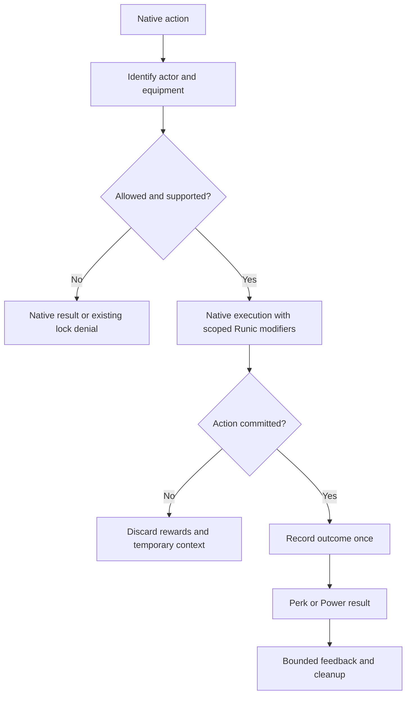

# Runic Skills 2.0.7: Tinkers' Construct Integration and Refinement Specification

**Target:** Minecraft 1.20.1, Forge, Java 17  
**Repository:** https://github.com/otectus/runic-skills  
**Research date:** September 5, 2026  
**Deliverable:** Implementation specification for a coding agent. This document does not represent implemented or runtime-tested changes.

**Navigation:** [Source review](#3-source-review-remaining-fixes-and-refinements) · [Architecture](#4-integration-architecture) · [Existing content compatibility](#8-existing-perks-passives-and-powers-compatibility-map) · [24 new perks](#10-new-perk-catalogue-24-additions) · [12 new Powers](#11-new-power-catalogue-12-additions) · [Add-ons](#12-add-on-and-complementary-mod-integration-programme) · [Configuration](#13-configuration-data-rules-and-balance-arithmetic) · [Implementation map](#16-coding-agent-implementation-map) · [Tests](#18-acceptance-scenarios-and-meaningful-tests) · [Delivery sequence](#19-delivery-sequence-and-dependencies) · [Sources](#21-source-and-evidence-ledger)

## 1. Update intent and implementation contract

Make Runic Skills understand modular equipment as modular equipment. A player's skill investment should work with a Tinkers' pickaxe, shield, bow, thrown weapon, suit of armor, or add-on accessory without losing materials, rewriting another mod's progression, duplicating rewards, or bypassing the tool's resource costs.

The update has four required parts:

1. Correct the remaining economy, crafting, durability, and effect-processing problems identified below.
2. Implement native Tinkers' compatibility across equipment classification, skill requirements, crafting, repair, combat, projectiles, harvesting, armor, and workshop processing.
3. Add **24 new perks and 12 new Powers**, with explicit triggers, limits, prerequisites, presentation, configuration, and regression coverage.
4. Provide focused integrations for relevant add-ons and complementary mods, together with a reproducible compatibility matrix and pack-author controls.

All new content in sections 10 and 11 is a proposed design, not a claim about current Runic Skills or Tinkers' behavior. Names beginning `tc_` are new Runic registry paths. All Java class names proposed for Runic below are implementation targets, not existing APIs.

### 1.1 Baseline reconciliation comes first

The inspected public `master` commit is:

`1863602abf2b779b1d55338741d82eaace7a726e`

At this commit, `VERSION`, `gradle.properties`, and `CLAUDE.md` identify **2.0.5**. The inspected branch list contains `master` and `feature/2.0.0`; it does not establish a public 2.0.6 implementation. The requested release number is **2.0.7**. Before editing, compare the actual working branch with this snapshot and incorporate any intervening 2.0.6 changes. Do not downgrade, overwrite, or repeat fixes simply to match this review. [RS1] [RS21]

The repository already contains the 2.0.5 repairs for Lucky Break, Mending Boost, crafting authority, the recipe index, damage recursion, and KubeJS event handling. Preserve them and run their regression tests. A historical report is not evidence that its original bug remains open. [RS2]

### 1.2 Release priorities

| Priority | Meaning | Release rule |
|---|---|---|
| P0 | Item duplication, item destruction, corrupt saves, exploitable action attribution | Must be fixed before enabling the relevant feature |
| P1 | Missing native behavior, incorrect bonuses, multiplayer disagreement, broken integration | Required for the advertised supported combinations |
| P2 | Quality of life, performance improvements, diagnostics, documentation | Required where specified; polish must not delay a P0 correction |
| Research gate | Exact runtime or upstream seam not yet proven | Resolve during implementation; never publish the feature as supported based on this document alone |

The release can truthfully support a bounded set of tested mod versions. It cannot promise compatibility with every historical or future Tinkers' add-on. Unsupported combinations must be clearly identified, and unavailable content must be unequippable rather than silently inert.

### 1.3 Design boundaries

- Keep the existing ten skills. Tinkering is the main governing skill; other skills provide complementary specializations.
- Keep existing perk IDs, ranks, player data, and the Mark/Seal/Crown Power model.
- Tinkers' owns materials, traits, modifier restrictions, native slot accounting, repair materials, projectiles, and its broken-tool state.
- Runic owns skill eligibility, modest additional benefits, its own craftsmanship stamps, its own cooldowns, and its own presentation.
- Do not add a second mana pool, duplicate tool XP system, replacement smeltery, parallel set of metals, or new world generation.
- Do not restore previously removed broad Botania or Blood Magic perk trees. The proposed Botania integration is narrowly tied to Tinkers' equipment and TCIntegrations.
- All external integrations remain optional. Base Runic must boot and work with no Tinkers', Mantle, JEI, Curios, or magic mods installed.
- New compatibility activates automatically when its validated dependencies are present. New perks still require normal unlocking and selection; new Powers still require equipping and Power Points.

## 2. Verified platform and version strategy

Tinkers' has two particularly relevant 1.20.1 baselines. The new Slimesuit update is a **beta**, so do not silently require it for players on the previous release. [TC1] [TC2]

| Component/profile | Verified source baseline | Required implementation treatment |
|---|---|---|
| Runic Skills | Public snapshot above; Forge 47.4.23; Java 17; Parchment 2023.09.03-1.20.1 | Preserve this platform; reconcile later branch changes |
| Tinkers' stable profile | **3.11.2.166**, commit `44bfab04f9f79365c963fb8cc087745a03f80823` | Full core compatibility target |
| Stable-profile Mantle | Tinkers' build pins **1.11.97**, minimum `[1.11.97,)` | Use a concrete tested artifact, not a floating dependency |
| Stable-profile JEI | Tinkers' declares minimum **15.20.0.103** | Resolve Runic's older 15.19.0.89 development pin when JEI is present |
| Tinkers' beta profile | **3.12.0.220**, September 4, 2026; commit `e86e8b95224c831b7b17bc663366698fd1f1bb09` | Separate full core compatibility target; explicitly label beta |
| Beta-profile Mantle | Tinkers' build pins/minimum **1.11.113** | Separate dependency profile |
| Beta-profile JEI | Tinkers' build pins/minimum **15.56.0.204** | Separate dependency profile |
| Json Things | Tinkers' baseline specifies **0.9.9** | Needed only by relevant low-code add-ons |

The version values above come from the corresponding pinned `gradle.properties`, not from assuming every latest dependency is compatible. [TC3] [TC4]

### 2.1 Why one unchecked adapter is insufficient

The 3.11 `ToolDamageUtil.damage` implementation uses `ToolDamageModifierHook.onDamageTool`. The 3.12 implementation adds a damage-cause `ModifierId` parameter and invokes `beforeDamageTool`. Its older overload delegates to the new overload. Hooking both indiscriminately would apply Runic avoidance twice. Version 3.12 also adds durability-change notifications and migrates many modifiers to JSON. [TC5] [TC6] [TC7]

Implement a small version-specific layer:

- Common contracts contain Minecraft/Forge types and Runic records only.
- Compile common Tinkers' integration against the lowest supported native API where practical.
- Isolate genuinely different 3.11 and 3.12 code and mixins. A class with a 3.12-only signature must never load in the 3.11 profile.
- Gate optional mixins using the existing `RunicSkillsMixinPlugin`, mod presence, version selection, and validated target signatures.
- Use genuine upstream dependencies, not handwritten stubs for Tinkers' internals.
- Record binary versions and SHA-256 hashes in the implementation's compatibility manifest.
- An unknown Tinkers' version enters a conservative mode: preserve base gameplay, exclude recognized native tools from unsafe generic Runic mutation paths, and disable unsupported integration features with a clear diagnostic.
- Never catch a linkage failure and announce successful integration. Report which capability is unavailable.

A single distributable jar is the preferred result. Separate compile/test profiles are appropriate; separate public jars should be used only if binary isolation cannot be made reliable.

### 2.2 Slimesuit and newer content requirements

The 3.12 profile must cover material-based slimesuit pieces, slimecages, slimeshells, slimeboots, skull variations, and migration of older slimesuits. Material assumptions must survive the manyullyn trait rework and the arrival of knightslime and nicrosil. Do not identify a gameplay trait by assuming a material always had the same effect. [TC2]

The 3.11 baseline already includes custom ammunition, thrown tools, fishing rods, tool recycling, and Twilight Forest support. In particular, ammunition is not universally a durable reusable tool. Do not implement a durability refund that recreates consumed arrows or shurikens. [TC8]

## 3. Source review: remaining fixes and refinements

This is a targeted static review of relevant code paths, not a complete proof of correctness for every perk in the repository. Each finding specifies what was observed and what still needs runtime reproduction.

### RS207-01: Craft rewards can duplicate modular equipment

**Priority:** P0. **Evidence:** Direct source path; cross-mod exploit must be reproduced in the supported profiles.

`PerkEffectsHandler.onCraft` calls `bonusCopies`; Assembly Line and Mass Production can each copy the result without requiring a stackable result or a manufacturing recipe. `TinkerStationBlockEntity.onCraft` fires Forge's crafting event for its station operations before updating inputs. That includes operations on an existing tool. The combination can award a copy of a repaired or modified modular item, including its valuable state. Crafting Luck's stack-size check alone does not repair this broader path. [RS3] [TC9]

**Required correction:**

1. Introduce one `CraftOperationContext` and `CraftRewardPolicy` used by every Runic crafting payout.
2. Distinguish manufacturing, assembly, repair, part swapping, modifier application/removal, renaming, recycling, conversion, and unknown operations.
3. Reject bonus copies for repair, modification, renaming, unstackable equipment, capability-bearing items, and unknown operations by default.
4. Generic stackable manufacturing rewards must also reject reversible compression/decompression and container/remainder transformations unless an explicit reviewed rule allows them.
5. Do not suppress other mods' Forge crafting events. Suppress only inappropriate Runic rewards.
6. Keep independent rolls for genuinely independent eligible perks, but apply a total extra-output cap of one per committed operation by default.

**Acceptance:** With Assembly Line and Mass Production forced to 100%, repairing, renaming, swapping a head, and applying a modifier never create a second tool. Manufacturing a whitelisted stackable item still produces the configured bounded bonus. Test normal click, shift-click, full inventory, and two simultaneous users.

### RS207-02: Block salvage creates a renewable material source

**Priority:** P0. **Evidence:** Confirmed algorithmic defect; quantify reproduction in game.

`WorkshopPerkHandler.onBlockBroken` looks up ingredients and spawns them without consuming or replacing the ordinary block drop. It contains no player-placement provenance check despite its comment. Repeated placement and breaking of a recoverable workstation can therefore generate ingredients while retaining the workstation. [RS4]

**Required correction:** Remove free ingredient payouts from ordinary block breaking. Route Resource Efficiency and Salvage Expert to an explicit, consumptive recycling operation. A successful operation consumes the item once and replaces it with a bounded, documented output; closing a preview produces nothing. Keep the perk IDs and revise their descriptions.

Ship a conservative allowlist of recycling recipes. Every entry specifies the consumed item count, possible outputs, maximum recovery, and compatibility exclusions. Reject filled containers, unknown capabilities, and NBT-bearing items unless a dedicated adapter understands their contents. Normal breaking must continue to return the normal block.

For Tinkers' equipment, native breakage is not destruction and awards no components. Integrate actual native recycling only after confirming that the original stack is consumed. Never infer parts from the first crafting recipe.

**Acceptance:** A 1,000-cycle place/break test cannot increase crafting materials. Cancelling a protected break produces no Runic payout. A broken Tinkers' tool remains one broken tool, with no salvage.

### RS207-03: Salvage lookup is expensive, unsafe, and semantically ambiguous

**Priority:** P1. **Evidence:** Direct source inspection.

`WorkshopPerkHandler.ingredientsOf` scans every recipe on each eligible event and invokes third-party `getResultItem`, `getIngredients`, and `getItems` without the isolation added to the separate Master Researcher index. It takes the first matching recipe and first ingredient alternative, ignoring recipe output counts and actual material identity. [RS4] [RS5]

Replace it with an immutable reload-built recycling index containing only explicitly supported transformations. Keep per-recipe exception isolation, bounded logging, and a last-good index on failed reload. Do not retain this method as a fallback for arbitrary modded equipment.

**Acceptance:** A deliberately throwing recipe cannot crash a break, recycle action, or reload. Two recipes for the same output cannot cause arbitrary valuable materials to be recovered. Hot action paths perform no whole-recipe-manager scans.

### RS207-04: Lucky Charm re-enters effect application

**Priority:** P1. **Evidence:** Source-proven event-order problem; not claimed as an observed stack-overflow crash.

`WorkshopPerkHandler.onHarmfulEffect` handles `MobEffectEvent.Added` by calling `player.addEffect` with a shorter effect. Forge's 1.20.1 patch posts that event before the incoming effect is inserted or merged. The nested call re-enters the same handler, and the outer call still retains the original incoming instance. This can cause repeated event dispatch and leave the intended duration reduction ineffective. [RS4] [F1] [F2]

Implement a single transformation of the incoming instance before merge. Prefer a narrowly scoped mixin at the accepted effect-application boundary, preserving the full effect instance through its native serialization/copy surface. Do not cancel the non-cancelable Added event or re-add effects from it.

Preserve amplifier, source, ambient/visibility/icon flags, hidden-effect chain, curative items, and infinite-duration semantics. Only transform the new incoming duration; do not repeatedly shrink the already-active effect. Share this duration path with any new Tinkers' effect benefits to avoid compounding reductions.

**Acceptance:** Poison for 200 ticks with a 25% setting becomes 150 ticks once. Reapplication, stronger/weaker overlapping effects, hidden effects, infinite effects, immunity, and another effect-duration mod behave predictably. No nested `addEffect` originates from Lucky Charm.

### RS207-05: Master Tinkerer still edits the wrong result on shift-click

**Priority:** P1. **Evidence:** Direct source, explicitly acknowledged in `MixCraftingMenu`.

`CraftingEventHandler.awardCraftingPerks` edits damage on the event result, while `MixCraftingMenu` documents that shift-click has already transferred copies. The same defect was addressed for Tinker's Touch but remains for Master Tinkerer. [RS6] [RS7]

Move output transformation into the shared validated-result/commit pathway. Keep its actual repair semantics unless a deliberate tooltip and balance change is made: it restores existing damage on an eligible newly manufactured output, up to the configured amount. It must not award a second maximum-durability bonus or run on a station repair merely because Forge calls it crafting.

**Acceptance:** A fixture recipe producing a damaged item has identical final damage through normal and shift-click. A full-durability craft receives no fictional repair. A Tinkers' station operation transforms the delivered copy, not a disconnected cached preview.

### RS207-06: Auto Repair has a one-point minimum regardless of small settings

**Priority:** P1. **Evidence:** Confirmed arithmetic behavior.

`PerkEffectsHandler` calculates `max(1, round(repairRate / 100 * 4))`. Every positive setting therefore repairs at least one point per pass. `PassiveRepairAccumulator` currently calculates a rate; it does not accumulate fractional repair credit. [RS8] [RS9]

Define 100% as four durability points per second, matching the current formula's scale, and preserve fractional credit. At 10%, twenty seconds should restore eight points, within the one-point scheduling remainder. Use a deterministic equipment selection policy with fair rotation; do not always favor the first enum slot. If no eligible damaged item exists, discard credit. Do not bank an unlimited repair burst.

Route native tools through the equipment adapter. Auto Repair is allowed to restore a broken but repairable Tinkers' tool through native repair APIs. It must honor native repair factors and unrepairable/blacklisted tools. It never refills overslime, ammunition, mana, FE, or a tank.

**Acceptance:** 0%, 1%, 10%, and 100% have distinct measured rates. Disabling the perk clears credit. Logout, item transfer, a full tool, and unknown equipment do not create stored repair rewards.

### RS207-07: Vanilla class checks miss modular roles

**Priority:** P1. **Evidence:** Confirmed classification limitation; coverage varies by native item family.

`DurabilityPerkRules` uses `TieredItem`, shears, and allow/deny tags. Anvil smith bonuses use `DiggerItem` and a sword/axe/trident rule. Other mining checks use vanilla shovel/hoe classes. These are insufficient for Tinkers' tools and low-code add-on weapons. [RS10] [RS11]

Introduce `EquipmentProfileService` with role-based adapters. Preserve existing vanilla behavior. Resolve native roles from Tinkers' definitions, tags, and supported hooks. A hammer can be both a broad mining tool and a melee weapon; a helmet capable of firing fluid is not automatically a spellbook.

**Acceptance:** Equivalent vanilla, Tinkers', and Json Things tools receive applicable existing bonuses. An unrelated item with `hammer`, `rune`, or `bow` in its name does not gain a role merely from its name.

### RS207-08: Current item locks lose stack-specific material information

**Priority:** P1 integration gap. **Evidence:** Direct source.

`SkillCapability.canUseItem` reduces an `ItemStack` to its registry ID. `LockProviderRegistry` has no Tinkers' provider. A wood and a late-game material version of the same tool cannot receive distinct automatic requirements through that interface. [RS12] [RS13]

Implement the stack-aware requirement resolver in section 7. Preserve the ID-only overload for external callers, but document that it cannot enforce material-dependent requirements without a stack.

### RS207-09: Break rewards can be scheduled before final cancellation

**Priority:** P1. **Evidence:** Static event-order risk.

`CraftingEventHandler.onPlayerBreakBlock` handles Treasure Hunter at HIGHEST priority and schedules a payout. A later protection listener can still cancel the break. Similar pre-commit payout paths must be audited while introducing action contexts. [RS6]

Require a confirmed successful break and the associated final loot action. Do not consider merely moving a listener to LOWEST sufficient proof of success. No reward may be emitted from a prediction, a canceled event, a failed removal, or an unloaded block lookup.

### RS207-10: Unrestricted conversion bonuses can create positive crafting cycles

**Priority:** P0 for proven cycles; P1 policy work. **Evidence:** Source-derived risk.

Generic Assembly Line/Mass Production and the ingot-name check for Alloy Master have no recipe-level conversion policy. Compression/decompression, part replacement, recoloring, and modded conversions can turn extra-output rolls into unlimited resources. [RS3]

Make reward eligibility recipe-aware and conservative. Record the operation's exact consumed quantities and remainders. Default-deny recipes involving retained containers, tool state, reversible storage conversions, repair, recycling, and unsupported custom serializers. Allow packs to explicitly opt into reviewed production chains. Do not claim a universal algorithm can prove conservation across every mod's recipes.

### RS207-11: Documentation and development dependencies have drifted

**Priority:** P2, with dependency compatibility P1.

The inspected README still describes 19 inert Powers, while the 2.0.3 changelog and current content-status material describe their implementation. `MODMAP.md` still lists an older Forge version and inventory counts. Correct these from runtime/registration data. Do not make another global promise that all effects are complete based only on symbol-reference tests. [RS1] [RS2] [RS14] [RS23] [RS24]

Update JEI test profiles as specified in section 2. Preserve existing version, language, mixin inventory, class-siding, and content-coverage checks, and add behavioral coverage for the new features.

### 3.1 Preserve these completed fixes

| Existing protection | Required regression |
|---|---|
| Lucky Break prevents wear rather than passively repairing | No repair while idle; genuine native wear can be reduced |
| Mending Boost applies to actual Mending repair | No repair without eligible XP/Mending; native modifier repair is separately attributed |
| `DamageContext` and `DamageMath` protect secondary damage | Cross-mod reflection/cleave chains terminate; no NaN or negative damage |
| Server-player checks and FakePlayer exclusions | Automation receives no player-selected perks unless explicitly supported |
| KubeJS authoritative progression gates | Veto charges no XP; supported `RunicSkillsEvents` examples remain correct |
| Unknown saved content retention | Temporarily missing add-ons do not erase acquired player state |
| Config authority and reload | Server decides effects; client settings cannot grant perks or lower requirements |
| Existing Power eligibility | New Powers remain reachable at the configured skill cap |

## 4. Integration architecture

### 4.1 Proposed components

Paths below are relative to `src/main/java/com/otectus/runicskills/` unless stated otherwise.

| Component | Responsibility |
|---|---|
| `common/equipment/EquipmentProfileService` | Single role, durability, repair, and requirement entry point |
| `common/equipment/EquipmentAdapter` | Forge-only interface implemented by vanilla and optional adapters |
| `common/equipment/EquipmentProfile` | Immutable action-scoped snapshot; no retained mutable tool wrappers |
| `common/actions/RunicActionContext` | Root action, actor, source slot, source stack identity, origin, commit state |
| `common/crafting/CraftOperationContext` | Recipe identity, operation classification, consumed inputs, actual delivered output |
| `common/crafting/CraftRewardPolicy` | Controls every Runic crafting/recycling payout |
| `common/durability/RepairService` | Owns repair-source policy and Runic amplification; delegates native mutation |
| `common/durability/DurabilityBudget` | Composes Runic wear avoidance and finite fractional repair credit |
| `integration/tconstruct/TConstructBootstrap` | Presence/version selection and registration of validated capabilities |
| `integration/tconstruct/TConstructEquipmentAdapter` | Native definition/material/modifier interpretation |
| `integration/tconstruct/TConstructRequirementResolver` | Stack-aware, role-aware requirements |
| `integration/tconstruct/TConstructStationBridge` | Station operation attribution, output transformation, input conservation |
| `integration/tconstruct/TConstructCombatBridge` | Native action/hand/projectile identification and existing perk coverage |
| `integration/tconstruct/TConstructWorkshopBridge` | Focused melting/casting progress and successful process observation |
| `integration/tconstruct/TConstructRepairBridge` | Station, kit, passive, XP, mana, and addon repair classification |
| `integration/tconstruct/TConstructPerkHandler` | Effects of the new perks; delegates operations to services |
| `integration/tconstruct/TConstructPowerDispatcher` | New Power triggers through existing eligibility/runtime services |
| `integration/tconstruct/TConstructCompatibilityStatus` | Capability availability, tested versions, missing/unsupported reasons |
| `integration/tconstruct/addons/` | Isolated TCIntegrations, levelling, Curios, culinary, and technology adapters |
| `client/integration/tconstruct/` | Tooltips, station preview, journal, focus controls, native screen reservations |
| `mixin/tconstruct/v311/` and `mixin/tconstruct/v312/` | Small, documented version-specific hooks where no suitable API exists |

Extend `RunicSkills.tryLoadIntegration`, `RunicSkillsMixinPlugin`, the existing lifecycle cleanup, config snapshot machinery, and content-status index. Do not introduce a second parallel registry system for perks or Powers.

### 4.2 Verified upstream seams and their limits

These source classes were inspected. Descriptors must still be verified against the actual runtime jars during implementation.

| Upstream seam | Appropriate use | Important limit |
|---|---|---|
| `library.tools.item.IModifiable`, `ToolStack`, `IToolStackView` | Read native tool definition and state | Do not construct a ToolStack for every arbitrary item |
| `common.TinkerTags.Items` | Modifiable, durability, harvest, melee, armor, shields, bows, staffs, fishing roles | A tag alone is not proof of a valid initialized native tool |
| `library.tools.helper.ToolDamageUtil` | Native damage/repair entry points | `getFakeMaxDamage` is a vanilla compatibility facade; use native durability stats |
| `ModifierHooks.TOOL_DAMAGE` | Native wear behavior | 3.11/3.12 signatures differ; modifiers can also spend durability as a resource |
| `ModifierHooks.REPAIR_FACTOR` | Native repair restrictions/scaling | `ToolDamageUtil.repair` itself does not calculate the recipe's repair factor |
| `ToolStack.rebuildStats`, `ModifierHooks.TOOL_STATS` | Rebuild-safe permanent craftsmanship statistics | Wait for native material, modifier, definition, and tag readiness |
| `tables.block.entity.table.TinkerStationBlockEntity.calcResult/onCraft` | Operation classification and actual actor | Shared block-entity preview is not player-specific; crafting event precedes input mutation |
| `tables.menu.TinkerStationContainerMenu.quickMoveStack` | Shift-click delivery | Native path calls `onCraft` before attempting inventory transfer |
| `tables.menu.slot.LazyResultSlot`, `LazyResultContainer` | Normal take and result lifetime | Validate actual delivery and avoid duplicated transforms |
| `tables.recipe.TinkerStationRepairRecipe` | Native material repair and consumption | Input shrinking derives from its native result; arbitrary preview edits can change costs |
| `library.tools.helper.ToolHarvestLogic` | Native area mining and protection path | Keep native secondary-block processing; do not run another vein miner |
| `library.tools.helper.ToolAttackUtil` | Native melee context | Do not replay a full attack just to add a bonus |
| Ranged modifier hook interfaces | Launch, hit, and native projectile metadata | A hook runs for modifiers actually attached to a tool; registering a listener does not make it global |
| `smeltery.block.entity.module.MeltingModule.heatItem` | Small progress-rate adjustment | Do not tick the whole machine twice or bypass temperature/fuel checks |
| `smeltery.block.entity.CastingBlockEntity.serverTick` | Cooling progress and completion | Simulation, recipe revalidation, switching slots, and consumed casts must remain native |

Source details: wear/repair [TC5] [TC6] [TC7]; tool state/roles [TC10] [TC11]; station transactions [TC9] [TC12] [TC13] [TC19] [TC20]; native actions [TC14] [TC18]; workshop processing [TC15] [TC16]. The inspected `TinkerToolEvent` exposes harvest/shear events; it is not a general tool-built, repair-completed, or damage event bus. Do not invent such upstream events. [TC17]

### 4.3 Action lifecycle



`RunicActionContext` is a scoped stack, closed in `finally`. It carries:

- Actor UUID and server identity; FakePlayer flag.
- Monotonic action ID for the server session, not a wall-clock timestamp.
- Root kind: melee, projectile launch, projectile hit, block break, harvest interaction, build, repair, modify, cast, melt, recycle, or unsupported.
- Native source: exact hand/slot and originating stack reference during synchronous execution.
- Compact equipment fingerprint for asynchronous follow-up; never a full copied inventory.
- Origin: `PRIMARY_NATIVE`, `NATIVE_AOE_CHILD`, `NATIVE_MODIFIER_EFFECT`, `RUNIC_SECONDARY`, `AUTOMATION`, or `UNKNOWN`.
- An effect-claim set so a Runic effect is applied at most once at its intended scope.
- Consumed inputs and actual outputs for transaction-backed events.

Do not persist a random UUID onto all ammunition or stackable items: that changes stacking semantics. Long-lived projectile identity belongs to the entity. Existing durable craftsmanship stamps can carry a tool lineage ID only where needed for an actual feature.

Per-root proc deduplication must not suppress legitimate native area damage or per-block durability. One hammer action can break nine blocks, consume native wear for nine blocks, and still trigger a Runic combo counter once. Damage-derived Runic secondary effects cannot generate another Runic secondary effect; reuse `DamageContext`.

## 5. Native equipment and durability behavior

### 5.1 Equipment classification

Resolve roles in this order:

1. Explicit server deny rules and capability exclusions.
2. Valid native tool definition and active native roles/hooks.
3. Validated add-on equipment adapter.
4. Runic allow tags or explicit item rules.
5. Existing vanilla classification.

Suggested profile fields: native provider, definition ID, role set, material IDs by part role, effective modifier IDs/levels, durability mode, native maximum and current durability, broken state, repair eligibility, actual slot, and a revision fingerprint.

Do not query mutable third-party state from a long-lived cached ToolStack. Cache immutable parsed rules and ID lookups. If caching a profile, invalidate it on native rebuild, material/modifier change, stack replacement, equipment movement, reload, or server config revision.

| Family | Required coverage |
|---|---|
| Small mining tools | Effective-tool checks, native tier, mining speed, wear, locks |
| Hammers/excavators/scythes and other broad tools | Native AoE, per-block permissions, one root proc |
| Swords/axes/cleavers and add-on melee tools | Correct hand, charge, reach, criticals, secondary damage |
| Bows/crossbows | Charge, ammo, launcher and projectile state, accuracy and damage |
| Javelins and thrown tools | Actual departing/returning stack, durability, inventory insertion |
| Arrows/shurikens/throwing ammo | Consumption, stack size, native reusable conditions; no copied ammo refunds |
| Fishing rods | Native fishing hook, reeling damage, fishing bonuses, tool costs |
| Staffs/fluid cannons/helmet firing | Actual native resource and origin; never assume Iron's spell events |
| Traveler's/plate/slime armor | Active slot, defense, knockback, durability, material and modifier identity |
| Shields and heavy shields | Block context, shield wear, separate attack role where native supports it |
| Curios/medals | Equipped-slot validity and deduplication through the addon adapter |
| Parts/casts/patterns/materials | Components, not usable finished equipment; no default gear lock |

### 5.2 Wear ownership and ordering

Tinkers' deliberately handles durability outside ordinary ItemStack wear and prevents broken tools from being deleted. Generic Runic `ItemStack.hurt` interception is therefore insufficient. [TC5] [TC6]

Required order for ordinary native use:

1. Tinkers' verifies tool usability and native resource eligibility.
2. Native modifiers process their own wear behavior and secondary durability reservoirs.
3. Runic adjusts the remaining **ordinary durability loss** once, at the call from native `damage` into its direct-damage operation.
4. Tinkers' commits actual durability and broken state.
5. Runic observes the committed outcome for feedback and counters.

Do not globally intercept `directDamage` to discount every use: callers can deliberately bypass ordinary avoidance. Do not discount modifier activation payments, tool eating, block provision, tank/energy conversion, or durability-to-resource behavior by default. In 3.12 use the explicit cause plus the action context. In 3.11 require a positively identified ordinary-use context; unknown origin gets native behavior.

**Existing perk composition:** Preserve the existing Runic avoidance calculation for existing perks: sum their eligible Runic contributions and cap at 90%. Precision Tools contributes `X / (100 + X)`, as already implemented. Apply native modifiers first, then the Runic stage. Document that the exact +X% lifetime interpretation applies to Precision Tools in isolation, not to every combined build.

New conditional wear reductions share that same Runic stage and cap. Do not give each new perk a separate 90% cap. Preserve native unbreakability; Runic's cap is not an instruction to make native unbreakable tools break.

For small wear amounts, per-point Bernoulli rolls preserve low probabilities. For large modded wear amounts, use a bounded-time binomial sampler or equivalent unbiased bounded strategy; never loop billions of times. Use checked arithmetic and maintain `0 <= reduced <= original`.

### 5.3 Repair sources

Every repair call made or amplified by Runic has one source:

`MATERIAL_STATION`, `REPAIR_KIT`, `VANILLA_MENDING`, `NATIVE_EXPERIENCE_REPAIR`, `BOTANIA_MANA`, `ARS_MANA`, `FORGE_ENERGY`, `AUTO_REPAIR`, `RUNIC_POWER`, or `UNKNOWN`.

- Only positive, committed repair is eligible for repair-triggered benefits.
- Native material/repair-factor rules apply exactly once. A zero native repair factor remains zero.
- A native operation that already calculated its repair factor does not get that factor again.
- For Runic-origin Auto Repair, evaluate the native repair factor explicitly before calling the native repair helper; the helper does not supply it for you.
- Runic bonuses never refill a resource pool under the guise of durability repair.
- Unknown external repairs proceed unchanged and trigger no Runic repair reward.
- Free repairs, commands, creative actions, and passive repairs cannot trigger perks requiring paid repair.

**Repair enhancement default:** Keep the native material consumption and add a bounded amount of extra durability restoration to the actual delivered result. This avoids guessing at partially consumed repair kits or changing the native recipe's shrink calculation. Use `bonus = floor(nativeActualRepair * additiveRunicBonus + fractionalCarry)`, capped by remaining damage. Carry is scoped to that player, tool, and repair source, bounded below one point; discard it when context changes.

The UI must show this as extra restoration for the same native materials. A pack-requested material-cost discount is a separate mode requiring native preview/consumption parity tests; it is off by default.

### 5.4 Persistent craftsmanship

Tinker's Touch, Tool Smith, and Weapon Smith should remain properties of the finished item when their current semantics promise that. Holder-only perks must remain on the holder.

For native items:

- Store Runic percentages and a schema version in namespaced persistent tool data.
- Add at most one internal `runicskills:workmanship` modifier when a real craftsmanship stamp is earned. Do not attach it to every item just to make global event handling easier.
- Its `TOOL_STATS` behavior applies only the stamped bonuses appropriate to the tool's native role. It must be rebuild-safe and idempotent.
- Durability stamps increase native `ToolStats.DURABILITY`, not just ItemStack's reported maximum.
- Attack/mining stamps have one native consumer. Disable the equivalent generic Runic consumer on these native items.
- Repeated qualifying crafts/repairs keep the maximum existing stamp; never add percentages indefinitely.
- Part swapping retains the stamp but recalculates against the new base materials. Slot use, traits, custom names, add-on XP, and stored inventory remain native.
- A repair stamp is applied only after positive actual repair. Renaming and dry previews do not improve an item.
- Rebuild once per committed change, not every tick or tooltip.

Use the native modifier/module system appropriate to the selected profile. Java modifier registration remains present in 3.12 but is deprecated; isolate that compatibility choice and prefer data-driven modules for static portions. Do not paste an imagined loader schema into a datapack. Generate native JSON using the pinned API and load-test it.

Migration from existing `ItemBonusTags` is lazy and idempotent: read a recognized old native-item stamp, convert it once to namespaced native persistent data, verify a successful rebuild, then mark it migrated. Retain unrecognized data. Generic durability scaling must skip the native item throughout the transition so it cannot apply twice.

## 6. Crafting, repair stations, casting, and economy

### 6.1 Operation classification is mandatory

| Operation | Eligible for new-item stamp? | Generic extra output? | Workshop/milestone credit? |
|---|---|---|---|
| Assemble a genuinely new finished tool | Yes, once on delivered result | No extra equipment | Yes |
| Manufacture whitelisted stackable supplies | According to explicit rule | At most one configured bonus | Yes, bounded |
| Repair an existing tool | Repair stamps only | Never | Paid positive repair only |
| Swap a part/material | Preserve/recompute existing stamps | Never | Distinct meaningful change only |
| Add/remove modifier | Preserve existing stamps | Never | First meaningful modifier milestone only |
| Rename/dye/reorder/cosmetic conversion | Preserve | Never | No |
| Cast a part or armor piece | Per recipe and proven actor | No generic copying | Yes after fluid and input consumption |
| Melt/alloy | No | No Runic fluid duplication | Successful process observation only |
| Recycle | No | Explicit conservative recycling rule only | No XP loop or repair-trigger credit |
| Automation/FakePlayer | Preserve existing item state | No player-derived payouts | No player progression credit |
| Unknown custom recipe | No inferred mutation | No | No |

### 6.2 Station transaction design

Native Tinkers' result computation is shared by the block entity. Do not bake player A's perks into a shared preview that player B can take. Use a per-menu `StationQuote` containing player UUID, menu ID, native recipe ID, input fingerprint, base result fingerprint, config/rule revision, and a monotonically increasing quote revision.

The native result remains the authoritative base item. Runic's client panel displays the player's extra repair/stamp preview separately, with the actual expected result. On taking:

1. Validate distance, menu identity, permission, current inputs, recipe, quote revision, and player eligibility on the server.
2. Build a detached copy of the native output and compute Runic changes deterministically.
3. Establish the native input-consumption plan. Reject unsupported operations before consuming or delivering anything.
4. Execute native consumption and output delivery through the native menu's intended path.
5. Commit Runic state/rewards exactly once only if input consumption and delivery succeeded.
6. Correctly handle any output remainder or native allowed drop; do not perform a second delivery from a post-event handler.
7. Always clear scoped context, including on third-party exceptions.

**Important inspected behavior:** Tinkers' quick-move calls `onCraft` before attempting inventory insertion. Treat full destination inventories as a required regression case. Capture and inspect that native failure path before selecting injection points. If necessary, perform a side-effect-free destination capacity check before entering it. Never roll back another mod's arbitrary side effects using a guessed inventory snapshot. A mismatch must abort before execution or follow a deliberately tested native completion path.

Do not reuse the vanilla ResultSlot assumption for every native menu. Trace normal click, shift-click, hotbar swap, number keys, drag, double-click, dropped output, close, disconnected player, and two viewers.

### 6.3 Workmanship and service crafting

A skilled smith may craft or repair equipment for another player. Permanent craftsmanship follows the item; personal combat perks do not. This supports player-run workshops without transferring character levels.

Always display provenance as optional information, not authorization. A crafter UUID/name is not a permission check. Do not trust client-supplied crafter names or accept a name match as ownership.

Special keystone work in section 10 is a separate native station recipe with an explicit material cost and a once-per-tool marker. It must never be auto-applied during an ordinary repair.

### 6.4 Workshop focus

Processing perks require a real, explicit focus action rather than attributing a machine to the nearest high-level player.

- Add a small Focus control in the integration's station panel, plus an equivalent command for accessibility.
- A player can focus one loaded controller, with up to eight explicitly associated nearby casting tables/basins, within 8 blocks of the controller.
- Only successful authorized interaction can establish or renew focus; proximity alone cannot claim it.
- Focus lasts 60 seconds, requires the player to remain online in the same dimension and within 16 blocks, and can be renewed by a real accepted manual workshop operation.
- Do not take over another player's active focus without their release or appropriate administrative permission.
- No chunk tickets. Invalid/dismantled controllers, logout, death, dimension change, or expired focus remove bonuses.
- The server revalidates focus at most once per second; native process ticks use a small cached eligibility snapshot.
- Focus provides process benefits, not XP ownership of automated output. Hoppers can still move native items, but automated throughput does not become an XP farm for the focuser.
- Default limits: one focus per player, eight associated casting blocks, 32 active focus records per server. All limits are configurable with bounded validation.

### 6.5 Processing benefits preserve native conservation

The default integration changes process speed, consumable-cast survival, and information. It never multiplies molten material, foundry byproducts, fuel temperature, or ore multipliers.

For melting, adjust the effective heating increment only after native fuel and temperature conditions are satisfied. Retain native input/output-space checks and fuel expenditure per native tick. Use fractional progress carry so a 5% bonus remains meaningful at a one-unit rate. Do not call the entire block entity tick an extra time.

For casting, adjust cooling progress once per native tick. Do not assemble the recipe a second time. Cast Keeper may return one verified disposable cast to the attributed player's inventory after a successful cast, without touching fluid amounts or output count. It excludes reusable gold casts, NBT/capability-bearing casts, consumed tools, molds with special behavior, and recipe types not explicitly supported.

Combined Runic melting/cooling speed bonuses cap at **25%**. Material conservation remains exact at all settings. Arbitrary fluid-unit assumptions such as “one ingot always equals a fixed number of mB” are prohibited; use native recipes and material values.

### 6.6 Recycling and conversion rules

Reuse native Tinkers' recycling where available. Runic's salvage perks may provide an alternative bounded consumptive recipe only when it is explicitly defined and economically reviewed. Never give native recycling both its output and a second recovered tool.

Initial Runic fallback recycling examples can use ordinary unenchanted, empty vanilla gear with fixed conservative payouts; compare against the pack's existing recipes before shipping. Tinkers' modular gear is handled only through its native material-aware route. No reverse-engineering from arbitrary `Recipe.getIngredients()` remains.

For configurable bonus recovery, every rule must cap output below or equal to the known paid material value after native returnables and other yields. Disable a rule if that value cannot be established. Test reversible pairs and longer known conversion cycles in the actual pack. These controls bound Runic's contribution; they do not prove another mod's economy is exploit-free.

## 7. Stack-aware skill requirements

### 7.1 Preserve existing behavior without imposing surprise restrictions

The compatibility layer is enabled automatically. **New automatic material-tier locks are off by default**, because turning them on in an existing world can unexpectedly disable players' equipment. Existing explicit item locks remain enforced. Ship an optional progression preset and explain its effect.

One server resolver returns `RequirementDecision`: allowed/denied, requirement map, matched rule IDs, unsupported facts, and a localized reason. Both the UI and action enforcement consume the same result.

### 7.2 Rule precedence

1. `enableItemLocks=false` bypasses all Runic equipment locks.
2. Explicit manual item allow/deny or configured requirements take precedence over automatic material rules. Preserve existing manual override behavior.
3. Explicit stack/tool-definition rules, including scoped exemptions.
4. Explicit material/modifier rules.
5. Optional automatic material-tier profile.
6. No matched requirement means allowed.

Manual override is replacement by default, not an undocumented maximum with generated rules. A pack can explicitly request additive/maximum composition. Within an automatic profile, combine same-skill requirements by maximum rather than summing every part.

### 7.3 Optional default material profile

Use the highest relevant functional material tier, excluding cosmetic embellishments, dyes, and unrelated storage materials. Map actual part roles from tool definitions; never assume index 0 is always a head.

| Native material tier | Tinkering requirement at stock cap 32 | Functional skill requirement |
|---|---:|---:|
| 1 | 1 | 1 |
| 2 | 8 | 4 |
| 3 | 16 | 8 |
| 4 | 24 | 16 |
| Greater/unknown | Explicit rule required; otherwise no inferred extra lock | Explicit rule required |

Functional skill is Strength for primary melee use, Dexterity for launch/throw use, Endurance for primary mining use, and Constitution for armor use. Hybrid equipment resolves against the action being performed; it does not require all possible skills just to sit in an inventory. Generic inspection may display each action's requirement separately.

Apply the existing discovered-lock multiplier where appropriate. Scale the optional preset thresholds proportionally when a server changes `skillMaxLevel`, with integer ceiling and a cap; explicit manual requirements keep their configured meaning.

Unknown or missing material data must not crash or mutate the item. Permit transport/storage and report that its automatic requirement could not be determined. Never generate a maximum-level punishment for an unrecognized add-on.

### 7.4 Enforcement surfaces

Enforce at the server-side start of mining, attack, launch, throw, armor activation, shield use, and native active tool abilities. Check again at the commit boundary where a delayed operation could invalidate the decision. Preserve the authorization snapshot of a legitimately launched projectile; switching the held item later does not rewrite its source.

For crafting, distinguish **make**, **modify**, and **use** requirements. By default, allow a skilled smith to make equipment for another player; use requirements apply to use. A pack can opt into manufacturing gates.

Never deny inventory removal, storage, dropping, repair access, or exchanging an unusable part for an accessible one. If a configured armor lock forbids equipping, reject the equip action; for already-equipped legacy gear, suspend Runic benefits and explain the state without deleting or forcibly dropping the item. Any suspension of native protection needs a separate explicitly enabled policy and adapter, not a hidden side effect of skill locks.

## 8. Existing perks, passives, and Powers: compatibility map

This map is a required implementation inventory. Extend it to every touched perk at implementation time, using the actual registration and effect handlers.

| Existing content | Tinkers' treatment | Ownership/stacking rule |
|---|---|---|
| Lucky Break | Native ordinary tool wear avoidance | Once in Runic wear stage |
| Precision Tools | Native wear avoidance using existing lifetime conversion | Same stage as Lucky Break |
| Unbreakable | Native armor durability loss reduction | Armor only; not health damage cancellation |
| Unbreaking Mastery | Native analogue only through a validated mapping to the native reinforced behavior | Do not equate all modifiers with enchantments; show exact supported scope |
| Auto Repair | Native real durability repair using the configured fractional budget | Does not restore overslime or resources |
| Mending Boost | Actual vanilla Mending or positively identified native XP repair | Apply once; preserve native XP accounting; mana repair is not Mending |
| Tinker's Touch | Permanent native maximum-durability workmanship stamp on new finished equipment | Maximum stamp, never additive recrafting |
| Tool Smith | Permanent native mining-speed workmanship stamp after paid repair | Native stats consumer only |
| Weapon Smith | Permanent native melee-damage workmanship stamp after paid repair | No second generic item-attribute bonus |
| Armor Smith | Preserve existing holder armor bonus; evaluate native worn armor correctly | Do not invent a second permanent armor stamp |
| Master Tinkerer | Correct real manufactured-output repair where relevant | No station repair event abuse |
| Repair Expert | Additional paid native restoration for the same materials, with explicit tooltip | Shares repair cap |
| Repair Efficiency passive | Preserve vanilla anvil behavior; add separately documented native repair enhancement | Existing passive's old anvil behavior is not silently replaced |
| Assembly Line/Mass Production/Crafting Luck | Apply only to approved manufacturing transactions | No equipment copies or conversion loops |
| Alloy Master | Keep eligible reviewed manufacturing behavior; native smeltery path grants cooling/processing efficiency instead of fluid duplication | Explain native-specific behavior; do not advertise extra ingots |
| Forge Master | Extend to focused native melting progress | Share workshop speed cap; no fake temperature |
| Disassembler/Salvage Master/Salvage Luck | Explicit consumptive recycling only | Native broken tools produce no salvage |
| Resource Efficiency/Salvage Expert | Explicit workstation recycling instead of ordinary block breaking | One input becomes one reviewed result |
| Runic Engineering | Existing enchantment route remains for genuinely enchantable items | No random native trait promotion; no forced enchantments on ordinary Tinkers' tools |
| Enchantment Transfer/Stacking/Master Artificer | Only with a verified enchantment-enabling adapter, otherwise unavailable for native tools | Native modifiers are not enchantment NBT |
| Modular Equipment | Preserve its current Apotheosis socket meaning | New Keystone Tinker separately owns the Tinkers' upgrade slot |
| Overgeared's Steady Hammer/Blueprint Savant/Metallurgist/Master Smith | Remain Overgeared-specific | Do not reuse their IDs to mean unrelated Tinkers' mechanics |
| Terraformer/Lumberjack/Master Breaker and mining passives | Recognize native actions and tool roles | No duplicate AoE mining; preserve native effective-block checks |
| Weapon Master/crit/cleave/strength passives | Native source hand and primary hit attribution | Shared damage guard; no recasting native attacks |
| Projectile damage/accuracy and projectile Powers | Native launcher/ammunition context | Authoritative launch snapshot; once per effect scope |
| Fishing bonuses | Native rod/hook where the matching action exists | Reeling combat is not automatically a fish catch |
| Magic resistance | Existing damage-type policy applies | Fluid, material, and physical attacks do not become spells by name |
| Soulbound/death-related functionality | Native item preservation and slot restoration remain in control | No duplicate retained item through grave/keepInventory paths |

A content entry that has no meaningful native equivalent should explain the limit. A well-labeled non-applicable effect is preferable to silently inventing a stronger substitute.

## 9. Combat, harvesting, projectiles, and protection

### 9.1 Combat ownership

Separate native tool-stat bonuses, holder attributes, final incoming/outgoing damage adjustments, and Runic secondary damage. Maintain an effect ledger per action. A Weapon Smith stamp applies in native attack statistics; the generic `SmithingPerkHandler` must not also apply it. A new final-hit perk applies after identifying a valid primary native hit, without replaying the original attack.

Use finite damage math and the existing `DamageContext`. Mark Runic-generated damage as secondary, and do not let secondary hits trigger charge counters, resource refunds, tool XP multipliers, summon bursts, lifesteal chains, or additional secondaries unless a feature explicitly documents a bounded exception.

Native modifiers can create their own extra effects. Do not disable those effects globally. Observe native action context so a secondary modifier effect is not mistaken for a fresh manual attack. Unknown origin is ineligible for new Runic procs.

Honor native critical-hit behavior and other combat mods' attack scheduling. Never force a vanilla sword cooldown onto every native weapon or treat an offhand attack as main-hand use.

### 9.2 Projectile snapshots

At the validated native launch boundary, capture actor UUID, root action ID, source hand, launcher definition, relevant material/modifier facts, Runic eligibility and scalar bonuses, config revision, and native projectile role. Prefer native metadata; add only a small namespaced Runic payload when missing.

- The arrow's owner and relevant source facts survive flight and chunk reload.
- A bow swap after firing cannot strengthen an old arrow.
- Multishot creates multiple native projectiles; each retains the same root ID. Damage applies to real hits, while one-shot proc counters consume once per launch.
- Bounces/piercing preserve native behavior. A Runic ricochet must not clone a returning physical tool.
- Thrown tool pickup returns the original native stack with its actual state. No replacement stack is manufactured from a cached profile.
- Dispensers and null-owner projectiles do not receive player perks.
- Caps: at most 16 recorded Runic proc claims per projectile and at most 2 KiB serialized Runic metadata per entity; no unbounded NBT or full capability dumps.

Some native ranged hooks require a modifier instance. If a global action is needed, use a narrow, version-validated native launch seam rather than assuming a registered modifier hook executes on unmodified tools. Resolve the exact bow, thrown-tool, ammunition, and fluid-projectile seams in the implementation's hook manifest.

### 9.3 Harvesting

- Native mining tier and effective-block checks decide whether mining is valid.
- Block protection is checked for every native AoE child.
- Runic must not generate drops, XP, or combo credit for a denied child.
- Fortune, Silk Touch, autosmelt, smeltery-related material traits, and Runic loot bonuses need one documented order. Do not reconstruct drops by calling loot generation a second time.
- Apply output-related enhancements only to the actual final eligible drop collection, excluding block-entity contents, placed container inventories, and already-bonused outputs.
- No chunk-loading ore searches or unlimited vein traversal.
- Native harvesting/shearing interactions must be distinguished from block destruction; rebuilding a crop is not a free break/replant XP loop.

### 9.4 PvP, allies, and claims

New offensive procs follow server PvP rules and the native accepted hit. Team-friendly effects require explicit team/alliance membership or a configurable opt-in party provider. “Standing nearby” is not sufficient for receiving paid cooperative work benefits.

FTB Chunks and other claim systems remain authoritative. Use normal protection-aware interactions, not direct world writes. No new Power destroys terrain, bypasses claims, or forcibly moves another player's items.

## 10. New perk catalogue: 24 additions

### 10.1 Common rules for all new perks

- All 24 are single-rank perks in this release. Do not create hidden additional ranks.
- Their base dependency is a supported Tinkers' profile. Add-on perks also require the named working adapter and actual relevant feature/material/modifier.
- Levels below assume the stock skill cap of 32. Default thresholds scale as `max(1, min(skillCap, ceil(baseLevel * skillCap / 32)))`; explicit per-perk overrides retain their configured meaning.
- Each entry supplies a real behavior, a localized tooltip, its governing skill, availability reason, icon, config values, and a behavioral test.
- Percent values are additive within their Runic channel, then subject to shared caps. They do not multiply one another unless explicitly stated.
- Personal temporary benefits clear on death, respec, logout, dimension change, perk disable, and invalid source-tool change. They do not transfer with an item.
- Permanent workmanship is a separate system governed by section 5.4.
- “Paid repair” means consumed native material/kit and positive native durability restored, excluding any Runic bonus. Passive repair, mana repair, and experience repair are not paid material repair for these triggers.
- For repair-triggered temporary benefits, require native restoration of at least `max(10, ceil(nativeMaxDurability * 0.05))`. If that exceeds the tool's total durability, use its total durability. Exceptions are explicit below.
- No perk grants XP merely for previewing, opening a menu, moving an item, or rebuilding native stats.

### 10.2 Sixteen core Tinkers' perks

| ID and display name | Skill / level | Default effect | Trigger, exclusions, and verification |
|---|---|---|---|
| `tc_cast_keeper` — Cast Keeper | Tinkering 4 | 15% chance to return one disposable cast | Attributed completed casting with a whitelisted consumed sand/red-sand cast. Native output/fluid use unchanged. Reusable casts, consumed equipment, and simulation never qualify. Force 100% and prove exactly one cast returns after completion. |
| `tc_thermal_rhythm` — Thermal Rhythm | Tinkering 8 | +10% melting progress | While valid workshop focus exists and native heating is already permitted. No bonus without fuel, sufficient temperature, inputs, or output capacity. Test cold/blocked machines and focus expiry. |
| `tc_repair_memory` — Repair Memory | Tinkering 8 | +10 percentage points Runic wear avoidance for the next 16 ordinary use actions, maximum 120 seconds | After qualifying paid repair; binds to the repaired nonstackable tool and repairing player. A root action consumes one charge only if it attempts ordinary wear. New repair refreshes to 16, never adds. Clear on tool transfer or loss of identity. |
| `tc_material_harmony` — Material Harmony | Tinkering 12 | +5% paid repair restoration | Tool has at least three distinct non-cosmetic native materials. Count material IDs once, with valid contributing part roles. Empty/unknown materials and copied modifier traits do not count. Verify repeated parts do not inflate the count. |
| `tc_tempered_edge` — Tempered Edge | Strength 12 | +6% damage on an accepted primary native melee hit at at least 90% native attack readiness | 60-tick internal cooldown; no modifier secondaries, reflected hits, automated attacks, or repeated native sweep children. Use the real attack hand. |
| `tc_counterweight` — Counterweight | Dexterity 12 | +5% effective native attack speed for broad melee tools | Native definition/explicit tool rule determines broadness; do not use material-count heuristics alone. Applies to the active attack role, not every weapon because a hammer is in the inventory. Verify offhand and Better Combat paths. |
| `tc_precision_footing` — Precision Footing | Endurance 12 | +8% effective mining speed | Actor is grounded, not sprinting, and using an effective native mining tool. Preserve water/fatigue/native penalties. Applies once to root mining speed; no extra block breaks. |
| `tc_slime_steward` — Slime Steward | Endurance 16 | +5 percentage points Runic ordinary-wear avoidance when a tool with a native overslime capability has no overslime remaining | Does not create/refill overslime or intercept overslime consumption. Requires actual supported overslime state, not a material name. Test 0, 1, and full overslime plus unbreakability. |
| `tc_plate_discipline` — Plate Discipline | Constitution 16 | +0.05 knockback resistance | While wearing at least three valid native armor pieces in their correct armor slots. One modifier per player, not per piece. Remove immediately when eligibility changes; use existing attribute UUID conventions. |
| `tc_measured_draw` — Measured Draw | Dexterity 16 | Multiply native launch inaccuracy by 0.90 | Fully charged native bow/crossbow launches only. Does not grant homing, increase damage, alter projectile count, or worsen a zero-inaccuracy shot. Verify native projectiles and add-on ammo. |
| `tc_returning_hand` — Returning Hand | Dexterity 20 | +10% draw speed on the next valid thrown-tool launch within 8 seconds | Trigger only after confirmed native return of a thrown tool to its original player; no pickup from the ground or arbitrary inventory insertion. 100-tick cooldown. Consume once when a legal launch begins; canceled launch restores eligibility without extending its expiry. |
| `tc_ember_guard` — Ember Guard | Constitution 20 | 5% reduction to accepted incoming fire-tagged damage | Only while the player has active focus on a currently heated supported workshop. No fire immunity and no protection outside valid focus range. Share the incoming-damage cap; no persistent armor edits. |
| `tc_field_service` — Field Service | Tinkering 20 | +10% extra repair restoration from a consumed native repair kit used outside a tinker station | Adapt a verified portable/crafting repair-kit operation. No bonus for holding a kit or for arbitrary right-click. Station repairs use Repair Expert, avoiding two bonuses for one kit path. |
| `tc_workshop_cadence` — Workshop Cadence | Tinkering 24 | +10% casting cooling progress for 30 seconds | A player manually completes three casts of the same recipe within 60 seconds under valid focus. Recipe must consume fluid each time. Trigger resets the three-cast counter; automated extraction does not count. 200-tick cooldown. |
| `tc_adaptive_grip` — Adaptive Grip | Tinkering 24 | +8% to the next eligible primary melee damage or effective mining speed after switching between those roles | Requires a completed prior action with the same valid hybrid native tool, within 8 seconds. Window lasts 4 seconds, consumes on the next committed root action, and has a 100-tick cooldown. No switching items in place to generate a charge. |
| `tc_keystone_tinker` — Keystone Tinker | Tinkering 32 | Allows one permanent additional **upgrade** slot on an eligible native tool | Explicit station service consumes one netherite ingot and one amethyst shard. No ability/defense/soul slot, no repeated application, no effect on ammo, no slot granted just by equipping the perk. Section 10.4 governs this exception. |

These effects deliberately include material handling, maintenance, hybrid-tool use, timing, and workshop productivity, rather than only larger universal damage numbers.

### 10.3 Eight add-on and complementary-mod perks

| ID and display name | Skill / level | Dependencies | Default effect and implementation contract |
|---|---|---|---|
| `tc_mana_polisher` — Mana Polisher | Tinkering 16 | TCIntegrations + Botania | Reduce the native Botania mana charge for a verified durability-repair transaction by 10%, with a minimum positive charge of one mana unit. Apply before the existing exact-charge request; never charge then refund, never touch attack bursts, and never improve the free Auto Repair path. |
| `tc_source_tempering` — Source Tempering | Magic 16 | TCIntegrations + Ars Nouveau | After native armor repair actually spends Ars mana and restores durability, grant +5% damage to the next accepted manually cast Ars spell within 8 seconds. 200-tick cooldown. No direct Iron's-spell bonus, secondary-cast recursion, or trigger when the mana check fails. One charge per player, not per armor piece. |
| `tc_clockwork_alternation` — Clockwork Alternation | Tinkering 16 | TCIntegrations + Create; native Mechanical Arm behavior available | After successful alternating main-hand/offhand native melee hits within 5 seconds, grant +10 percentage points ordinary-wear avoidance on the next root tool use within 5 seconds. 100-tick cooldown. Native TCIntegrations owns offhand attacks; Runic never synthesizes another one. |
| `tc_seasoned_hands` — Seasoned Hands | Tinkering 16 | Tinkers' Levelling Addon | +10% **tool XP** on an eligible native tool XP award. Apply as a scalar to the original award at one verified seam, with fractional carry. Do not call `addExperience` again. No player XP, free slots, or grants after the addon's level cap. |
| `tc_medallion_concord` — Medallion Concord | Wisdom 16 | Tinkers' Ingenuity + Curios | +5% paid native repair restoration while one valid Tinker's Medal is equipped in its supported Curios slot. Multiple medals never multiply the bonus. Backpack/inventory copies do not count. Add-on modifiers remain the addon's responsibility. |
| `tc_banquet_of_cinders` — Banquet of Cinders | Wisdom 12 | Tinkers Delight + Farmer's Delight | While the addon's actual Tinkers Skill food effect is active, gain +3% accepted primary native melee damage. Do not apply the food effect again, duplicate meals, amplify every potion, or affect the addon's ordinary metal knives unless their native role truly qualifies. |
| `tc_soulsteel_resolve` — Soulsteel Resolve | Constitution 20 | TCIntegrations + Malum; supported Soul Stained modifier present | A successful primary native melee hit from Soul Stained equipment grants +0.06 knockback resistance for 4 seconds. 100-tick cooldown. One transient modifier; no free spirits, no Soul Ward refill, no multiplication of the modifier's own magical secondary damage. |
| `tc_charged_craft` — Charged Craft | Tinkering 24 | Validated Tinkers' Advanced tool/energy adapter and its required Core | Reduce the native FE cost of a positively identified player tool operation by 10%, minimum one FE for positive costs. Exclude energy generation, transfers, charging other items, external machine use, simulation, and durability-to-energy conversions. Unsupported tool energy paths receive no discount. |

Each add-on entry has its own toggle and capability flag. Installed mod ID alone does not prove an applicable effect exists. If an upstream combination cannot boot or exposes incompatible APIs, retain the acquired perk ID but mark it unavailable and charge no active perk budget for it under the same policy used for unavailable content. Do not ship a selectable no-op.

### 10.4 Keystone Tinker: permanent service, not a temporary slot exploit

Register a native `runicskills:keystone` modifier/service at level one, with no further levels. It grants exactly one upgrade slot through native slot accounting. It requires a native definition that supports upgrade slots and a configurable tool allowlist; default includes durable handheld tools, bows, shields, and ordinary armor, but excludes ammo, component items, and arbitrary add-on curios.

The service is available only to an eligible smith with Keystone Tinker selected. The material cost and server validation occur on commit. A tool can carry only one keystone regardless of how many smiths work on it. Preview refresh, part swap, rename, tool XP level-up, death, and reload cannot apply it again.

The slot is paid permanent craftsmanship. It remains valid when the smith logs out or respeccs and when the item is traded. Do not dynamically remove a consumed slot from equipment and invalidate its existing modifiers. Disabling the service prevents new keystones; removal of existing ones is an explicit administrative migration requiring native validation and a preview, not a background sweep.

Tinkers' Levelling Addon and other slot providers keep their own contributions. Runic adds one own contribution, neither replaces native slots nor grants an ability slot as compensation. Expose the origin in the tooltip.

## 11. New Power catalogue: 12 additions

### 11.1 Registration and eligibility

Create the Power category `runicskills:tinkering`, displayed as **Artifice**. All twelve use Tinkering as their governing skill and the existing global tier thresholds, secondary Intelligence condition for Seals, total-level condition for Crowns, same-category prerequisite rules, slot limits, and Power Point costs.

Use `PowerEligibility.governingSkillRequirement`, not legacy hardcoded 30/60/90 values. Do not change the existing 5 Mark / 3 Seal / 1 Crown slot limits or point costs of 1 / 2 / 3 simply to make room for the new category. [RS15]

These are contextual Powers, consistent with the existing proc system. No new mandatory combat keybind is introduced. All magnitudes, timing, count thresholds, and cooldowns belong in the existing Power overrides system and are shown using the same values the server executes.

Only accepted events build counters. Unless stated otherwise, a canceled trigger does not spend a charge or start the cooldown, and repeated events from one root action count once. A proc's presentation fires only after its effect commits.

### 11.2 Four Marks

| ID / name | Exact default behavior | State and tests |
|---|---|---|
| `tc_first_heat` — First Heat | Three accepted primary native melee hits, each with at least 90% native readiness, within 8 seconds prepare the **next** primary hit for +10% damage. Prepared strike expires after 5 seconds. | 100-tick cooldown begins on the enhanced hit. Enhanced hit resets the counter and does not count toward the next sequence. Native sweeps count once. Test blocked/missed/secondary hits. |
| `tc_plumb_line` — Plumb Line | Three committed effective root mining actions while remaining grounded prepare +10% mining speed for 4 seconds. | Actions must occur within 6 seconds. One hammer AoE is one action. 120-tick cooldown after activation. No block creation, drop multiplier, or mine-through-wall behavior. |
| `tc_quench` — Quench | A qualifying paid repair grants 15% reduction to accepted fire-tagged damage for 6 seconds. | 600-tick cooldown. Uses only native paid repair amount for threshold. Repeated one-point repairs and passive/mana repairs cannot trigger it. Share incoming-damage cap. |
| `tc_working_memory` — Working Memory | A paid, meaningful change to a native material part prepares +10% additional restoration on the next paid repair of that same tool within 120 seconds. | Cosmetic changes do not count; swapping the same material does not count. One pending tool per player. 600-tick cooldown after consumption; no extra materials or XP. Clear on transfer/identity loss. |

### 11.3 Four Seals

| ID / name | Exact default behavior | State and tests |
|---|---|---|
| `tc_hammer_and_tongs` — Hammer and Tongs | A native shield block that prevents at least two health points prepares the next primary native melee hit for +15% damage within 6 seconds. | 200-tick cooldown on enhanced hit. Respect shield-break, unblockable damage, PvP, and actual blocking slot. No reflected duplicate attack. |
| `tc_temper_reserve` — Temper Reserve | A paid repair restoring at least `max(10, ceil(maxDurability * 0.10))` native durability grants +15 percentage points ordinary-wear avoidance to that tool for 20 seconds. | 1,200-tick cooldown. This is part of the 90% Runic avoidance cap. It creates no durability, overslime, or transferable charge item. |
| `tc_resonant_return` — Resonant Return | After the player's native thrown tool successfully returns, the next legal thrown-tool launch within 8 seconds carries +15% damage on its first accepted primary entity hit. | 300-tick cooldown begins on launch. Captured on the projectile; switching gear cannot change it. Missed shot keeps the native tool-return behavior but does not refund the Power cooldown. No duplicate projectile or hit on every bounce. |
| `tc_workshop_aegis` — Workshop Aegis | Completing an attributed cast that consumes fluid grants the focuser 10% reduction to accepted non-bypassing damage for 6 seconds while remaining within the workshop's valid range. | 400-tick cooldown; bonuses end when focus is lost. No protection from void/admin damage or invulnerability-bypassing types. Does not extend to unrelated bystanders. |

### 11.4 Four Crowns

| ID / name | Exact default behavior | State and tests |
|---|---|---|
| `tc_great_work` — The Great Work | Personally complete one new tool assembly, one qualifying paid repair, and one manual attributed cast within 5 minutes. Gain Inspired for 60 seconds: +10% effective mining speed and +10 percentage points ordinary native wear avoidance. | 3,600-tick cooldown. Three distinct committed operation IDs required. Clear the sequence after proc; no XP/material reward. Native-only benefits, shared caps. |
| `tc_last_temper` — Last Temper | When ordinary native wear would break a currently usable tool with more than one durability remaining, reduce that single pending loss enough to leave exactly one durability. | 3,600-tick cooldown, shared per player across tools. Does not repair the item or trigger on an already-broken/one-durability tool. Does not prevent modifier resource payments. One explicit bounded exception to ordinary probabilistic avoidance. Native unbreakability never spends the cooldown. |
| `tc_foundry_heart` — Heart of the Foundry | Ten completed melting operations with inputs positively attributed to the player's manual insertion under valid focus prepare +15% melting/cooling progress for 30 seconds. | 6,000-tick cooldown. No bonus fluid/byproducts. A stack manually inserted once can supply multiple native operations but counts once toward the ten-operation charge; machines/hoppers do not build it. At most ten pending input records, cleared on focus loss. Share 25% workshop cap. |
| `tc_many_hands` — Many Hands, One Forge | The equipped player and at least one consenting allied player each complete a qualifying build, paid repair, or manual cast at the same focused workshop within 60 seconds. Those actual contributors gain +10% paid repair restoration for 60 seconds. | 3,600-tick cooldown on the Power owner; one award per root sequence, maximum four contributors. The owner must personally contribute. No standing-near credit, offline credit, or stacking multiple owners' copies; keep strongest active bonus/longest legitimate expiry. |

### 11.5 Power state and feedback

- Reuse `PowerRuntime`, Power eligibility, and `PowerProcEvent` rather than building an independent proc bus.
- Persist cooldowns in the existing player-data lifecycle so logout/restart cannot reset Last Temper or workshop Crowns. Store remaining server-tick duration safely across server restarts; do not compare a saved deadline against a reset tick counter.
- Temporary charges and multi-step sequences are cleared on death/logout/dimension change unless explicitly required for an in-flight projectile.
- Per-player new Power state is bounded: twelve cooldown records, at most one pending tool for each relevant Power, at most ten input records for Foundry Heart, and at most four contributor records per cooperative award.
- Visuals use the existing Mark/Seal/Crown glyph distinctions and particle/audio/HUD caps. Add an Artifice palette with metal/gold and cooling-blue accents, but do not encode state solely by color.
- No camera shake or flashing defaults. “Last Temper” should show a small tool-themed proc card and a clear remaining cooldown.
- Tooltips distinguish ordinary wear from durability used to activate an ability, and paid repair from passive repair.

## 12. Add-on and complementary-mod integration programme

### 12.1 Evidence and support tiers

The following projects were verified through author-controlled source repositories or project pages. **Availability on 1.20.1 is not proof of compatibility with both targeted Tinkers' builds.** In particular, 3.12 was released immediately before this review. Record complete combinations after native boot tests, not just broad version ranges from metadata.

| Project | Observed evidence | Planned support |
|---|---|---|
| TCIntegrations / Tinkers' Integrations and Tweaks | Source `1.20.1`, commit `cf91eaef2cc49a5a79ac0a3c639f0e9bddfe9e9c`; properties say 2.0.25.19 and compile against Tinkers' 3.10.2.92 | First-class focused adapter; validate native boot before Runic tests [A1] [A2] [A3] [A16] |
| Tinkers' Levelling Addon | Public 1.20.1 file 1.4.3; source branch `1.20`, commit `2ecb533565610553c31584dbe3bb7526fa1bba65` | First-class XP coexistence and one bounded XP perk [A4] [A5] |
| Tinkers' Things | Author release 1.3.0 for 1.20.1; low-code example tools/armor | Generic native-definition coverage and recipe/station smoke tests [A6] |
| Construct's Arsenal | Public 1.20.1 file 1.0.2; source metadata at `2bf5cb20970ca027a55c4ac222cfed06d5634a21` says 1.1.0, mod ID `construct_arsenal` | Treat source/file discrepancy explicitly; test published artifact and actual tool definitions [A7] [A8] |
| Tinkers' Ingenuity | Public file 1.1.9; inspected source properties at `7ceac46c0bf7b7d33f90ada71ca8910fd4ac5aab` still say 1.1.6 | First-class medal/Curios adapter; inspect actual jar before claiming 1.1.9 API compatibility [A9] [A10] |
| Tinkers Delight | Author's 1.2.0 Forge 1.20.1 file and description | Culinary/tag integration and food-effect synergy; its ordinary knives remain ordinary items [A11] |
| Tinkers' Innovation | Public 1.20.1 3.0.0 beta; latest project update also includes a different Minecraft line | Material/weapon/Apotheosis overlap tests; no inferred support from the page's overall latest date [A12] |
| Tinkers' Advanced series | Legacy page says project split into Core, Tools, Materials, Utilities | Use split family, not legacy monolith. Generic materials plus explicitly supported energy/tool routes [A13] [A14] [A15] |
| JEI | Native recipe UI support and version requirements verified in Tinkers' properties | First-class informational integration; optional client dependency |
| KubeJS and FTB Quests | Already integrated by Runic | Extend existing supported APIs and task surfaces |
| Create, Botania, Ars Nouveau, Ars Elemental, Malum, Aquaculture, Mekanism, Thermal, Immersive Engineering, Ice and Fire, Twilight Forest | Complementary features documented by TCIntegrations and/or native Tinkers' | Reuse existing integrations and native capabilities; specific scope below |

Do not select legacy Tinkers' Tool Leveling or Construct's Armory versions merely because their names are familiar. A 1.12 API or an unrelated fork is not a supported 1.20.1 dependency. This update already covers native armor and contemporary levelling without requiring legacy armor add-ons.

### 12.2 TCIntegrations: share responsibilities

TCIntegrations already supplies integrations for many of the proposed ecosystem mods. Let it own its materials, recipes, modifier behavior, armor-set bonuses, mana charging, and projectile spawning. Runic adds character skill interaction around real operations. [A1]

Create a trait/feature registry mapping actual modifier/material IDs to semantic capabilities such as `botania_mana_repair`, `ars_mana_repair`, `offhand_melee`, `soul_stained`, `native_goggles`, and `energy_consuming_tool`. These are Runic semantic keys; verify the associated upstream registry IDs from each tested binary.

Never identify a modded benefit by translated tooltip text. A material named “mana steel” does not establish the exact charging API.

**Botania:** Mana Polisher adjusts only a known durability-repair charge before the native exact-charge request. TCIntegrations' inspected `ManaModifier` calls Botania's charge API and then sets native tool damage directly; a generic `ToolDamageUtil.repair` listener would miss that path. Its code and README also express different apparent per-point cost accounting, so use runtime code, not copied documentation numbers. [A2]

**Ars Nouveau:** Source Tempering observes a completed mana charge plus actual armor repair. The inspected base modifier directly removes mana and updates ToolStack damage. Classify this source in the adapter; do not infer successful repair by merely seeing a periodic tick. Retain existing Runic Ars spell scaling and apply the new one-shot 5% contribution once in the same damage policy. [A3]

**Ars Elemental:** Preserve TCIntegrations' elemental armor/set logic. Test element matching, set removal, mana regen, and the new Source Tempering charge together. Do not translate elemental armor to an Iron's school unless an existing, verified cross-mod bridge already does that.

**Create:** Native goggles overlays remain TCIntegrations/Create's feature. Clockwork Alternation observes actual offhand attacks; it does not grant them. Focused workshop progression remains manual even when Create moves items. Do not suppress existing goggles rendering or treat every Create fake player as an entitled smith.

**Malum:** Read actual Soul Stained modifier presence, preserve Soul Ward and spirit behavior, and keep Soulsteel Resolve's bonus purely in its declared transient knockback-resistance effect. Secondary magical damage does not become a primary Runic hit.

**Ice and Fire / Community Edition:** Validate the actual installed mod identity and version. TCIntegrations' current build lists both original and Community Edition development artifacts; that does not establish that every API is interchangeable. Preserve native dragon bonuses and ghost-sword behavior. Runic's existing dragon-target bonus must not be independently applied once for the tool and once for its secondary effect.

**Twilight Forest:** Native Tinkers' 3.11 already provides material and recipe support. Do not duplicate it. Resolve conflicts with TCIntegrations' own recipes/traits by checking actual registered IDs and selected recipes. Explicitly test uncrafting/recycling and embossed/slot-related mechanics, because they intersect with economy and Keystone Tinker.

**Aquaculture:** Use actual native fishing action and rod classification. Do not confuse underwater melee, water-powered wear reduction, and loot from a successful fishing catch.

### 12.3 Levelling: player progression and tool progression remain separate

Tinkers' Levelling Addon owns its tool XP, level, slot/stat rewards, histories, and level cap. Runic's player XP remains Runic/vanilla progression currency. Do not convert one into the other by default.

The inspected `ToolLevellingUtil.addExperience(ToolStack, int, ServerPlayer)` is an actual source seam for XP and level transitions. A public Runic post-observation event may be emitted after a successful native transition, but do not assume an upstream level-up event exists. [A5]

Seasoned Hands changes the incoming positive legitimate award once. It must not recursively call that method. Its fractional carry cannot be transferred between players/tools or banked at the native cap. An incoming command grant, negative XP edit, or unknown origin receives no multiplier by default.

Do not “correct” the addon's own slot/stat histories or duplicate their entries. Read-only journal display is allowed. Observe levels for a cosmetic Runic title or FTB quest condition, with historical progress distinguished from player-earned new progress. Equipping a borrowed high-level tool is not evidence the borrower trained it.

**Required tests:** One-block and native AoE mining, multi-hit weapons, projectile XP, repair behavior, cap reached, 0 XP, multi-level award, restart, a tool transferred to another player, and an add-on configuration that grants slots as well as stats. Run the same input sequence with Seasoned Hands off/on and confirm only the intended XP difference.

### 12.4 Low-code tools and armor

Tinkers' Things and Construct's Arsenal demonstrate why a registry-name list is insufficient. Discover valid native definitions and native tags across namespaces, including Json Things items. Do not require the item namespace to equal `tconstruct`.

Verify at least one new melee tool, broad mining tool if present, bow, shield, and armor item across these add-ons. Preserve part swapping, textures, repair materials, native stats, and station layouts. Recipe/definition reload must refresh role and requirement decisions.

Construct's Arsenal exposes `construct_arsenal` in inspected metadata and depends on Json Things; do not guess its mod ID from the display name. Different source and public-file versions must remain distinct in the manifest.

### 12.5 Ingenuity, Curios, and accessories

Use the actual medal slot and equipment API. The source includes `tinkers_curio` slot data, but verify its final registered behavior in the supported artifact. Do not count a medal merely because it appears in a generic Curios inventory listing.

- Count one qualifying equipped medal at most for Medallion Concord.
- Deduplicate the same equipped stack observed through multiple providers.
- Remove transient effects on slot change, death, logout, or invalidated capability.
- Do not run ordinary armor-wear reduction on an accessory unless its native adapter explicitly identifies an applicable wear operation.
- Handle the addon's blowgun and meteor spear through native ranged/throw roles where possible.
- Do not automatically apply Keystone to every accessory; allow only individually tested definitions.

### 12.6 Food and harvesting

Use Runic's existing Culinary integration for food consumption and Farmer's Delight behavior. Extend its semantic food/effect mapping for Tinkers Delight. Do not require all integration foods to share one namespace if the native recipe returns another mod's food.

Daggers used for cutting/harvesting must keep the native cutting tool action. Bonus culinary output applies only to a confirmed food-production transaction. Cutting a recyclable block, slicing/recombining a cake, or uncrafting seared bricks must not create a general crafting-bonus loop.

Banquet of Cinders observes the real Tinkers Skill effect and contributes its own small damage scalar. It does not replace that effect's own native damage/weakness behavior or apply to all items made from a Tinkers' metal.

### 12.7 Technology and the Tinkers' Advanced family

Treat Core, Tools, Materials, and Utilities as distinct dependencies. A material-only installation should gain material classification and requirements without loading a tools/energy implementation.

Charged Craft is enabled only for an exact audited player-operation charge seam. Respect simulation-versus-execution contracts. A `simulate=true` energy query must neither consume Runic charges nor award progress. Preserve positive minimum costs and never discount transfer or generation paths.

Mekanism, Thermal, Immersive Engineering, and PneumaticCraft integrations should retain their original material and energy semantics. Runic must not globally change every `IEnergyStorage.extractEnergy` call, or reinterpret pressure as FE. Pressure-based tools require a future explicit resource adapter unless a concrete 2.0.7 adapter is implemented and tested.

Utilities that automate tool exchange must invalidate holder/profile caches. A machine that holds a previously improved tool keeps its paid craftsmanship, but receives no personal wear avoidance, workshop focus, or player XP.

### 12.8 Apotheosis, enchantment-enabling add-ons, and L2

Runic already integrates with Apotheosis. Preserve its existing affix and socket behavior on equipment for which it is valid. Native modifier slots, Apotheosis sockets, and levelling rewards remain independent quantities.

Do not append enchantment NBT to ordinary Tinkers' items or use Runic Engineering to raise random material traits. If an add-on makes native tools genuinely enchantable, require a versioned adapter and tests for application, removal, caps, anvil cost, grindstone, and interactions with native modifier equivalents. No automatic duplication of Unbreaking/Reinforced or Fortune/Luck semantics.

Tinkers' Innovation advertises modifiers related to Apotheosis and L2 Complements. Its special shielding and modifiers receive native role coverage plus collision tests. Runic adds no assumption that every L2 library supplies the same item or attribute API.

### 12.9 Better Combat, inventory mods, graves, and claims

These are interoperability test targets, not permission to add a new dependency or recreate their mechanics.

- **Better Combat:** Determine actual action hand and one root action; do not let combo/AoE scheduling multiply Runic proc counts.
- **Inventory/backpack mods:** Read the real active/equipped item; do not scan every stored item for active perks. Safely preserve native contained inventory when moving or modifying tools.
- **Grave mods, keepInventory, native soulbound:** Preserve one exact item; never clone through separate retention paths. Test both death and server restart before retrieval.
- **FTB Chunks/claim mods:** Use native permission checks for actions and workshop focus. Denied crafting/interaction/breaks pay no rewards.
- **ModernFix and custom ingredients:** Keep reload indexes bounded and isolate external recipe exceptions. Do not claim performance-mod compatibility merely because a unit test never loads Minecraft.

## 13. Configuration, data rules, and balance arithmetic

### 13.1 Extend the existing configuration system

The repository uses `HandlerCommonConfig`, server-safe `ConfigHolder`, `ConfigSchema`, and gameplay snapshots. Its common file is `runicskills.common.json5`; YACL supplies a client configuration screen. Extend this system instead of introducing a Forge TOML file, a client-owned gameplay configuration, or a second configuration serializer. [RS16]

The following are **proposed new fields**, not configuration keys already supported by the reviewed version. Give each numeric field a matching clamp, serialized comment, UI range, and server snapshot representation. Explicitly classify restart-only fields; normal gameplay fields follow the existing authoritative reload policy.

| Proposed common field | Default | Bounds / behavior |
|---|---:|---|
| `enableTConstructIntegration` | `true` | Restart required because native mixins and modifier registration are selected at startup |
| `enableTConstructPerks` | `true` | Reloadable effect/selection gate; never removes saved ranks or permanent workmanship |
| `enableTConstructPowers` | `true` | Reloadable; suppress new effects and clear temporary charges, retaining cooldown debt |
| `enableTConstructLockItems` | `false` | Enables the optional automatic material profile; does not bypass existing manual item locks |
| `tconstructWorkshopFocusSeconds` | `60` | 10–300; expiry in server ticks |
| `tconstructWorkshopFocusRadius` | `16` | 4–32 blocks; never authorizes remote interaction |
| `tconstructMaxFocusedWorkshops` | `32` | 1–128 active records per server |
| `tconstructMaxCastingAssociations` | `8` | 0–16 per focused controller; association distance remains bounded |
| `tconstructWorkshopBonusCap` | `0.25` | 0–0.50; shared melting/cooling contribution |
| `tconstructNewDamageBonusCap` | `0.30` | 0–0.50; only the new integration damage contributions |
| `tconstructNewMiningBonusCap` | `0.25` | 0–0.50; only new integration mining contributions |
| `tconstructNewActionSpeedBonusCap` | `0.20` | 0–0.40; new attack/draw-speed contributions in their respective channels |
| `tconstructNewDamageReductionCap` | `0.25` | 0–0.50; only new integration incoming-damage reductions |
| `tconstructRepairBonusCap` | `0.50` | 0–1.00; total extra Runic restoration on one supported native repair |
| `tconstructResourceDiscountCap` | `0.25` | 0–0.50; combined Runic discount on one supported positive resource cost |
| `tconstructMaterialCostDiscountMode` | `false` | Keep off in stock 2.0.7; only enable after a separately implemented and tested native consumption adapter |
| `tconstructAllowAutomationRewards` | `false` | Stock profiles keep false. A pack override must name a supported actor provider and specific reward rules; a boolean alone never creates ownership |
| `tconstructCompatibilityDiagnostics` | `true` | One startup summary plus rate-limited capability failures; no per-tick logging |

Add per-adapter enable flags and ordinary per-perk numeric settings using existing conventions. Extend the existing Power override loader for new Power parameters. A release test must compare every displayed magnitude and duration with the value actually used by the server. No hardcoded alternate numbers in translated descriptions.

The 90% ordinary Runic wear-avoidance cap remains the shared existing rule. Do not create a second Tinkers-only cap that permits the same contributions to run twice. New damage/mining/speed caps intentionally concern new content; they are not an unannounced global rebalance of every existing skill, native modifier, or external mod.

### 13.2 Exact composition rules

All calculations use finite, validated numbers and checked integer conversion. Reject NaN/infinity and negative costs at the boundary; do not allow malformed pack data to turn damage or consumption into generation.

| Channel | Required calculation |
|---|---|
| New outgoing damage | `nativeAcceptedBase * (1 + min(sumEligibleNewBonuses, newDamageCap))`, composed once at the existing Runic damage stage; do not replay damage |
| New mining speed | Multiply the supported effective mining speed by `1 + min(sumEligibleNewBonuses, newMiningCap)` once; preserve native penalties and block effectiveness |
| New attack/draw speed | Sum in the corresponding speed channel, cap, then use the native effective-speed mechanism; do not both change an attribute and shorten the same action timer |
| New incoming reduction | `eligibleIncoming * (1 - min(sumEligibleNewReductions, reductionCap))`; use the existing accepted-damage stage and preserve bypass rules |
| Runic wear avoidance | Native wear first; sum eligible Runic probabilities, including existing formulas and new percentage-point contributions; clamp to 0–0.90; sample once per point or with an equivalent bounded sampler |
| Paid repair | `floor(nativeActualRepair * min(sumEligibleRepairBonuses, repairCap) + carry)`, limited by remaining native damage; no change to the native cost by default |
| Resource discount | `max(1, ceil(nativePositiveCost * (1 - min(sumEligibleDiscounts, discountCap))))`; a native zero cost remains zero; never discount simulated extraction or a failed charge |
| Workshop progress | Accumulate `nativeIncrement * (1 + min(sumEligibleProgressBonuses, workshopCap))`; apply integer progress and retain only the sub-unit remainder while that exact process remains valid |
| Tool XP | Scale the original eligible positive award; `extra = floor(original * bonus + carry)`; forward one bounded integer award to the add-on, retain only the fractional remainder |

Examples that must become assertions:

- Thermal Rhythm 10% plus Heart of the Foundry 15% produces 25% extra melting progress. Adding Workshop Cadence to cooling cannot exceed the same 25% cooling cap.
- Precision Tools at 25% contributes `25 / 125 = 0.20` avoidance. Repair Memory adds 0.10, for 0.30 before other eligible Runic contributions. It does not yield 25% + 10% by substituting a different formula.
- First Heat 10%, Hammer and Tongs 15%, and Tempered Edge 6% total 31%, reduced to the default 30% new-damage cap. Their individual trigger/cooldown consumption still follows the accepted root hit.
- Native restoration of 40 points with Repair Expert contributing 20% and Material Harmony contributing 5% adds 10 restoration, provided at least 10 damage remains. Native materials are consumed once.
- An original mana cost of 9 with a 10% discount remains 9 after ceiling; a cost of 10 becomes 9. Small integer costs never round into free operations.

Auto Repair uses **one player repair budget**, distributed fairly among eligible equipped/held items, rather than granting a full budget independently to every armor slot. Define 100% as four raw durability points per second before native repair-factor scaling. At 10% and factor 1, twenty seconds restores eight total points. Record this behavior change in the changelog. A repair factor of 0.5 restores four over the same interval; zero restores none.

Keep one raw player-budget remainder below one point, then distribute whole raw points round-robin. Apply the native factor at the selected recipient and keep its effective repair remainder below one point in a bounded slot-and-stack context. Ordinary scheduling rotation does not erase a valid recipient's fraction; replacing, moving or invalidating that item does. Keep at most eight eligible slot contexts, exclude zero-factor/full/unknown items, and clear unused credit when none remains eligible. This prevents low settings or fractional native factors from being rounded to zero forever while preserving one total budget. No stored credit follows a traded tool.

Keystone's paid permanent upgrade slot is outside temporary numerical caps. Last Temper is the one explicit ordinary-wear interception exception described in its Power entry; it cannot bypass resource costs or native unbreakability checks.

### 13.3 Proposed Runic datapack schema

Add a Runic-owned reload listener for `data/<namespace>/runicskills/tconstruct_rules/*.json`. This is a **new schema to implement**, not Tinkers' native modifier JSON. Native modifier/recipe JSON must still be generated using the pinned Tinkers'/Mantle API.

Use resource IDs, recipe IDs/types, validated tags, definition IDs, material IDs, modifier IDs, and adapter capability IDs. Do not evaluate arbitrary Java class names, scripts, or regular expressions inside these data rules. Maximum file size: 256 KiB; maximum 2,048 rules per reload; bounded ID lists of 64 values per selector. Reject unknown fields so misspelled economy exclusions do not silently fail.

Example of a complete proposed Runic rule document:

```json
{
  "schema_version": 1,
  "requires_mods": ["tconstruct"],
  "rules": [
    {
      "id": "examplepack:broad_tool_training",
      "kind": "use_requirement",
      "priority": 100,
      "match": {
        "roles": ["mining"],
        "native_material_tiers": [3]
      },
      "requirements": {
        "tinkering": 16,
        "endurance": 8
      },
      "composition": "replace_automatic"
    },
    {
      "id": "examplepack:no_modular_copy_rewards",
      "kind": "craft_reward_policy",
      "priority": 100,
      "match": {
        "equipment_provider": "tconstruct"
      },
      "allow_extra_output": false
    }
  ]
}
```

`examplepack` is an example namespace. `roles`, `kind`, `equipment_provider`, and `composition` are Runic schema concepts specified here; they are not claimed upstream APIs. Supply a JSON schema and tested examples alongside the listener.

Resolution contract:

1. Parse into temporary immutable structures; isolate each external registry lookup.
2. Skip rules with absent optional dependencies and report their reason. A present dependency with an unknown required ID invalidates that rule.
3. Apply the manual-lock precedence from section 7 before these automatic rules. Higher numeric rule priority wins within a kind; equally ranked conflicting replacement rules are an error, not filesystem-order behavior.
4. Merge by explicit rule ID across resource-pack priority, using normal resource override order. Duplicate IDs at an indistinguishable priority are rejected.
5. Validate economy rules against mandatory exclusions. An output-copy allow rule cannot override the hard prohibition on copying existing modular equipment, inventories, capabilities, or consumed ammunition through generic rewards.
6. Swap the validated rules atomically at a server tick boundary, increment a revision, invalidate profiles/previews, and sync the necessary presentation snapshot.
7. On structural reload failure, keep the last working rules and report errors. Initial load without valid custom rules uses safe shipped defaults. Never leave an empty half-built protection/economy index.

Ship optional material progression and conservative crafting-reward examples separately from the default-enabled compatibility rules. Do not ship an `allow_all_modded_recipes` shortcut.

## 14. Player experience and pack-author APIs

### 14.1 Tooltips and the Artifice page

Basic information must be available to every player, without a perk tax. Extend the existing Runic tooltip and skill-screen conventions:

- Show native role, applicable Runic skill requirements, and the exact blocked action, if any.
- Show permanent workmanship and Keystone origin separately from the current holder's bonuses.
- Show native repair eligibility and explain ordinary wear versus ability resource costs.
- Offer a details key for contributing material requirements and effect breakdowns; the short tooltip remains compact.
- For unsupported native versions, display one useful capability reason when relevant, rather than claiming every tool is unsupported or dumping a Java exception.
- New perks appear under a Tinkers' integration grouping within their existing governing skill. The Power screen gets the Artifice category using the same navigation and prerequisite model as existing categories.
- Ensure the category works without Iron's Spells 'n Spellbooks. Use the generic category Power factory/representation and an explicit Tinkers capability requirement; do not put Artifice behind the ISS registration helper. [RS15] [RS22]

Add a small Artifice journal panel to the existing skill interface, containing available native integrations, a player's active workshop, and the new Power sequence progress. It is an information panel, not a second quest system. Avoid recording every tool craft or material forever. The journal can show the current Great Work sequence and discard it when the sequence expires.

### 14.2 Station presentation and focus controls

Reserve a compact area through the native screen layout where possible. Do not overlap native modifier, repair, or tool-information tabs, JEI transfer controls, or low-code add-on screen extensions. If a reliable in-screen area is unavailable, use an adjacent collapsible Runic panel with explicit bounds.

Show a player-specific server quote such as:

> Repair: 40 native + 10 Runic durability. Same native material cost. Your Repair Memory will refresh after taking the result.

The quote must be generated from the same calculation as the commit. It is not the shared block entity's native cached result. Mark it stale when the tool, inputs, player's skills, configuration, or recipe revision changes. A stale quote can refresh; it cannot authorize a stale transaction.

The Focus control identifies the controller and current owner, offers release, and explains remaining time/range in plain language. It cannot silently claim a workshop on opening a menu. A controller shared through Many Hands shows actual consenting contributors only.

Provide localized messages for unavailable adapter, insufficient skill, invalid focus, occupied workshop, blocked interaction, stale quote, missing keystone ingredients, and already-keystoned equipment. Rate-limit denial messages and retain existing accessibility/tooltip wrapping behavior.

### 14.3 Art and localization deliverables

- Create 24 distinct perk icons and 12 Power glyphs consistent with existing asset dimensions and sprite conventions; inspect those conventions before drawing assets.
- Mark/Seal/Crown shape differences must survive grayscale. Use a restrained forge-metal and cooling-blue palette without relying only on color.
- Use original Runic assets or properly licensed upstream references. Do not bundle add-on assets, jars, or material textures simply because a project page is public.
- Update `en_us` and every translation file required by the repository's language-parity gate. Supply honest English fallback text where a translated wording is not available; do not invent a completed translation claim.
- Extend icon-resolution, missing-texture, content-status, and language checks, then inspect the screens in the actual client at small and large GUI scales.

### 14.4 Commands and diagnostics

Extend the existing `/skills` command tree; check for collisions before adopting these proposed forms:

| Proposed command | Permission / result |
|---|---|
| `/skills tinkers inspect` | Player may inspect their held item; reads provider, role, requirements, native durability, workmanship, and relevant capability status |
| `/skills tinkers workshop focus` | Player must target a loaded supported controller and pass normal interaction permissions; equivalent to the Focus button |
| `/skills tinkers workshop release` | Releases the caller's own focus |
| `/skills tinkers compat` | Player sees the server's supported feature summary; operators may request full artifact and hook diagnostics |
| `/skills tinkers inspect <player>` | Operator-only detailed inspection of another online player's held equipment; no inventory dump by default |

Diagnostics must distinguish `ABSENT`, `SUPPORTED`, `VERSION_UNVERIFIED`, `UPSTREAM_INCOMPATIBLE`, `HOOK_UNAVAILABLE`, and `DISABLED_BY_CONFIG`. These are proposed statuses. Display a short reason and the specific affected feature. Read-only inspection never repairs, stamps, assigns tool identity, adds modifiers, or marks an item dirty.

### 14.5 KubeJS and quests

Preserve the existing `RunicSkillsEvents.skillLevelUp` API and authoritative `server_scripts` behavior. Do not resurrect the invalid `ForgeEvents` examples already repaired in the repository. [RS17]

Add the following **new Runic-owned events**, through the existing plugin/bridge. Register the event surface without requiring Tinkers classes; it simply emits no Tinkers events when the integration is absent.

| Proposed event | Timing and contract |
|---|---|
| `RunicSkillsEvents.tinkerOperationCheck` | Server-only pre-commit gate, after a valid native operation/quote is known but before any input or resource consumption. May call `deny(reason)`; may not replace the native stack or raise a Runic reward beyond validated caps |
| `RunicSkillsEvents.tinkerOperationCompleted` | Read-only post-commit observation; one emission per root operation. Exposes actor, operation ID, kind, recipe ID, native cost summary, actual native restoration, and Runic bonus summary |
| `RunicSkillsEvents.tinkerToolLevelChanged` | Read-only observation after a real levelling add-on transition. Includes old/new level and source award; does not grant another XP award |

Do not promise these methods in 2.0.5: implement and document them for 2.0.7. Use immutable summaries or safe copies for script-facing stack inspection so an observation callback cannot corrupt a committed output. Bound copied data and avoid full serialized capabilities. A script exception in a pre-commit check denies the pending **Runic service** with a useful error and no consumption; do not globally brick unrelated native crafting because an observer throws. A post-commit exception is logged and cannot cause a retry or duplicate reward.

Example **to ship after the new event is implemented**:

```js
// kubejs/server_scripts/runic_keystone_gate.js
RunicSkillsEvents.tinkerOperationCheck(event => {
  if (event.kind !== 'keystone_service') return;
  if (!event.hasAdvancement('minecraft:story/enter_the_nether')) {
    event.deny('Visit the Nether before performing Keystone work.');
  }
});
```

Provide `hasAdvancement` with the same documented server semantics as the existing progression event. Include the new events in ProbeJS declarations when that optional developer tool is installed. Tests must execute real server scripts, including cancel aliases, malformed advancement IDs, script reload, and an exception path.

Expose optional Runic advancement triggers for first native tool assembly, first paid native repair, and completion of The Great Work. Use these as a simple integration route for quest packs; do not hard-depend on FTB Quests or invoke an assumed quest API. Trigger only on an actual player action, never a preview or hopper transfer. Quest rewards remain pack-authored so this integration does not supply a repeatable XP/material loop.

## 15. Persistence, networking, and lifecycle

### 15.1 Save compatibility

Keep existing player capability keys, skill levels, unlocked perks, ranks, titles, equipped Powers, and unrelated mod data. Add a versioned Runic-owned compound for new integration state; proposed schema version starts at 1. Use stable resource IDs, never registry numeric ordinals.

| State | Storage and lifetime |
|---|---|
| Permanent workmanship / Keystone | Namespaced native persistent tool data plus the corresponding native modifier; survives trading, part swapping, saves, and ordinary death handling |
| Power cooldown debt | Existing player capability extended with new records; persist remaining server-tick durations at save/logout and restore against the new runtime clock |
| Personal combo counters / buffs | Server memory, bounded and cleared on invalidation; never transferred with a tool |
| Focus | Server memory only; cleared on restart/logout/unload and reacquired explicitly |
| Foundry input attribution | Bounded focus-local records; invalidation loses eligibility, not the underlying native input |
| Projectile snapshot | Small namespaced entity data, with supported native serialization where required; follows that projectile's valid lifecycle |
| Fractional repair/progress/XP credit | Narrow source-specific bounded remainder; clear on source invalidation, transfer, or inappropriate lifecycle changes; never serialize an unlimited bank |
| Compatibility / rules snapshot | Rebuilt at startup/reload; clients receive only bounded authoritative presentation data |

`PowerRuntime.InternalCooldowns` is currently an in-memory map with lifecycle cleanup. Its existence does not establish persistent cooldown storage for these new effects. Implement and test the capability persistence/restore bridge before claiming Last Temper cannot be reset by relogging. Do not remove the existing runtime cleanup to preserve cooldowns: serialize the debt, clear runtime references, and restore cleanly. [RS18]

Cooldown debt does not tick down while the server is stopped or the player is offline. Store remaining ticks with a validated maximum of one day of game ticks, unless a narrower existing override bound applies. Death, respec, dependency removal, or disabling a Power removes its active benefit but preserves legitimate cooldown debt; re-enabling or re-equipping cannot reset it. New temporary sequences start empty after those lifecycle events.

Missing optional mods do not erase saved Runic content IDs. Unavailable new perks/Powers are inactive and contribute no active effect. Preserve their saved selection intent, but revalidate requirements, category prerequisites, and budget before allowing them to become active when dependencies return. Never activate over-capacity content automatically. Expose a dormant reason and let the player resolve a conflict without losing ranks.

### 15.2 Item migration and removal

Migration must be lazy, namespaced, and idempotent. Apply it only to a valid native tool on the authoritative server at a safe inventory/transaction boundary. Reading a tooltip is not a migration trigger.

For old generic craftsmanship data, compare the native and Runic state, convert only recognized Runic fields, rebuild once, and mark success only after a valid native result. Preserve custom names, material order, modifier histories, native damage/broken state, contained items, and add-on XP. Test damaged items because changing native maximum durability can change the interpretation of remaining durability.

When workmanship raises maximum durability, preserve **damage already incurred**, clamped to the new maximum, rather than silently granting an additional full repair. A prior broken tool must stay broken unless the committed operation includes a real repair; use native validation to preserve that state if the maximum grows. Document any native constraint that requires a different equivalent representation.

When removing the integration configuration, keep the minimal native readers/consumers for already-paid workmanship and Keystone while preventing new applications. If the entire Runic jar is removed, the behavior of its native modifier IDs depends on Tinkers' missing-modifier handling; do not promise that every stamped item is identical afterward. Supply an operator migration guide using a backup and native validation if removal is desired. Do not schedule an automatic destructive sweep.

### 15.3 Network boundaries

The inspected Runic protocol is **11**. New packet fields and registrations require a protocol change: use **12 if still unused on the reconciled working branch**, otherwise the next consistent protocol value. Update the channel predicate, documentation, and consistency checks together. Mod version 2.0.7 and network protocol are separate values. [RS19]

Client requests may identify a menu action, a target controller, an association, or a selection. They may not supply authoritative player identity, skill level, repair amount, material list, reward chance, XP amount, or native output NBT.

Every mutable request validates server sender, permission, current container ID, relevant state/recipe revision, loaded target, distance, and capability. Enqueue work on the server thread. Sequence tokens expire with the menu or quote; replaying a successful token produces no second operation. A packet with an arbitrary controller coordinate cannot load a chunk or establish focus remotely.

Bound each optional payload: at most 32 KiB per rules/presentation fragment, 256 displayed rule summaries per response, 128-character resource-ID fields, and 256-character user-visible reason text. Split larger legitimate presentation data through the existing bounded synchronization pattern, with a maximum total of 256 KiB per requested snapshot. Check actual encoded byte size, not just element count. Do not send an entire ToolStack or all recipes every tick.

Sync on join, authoritative reload, meaningful equipment/menu change, and effect-state change. Rate-limit workshop status to two updates per second while its panel is open, and stop when it closes. Derive ticking countdown presentation locally from a server timestamp; do not stream one packet per cooldown tick.

### 15.4 Lifecycle and threading checklist

All mutable tool/player/world operations occur on the logical server thread. Reload preparation can parse immutable data off-thread, but registry-sensitive resolution and cache swaps follow the proper reload/apply boundary. No static cache may retain a server, level, menu, player, or mutable ToolStack after shutdown.

Clean up on logout, death, clone/respawn, dimension travel, server stop, datapack reload, config reload, tool swap, Curios slot change, controller removal, chunk unload, and recipe change as applicable. Distinguish invalidating a personal charge from destroying an item. Reuse the existing Runic lifecycle hooks and update their tests.

## 16. Coding-agent implementation map

### 16.1 Existing files to extend

Paths are relative to the Runic repository root. This is a change map, not an instruction to replace whole files. Inspect the reconciled branch before every edit and preserve unrelated integrations.

| Existing file or area | Work required |
|---|---|
| `VERSION`, `gradle.properties`, `build.gradle` | Reconcile current version, set release 2.0.7, add pinned optional native compile/runtime profiles and dependency verification; resolve JEI profile mismatch |
| `src/main/java/com/otectus/runicskills/RunicSkills.java` | Register isolated Tinkers bootstrap through the existing optional integration mechanism |
| Existing `RunicSkillsMixinPlugin` and `runicskills.mixins.json` | Gate native/version/add-on hooks without resolving absent classes; preserve existing gates and inventory checks |
| `registry/RegistryPerks.java`, existing perk grouping definitions | Register 24 new single-rank IDs with server capability checks and appropriate governing skills |
| `registry/RegistryPowers.java`, `registry/powers/Power.java`, eligibility/overrides | Register Artifice's 12 contextual Powers, category presentation and capability reasons; reuse existing tier gates and budgets |
| `common/capability/SkillCapability.java` | Stack-aware requirements entry point, persistent new cooldown debt, dormant-content handling, save migration |
| `integration/lock/LockProviderRegistry.java` | Register the Tinkers stack-aware resolver while retaining the existing registry-ID contract for older providers |
| `common/durability/DurabilityPerkRules.java`, `PassiveRepairAccumulator.java` | Adapter-backed classification, shared wear/repair calculations, bounded fractional repair |
| `common/util/ItemBonusTags.java` | Delegate native craftsmanship reads/writes; prevent duplicate generic consumption |
| `registry/events/PerkEffectsHandler.java` | Route crafting copy rewards through operation policy; use adapter repair and one player budget |
| `registry/events/WorkshopPerkHandler.java` | Remove unsafe break-salvage/reverse-recipe behavior; fix incoming harmful-effect transformation; route supported workshop effects |
| `registry/events/CraftingEventHandler.java`, `mixin/MixCraftingMenu.java` | Actual-output craftsmanship, operation classification, confirmed break rewards; preserve existing shift-click/recipe-index repairs |
| `registry/events/AnvilPerkHandler.java` | Native role-aware smithing and repair routing; do not force modular tools through vanilla anvil assumptions |
| `common/powers/PowerRuntime.java`, existing lifecycle handlers | Scoped counters/claims and persistent debt restore; cleanup of temporary state |
| `handler/HandlerCommonConfig.java`, config schema/clamps/snapshots | New fields, bounds, server authority, reload invalidation and YACL grouping |
| `network/ServerNetworking.java`, packet registration/snapshot classes | Protocol revision, bounded focus/quote/status messages, validated sender and menu state |
| `kubejs/Plugin.java`, bridge and event classes | New server operation gate and read-only completion/level observation events |
| Existing tooltip, skill screen, Power screen and asset directories | Artifice category, capability reasons, player-specific station quote, accessible controls and 36 new icons |
| `.github/workflows/build.yml` | Extend existing checks with explicitly pinned native runtime jobs; publish logs and compatibility manifest as build artifacts |
| `README.md`, `CHANGELOG.md`, `MODMAP.md`, `CLAUDE.md`, `docs/CONTENT_STATUS.md`, `docs/KUBEJS.md` | Version/platform corrections, actual supported matrix, migration notes, implemented content and API examples |

Entries without a `src/` prefix after the first rows refer to the Java package root established in section 4. Locate the actual lifecycle/UI class in the working tree rather than creating a same-purpose duplicate.

### 16.2 New files and documents

Implement the services/bridges listed in section 4, with the minimum number of classes needed to keep ownership clear. Add:

- Version-specific native adapter/mixin directories and a capability manifest.
- Runic rule reload listener, immutable validated model, JSON schema, defaults, and pack examples.
- Native workmanship and keystone modifier/service implementations with data generation for each supported profile.
- Focus service and per-menu quote/transaction state; no world-wide player-nearest search.
- New GameTest fixtures and native tool builders that use real loaded material definitions.
- `docs/TCONSTRUCT_INTEGRATION.md`: player/admin behavior, exact versions and known limitations.
- `docs/TCONSTRUCT_HOOKS.md`: upstream methods, descriptors, native ordering, ownership and regression references.
- `docs/TCONSTRUCT_PACK_RULES.md`: schema, examples, reload errors and precedence.
- `docs/TCONSTRUCT_TEST_MATRIX.md` and a machine-readable compatibility manifest with actual jar hashes.
- `docs/MIGRATING_TO_2.0.7.md`: public 2.0.5/intervening 2.0.6 reconciliation, save changes, Auto Repair change, locks off by default, native 3.12 migration interaction.

### 16.3 Resolve these exact seams before feature implementation

Maintain a hook manifest with: supported artifact hash, class/method descriptor, injection point, expected match count, actor source, operation phase, resource ownership, profile gate, and test ID. Do not leave `require = 0` as the only explanation for silently missing a required hook.

| Seam | Required proof |
|---|---|
| Native wear | One interception after native wear modifiers and before ordinary direct loss in each profile; delegates do not double-trigger; special costs stay outside |
| Station normal take and quick-move | Exact actor and native operation kind; output mutation/delivery occurs once; native input shrink remains unchanged |
| Portable repair kit | Exact supported recipe/use route in the pinned version; no assumption that a kit has a generic right-click API |
| Workmanship rebuild | Native material/modifier/tag readiness; one stat contribution on every valid rebuild; no accumulation |
| Native ranged launch | Bow/crossbow, thrown tool, fluid/staff and helmet origins identified separately; use attached hooks only where genuinely attached |
| Native return | Confirm successful return/insertion through the native projectile/return routine; do not infer return from any inventory pickup |
| Melting/casting | Effective progress and committed completion without a second fluid/recipe/fuel mutation |
| TCIntegrations resources | Actual charge and actual repair, including direct ToolStack damage setters; minimum positive costs respected |
| Tool XP | One original award and native level transition; no recursion or duplicate slot history |
| Advanced energy | Concrete operation-specific FE API in the selected Tools/Core artifacts; distinguish simulation, extraction, conversion and generation |

If a selected add-on already fails to boot with a selected Tinkers' version **without Runic**, record an upstream incompatibility and choose a natively compatible published combination. Do not hide that failure inside broad exception handling, replace the upstream mod, or claim that a missing hook implements the perk. No release file may describe an unresolved capability as supported.

### 16.4 Compile and packaging strategy

Add genuine compile-only native dependencies and explicit development runtime configurations. Base runtime tests must not inherit Tinkers or Mantle transitively. Avoid `implementation` dependencies that accidentally make an optional mod mandatory; do not shade or redistribute upstream jars.

If source isolation needs additional source sets, compile shared integration against the older supported API and isolate 3.12-only references in a separate source set whose outputs are deliberately included in the final remapped jar. Configure annotation processing/refmaps for every included mixin source set. Verify both the development run and the **packaged jar**, since classpath success in an IDE does not prove packaging correctness.

Do not use reflection to repeatedly probe APIs during gameplay. Resolve the version adapter once at startup. Bytecode/signature verification and the mixin plugin must not initialize absent optional classes or reference client-only classes on a dedicated server.

An integration disable flag stops new behavior but cannot erase a paid native slot. On a supported installed Tinkers profile, retain the minimal registration/reader needed for existing Runic workmanship and keystone data even when new integration effects are disabled. On an unknown native profile, preserve item data and report that those consumers could not be validated; never fabricate a successful migration.

## 17. Runtime compatibility matrix

### 17.1 Required profiles

The agent must resolve exact artifact filenames/hashes during implementation. The versions in section 2 are source baselines, not a claim that every combination below has already run.

| Profile | Contents | Required coverage |
|---|---|---|
| M0 | Runic with its normal required dependencies, no Tinkers/Mantle/JEI | Unit/check/build, client start, dedicated server start, existing vanilla crafting/repair regressions |
| M1 | M0 + Tinkers 3.11.2.166 + compatible pinned Mantle | Full core integration GameTests, client screens, dedicated server, no ISS dependency |
| M2 | M0 + Tinkers 3.12.0.220 + compatible pinned Mantle | Same core suite plus slimesuit migration and changed durability-hook tests |
| M3 | Each core profile + its compatible JEI artifact; then ModernFix | Recipe display/transfer, station quote, reload indexes, no screen overlap or eager ingredient failure |
| M4 | Each natively compatible core profile + TCIntegrations; Botania, Ars, Create and Malum added individually with their actual dependencies | Resource/cost, spell, hand and modifier tests; record every positive/negative capability |
| M5 | Each natively compatible core profile + Tinkers' Levelling Addon | XP, level transitions, slot/stat history, keystone coexistence, tool transfer and cap behavior |
| M6 | Low-code packs: Tinkers' Things and Construct's Arsenal with Json Things | Real published tool/armor definitions, crafting, bows/shields and modifier persistence |
| M7 | Ingenuity + Curios and Tinkers Delight + Farmer's Delight, separately | Actual equipped accessory slot, medal deduplication, food-effect and knife-tag behavior |
| M8 | Innovation and the split Advanced family, separately | Material/role coverage; validated energy path; special shield/enchantment overlap |
| M9 | A small published support pack combining the natively compatible first-class adapters | Cross-adapter stacking, recipes, server join, service crafting and a normal survival session |
| M10 | M1/M2 with representative Better Combat, claim, backpack, and grave configurations | Actual attack hand, denied actions, one retained item on death, no stored-item perks |
| M11 | Saved worlds upgraded from the reconciled prior Runic version; repeat with selected optional mods disabled/removed | Player state, crafted tools, names/NBT, native slimesuit migration, dormant content, cooldown persistence |

M1 and M2 are both core targets. Optional add-ons receive a supported subset of M1/M2 according to proven upstream compatibility. In M4–M10, test the highest-risk individual adapters first, then a deliberate pairwise combination set; do not demand every theoretical Cartesian product. Record omitted combinations explicitly.

Run each important multi-mod boot once without Runic to distinguish an upstream problem from a regression introduced by this update. This preflight is especially important for the newly released 3.12 beta and add-ons compiled against 3.10/early 3.11.

### 17.2 Executable test commands

Reuse the repository's existing Gradle tests and checks. These commands are implementation validation instructions; they were **not run as part of this document's static review**.

```bash
./gradlew test check build
./gradlew checkSidedImports checkLockProviders checkVersionConsistency
./gradlew checkLangParity checkMixinInventory checkYaclAutogen
./gradlew runGameTestServer
```

The inspected build declares the `gameTestServer` run configuration and its GameTest source setup. Confirm the task name and ensure the packaged GameTest fixtures are included in each native runtime job. Add explicit profile tasks/properties only after the build configuration exists, and document their actual names; do not copy hypothetical commands from this specification into CI as though they already work. [RS20]

Check the real remapped 2.0.7 jar in separate client and dedicated-server installations. Confirm that optional mod classes are absent from M0's dependency graph. Preserve useful existing tests, including crafting authority, efficient crafting, Master Researcher, durability, damage-context, smithing, Power eligibility, lifecycle, configuration authority and KubeJS gates.

## 18. Acceptance scenarios and meaningful tests

Use pure tests for arithmetic/rule precedence and runtime GameTests for inventory, Forge events, native tool state, mixins and optional classes. A source-text reference or successful registration is not behavioral proof. Build fixtures through actual native definitions/recipes; mocked ToolStack behavior cannot validate native consumption or rebuild semantics.

### 18.1 Economy and transaction gates

| ID | Setup / action | Required assertion |
|---|---|---|
| E01 | Enable Assembly Line/Mass Production at deterministic 100% test chance; repair, part-swap, rename and modify a native tool carrying valuable modifiers and custom data | Exactly one resulting tool, one native consumption, unchanged unrelated data; zero generic extra-copy reward |
| E02 | Assemble a fresh native tool by normal click and shift-click, with Tinker's Touch and Master Tinkerer enabled | Correct craftsmanship and damage on the actual delivered stack; one stamp; native components consumed once |
| E03 | Shift-click a station result with an inventory that has no compatible free space | Side-effect-free rejection before native consumption; no output, reward, XP, stamp or material loss |
| E04 | Force an accepted pre-commit check to be denied by KubeJS, claim logic, or changed skills | No input/resource loss; no result mutation or proc; exactly one useful denial |
| E05 | Open one station with two players having different skills; alternate and rapidly repeat take requests | Player-specific previews; each commit uses the actual actor; no shared-preview bonus leakage or duplicated output |
| E06 | Repeat known compression/decompression, nugget/ingot/block and reversible part/conversion cycles 100 times at forced reward chance | No net value increase caused by Runic; deny unknown conversion rewards; include native returnables in accounting |
| E07 | Place and break a salvage-eligible workstation repeatedly; include a protection-canceled break | No recipe-ingredient drops from ordinary breaking; explicit consumptive recycle works once only |
| E08 | Repair a nearly full native tool with a partially consumable native repair kit | Actual native cost matches native result; extra restoration capped to missing damage; no kit refill, free second output or negative damage |
| E09 | Cast with reusable gold, whitelisted disposable sand, consumed equipment, custom NBT cast and automation | Only approved disposable manual cast can return once; all fluid/output counts remain native |
| E10 | Apply Keystone, swap parts, repair, level up through the add-on, rename, trade, respec and restart | Exactly one additional native upgrade slot; no loss of paid existing modifiers or additive reapplication |
| E11 | Schedule Treasure Hunter then cancel the originating break at a later listener | Zero payout; a committed allowed break produces at most one payout |
| E12 | During a craft callback, deliberately fill the last inventory slot after an otherwise valid preflight | Preserve one committed output in a server-owned pending-result escrow; never repeat `onCraft` or restore already-consumed ingredients as a refund |

E12 addresses a narrower failure than an initially full inventory. Implement a bounded per-menu pending result for the rare post-consumption delivery failure. Stop further crafting until that result is delivered through the normal cursor/inventory path; on close use the standard one-item return/drop behavior at the player's permitted location. Persist or safely drain it through the normal menu-close/disconnect lifecycle. Award completion-dependent Runic rewards only when that output is actually delivered. Do not replay third-party callbacks or attempt to reverse arbitrary side effects.

For items that contain inventories or unusually large capability data, assert semantic preservation of native state. A byte-for-byte NBT equality assertion alone can be misleading when native code legitimately reorders or recalculates derived tags; compare exact owned/unrelated persistent fields and valid native derived state separately.

### 18.2 Durability, resources and native behavior

| ID | Setup / action | Required assertion |
|---|---|---|
| D01 | Ordinary one-point and multi-point wear with only native modifiers, then only Runic, then both | Native stage precedes Runic; one Runic application; loss bounded between zero and native residual loss |
| D02 | Use the old overload in 3.12 and the selected 3.11 entry point | Delegate path does not double-apply Runic avoidance; expected hook match count is exactly one |
| D03 | Overslime, reinforced/unbreakable, zero durability, broken tools and a native ability spending durability | Overslime/native protections remain authoritative; paid ability costs unchanged; no tool deletion or infinite use of broken equipment |
| D04 | Auto Repair at 0%, 1%, 10%, 100% with one then four eligible damaged items and different repair factors | Distinct rates and one total player budget; no slot multiplication; correct fractional carry, fair progress, no credit banking |
| D05 | Native paid repair, XP repair, Botania repair, Ars repair, FE repair and unknown direct setter | Correct source classification where supported; native factor exactly once; unsupported source unchanged and no paid-repair proc |
| D06 | Test Mana Polisher with insufficient, exact, and excess mana; test Charged Craft with simulate/commit and a generated-energy operation | No free positive cost, failed operation or refund loop; only committed eligible tool resource use discounted |
| D07 | Rebuild a workmanship tool 100 times, then part-swap and level up | Stable bonus, one modifier entry, native slot/material/XP preservation and no max-durability inflation |
| D08 | Trigger Last Temper at more than one durability, one durability, already broken, unbreakable, and a resource-cost action | Only the qualifying ordinary break leaves one durability and spends cooldown; relog/respec/tool swap cannot repeat it early |
| D09 | Extreme configured wear, repair and XP values near integer limits | Bounded execution, no overflow/sign reversal, valid native clamping |

For probabilistic wear, inject deterministic random values for boundary cases and use a fixed-seed distribution test for the pure sampler. Validate expected mean/variance within a declared statistical tolerance, rather than a flaky assertion on one short mining session. Native integration tests prove invocation count and state conservation, not randomness quality a second time.

### 18.3 Combat, Powers, roles and protection

| ID | Required scenario |
|---|---|
| C01 | Primary hit, sweep, AoE, native modifier secondary, Runic secondary, reflected damage and canceled hit: verify origin and one eligible root proc |
| C02 | Offhand/native Mechanical Arm/Better Combat action: only the real source item contributes attack-role bonuses |
| C03 | Launch a bow, throw a tool and fire a supported staff/helmet; switch or drop equipment before impact: preserve original validated source, cost and bounded snapshot |
| C04 | Native return, pickup from ground, inventory insertion by command, native bounce/multi-hit and consumed ammunition: only a genuine return prepares return Powers and no tool/ammo clone appears |
| C05 | Hammer/scythe/excavator AoE crossing a claim boundary: native permitted blocks proceed, denied blocks and canceled root produce no Runic drops, extra breaks or extra XP |
| C06 | Hybrid tool and add-on weapon/medal: action-specific skill requirement and role work; components/storage do not become locked usable gear |
| C07 | Equip/remove native armor, shields and Curios in real slots; move duplicates to a backpack: exact transient attributes and no stored-item contribution |
| C08 | Test every new perk once active, once inactive, with missing dependency, and at its documented exclusion/boundary; assert the actual magnitude and side effect |
| C09 | Test every Power's prepare, expire, consume, cooldown and canceled-action behavior; test category prerequisites and budget at nondefault skill caps |
| C10 | Cooperative Crown with consenting allies, an unrelated spectator, offline member, absent owner and two concurrent Power owners: only real eligible contributors benefit once |
| C11 | PvP disabled, allied PvP denied, bypassing damage, shield-break and ineffective shield block: no illegal proc or unconditional immunity |
| C12 | Base Runic + Tinkers without ISS: Artifice appears, equips through normal prerequisites, and executes; no spellbook linkage requirement |

Use the 24 perk rows and 12 Power rows as a traceability checklist. One generic test that all IDs register is insufficient. Group parameterized tests by shared mechanism where sensible, while retaining a distinct case label per content ID.

### 18.4 Workshop, lifecycle and reload

| ID | Required scenario and result |
|---|---|
| W01 | Cold, unpowered, blocked-output, invalid-recipe and paused workshop: Runic supplies no bypass or extra fluid; native baseline remains unchanged |
| W02 | Valid native one-unit melting/cooling increments over a measured interval: bounded fractional progress yields the configured gain without a second recipe completion |
| W03 | Focus expiration, distance boundary, controller destruction, chunk unload, dimension change and logout: bonuses and stale attribution stop; no chunk remains force-loaded |
| W04 | Hopper insert/extract, manual insertion of a stack, splitting/recombining input stacks and canceled transfer: Foundry counts only distinct supported manual input records; automation never builds manual milestones |
| W05 | Unloaded/remote coordinates, another player's occupied workshop and forged focus packet: denied without loading or mutating the target |
| L01 | Save/restart/death/clone/respec while a new Power is cooling: debt survives according to section 15; temporary charge does not |
| L02 | Remove an optional add-on and later restore it: preserve saved content intent/data; no missing-class crash, free slot budget or over-capacity automatic activation |
| L03 | Upgrade old stamped native tools and pre-3.12 slimesuits: Runic migration composes with native migration, performs once and preserves intended broken state |
| L04 | Reload valid rules, conflicting rules, missing optional IDs and malformed files: atomic ruleset behavior, clear reason and no partial index |
| L05 | Restart a second integrated-server world in the same client process: no previous-world focus, player references, claims, progress or cooldown clocks leak |
| L06 | Join with mismatched Runic protocol or stale client configuration: clear mismatch or authoritative sync; clients cannot choose gameplay numbers |
| L07 | Replay a completed action token, stale menu request and oversized/malformed packet: no repeated mutation, bounded parsing and no broadcast amplification |
| L08 | Run KubeJS examples on the real supported server-script API: cancel before consumption; exception after completion cannot retry or duplicate the operation |

### 18.5 Performance and manual play verification

Measure relative overhead in a reproducible scene: 20 players or documented simulated actors with real native equipment, 32 focused workshops, and a fixed set of active native projectiles. Include ordinary idle time, recipe reload, a burst of AoE harvesting and GUI opening. Use a profiler with identical mod versions and workload for Runic integration enabled versus disabled; state hardware, JVM settings, duration and sample size.

Targets are acceptance budgets to measure, not performance claims from this review:

- No recipe-wide scan on tool use, inventory tick, block break, or tooltip rendering.
- No ToolStack rebuild in a normal player tick or tooltip; rebuild only after a committed owned change or native-required update.
- No repeated reflective lookup after adapter initialization.
- All transient maps return to their baseline after player logout/server stop; no growing caches during repeated menu open/close and world reload.
- On the stated reference scene, new integration work should add less than 1 ms to median server tick time and less than 2 ms to p95. If exceeded, profile the concrete hot path and fix or document the measured constrained profile; do not assert universal hardware performance.
- A throttled status stream respects section 15's limits; tooltips and inventory movement must not send per-item, per-tick full-NBT packets.

Do one purposeful survival play session for each core profile: early tool assembly, broad tool, bow/throwing tool, armor/shield, paid service for another player, workshop focus, native break/repair, one new Power of each tier, a death/retrieval cycle, and save/rejoin. Inspect client layout at two GUI scales and verify dedicated-server behavior. Stop extra testing when the required gates pass; broaden only to resolve a specific failure or newly advertised support combination.

## 19. Delivery sequence and dependencies

Implement in reviewable increments. Each stage produces working code and evidence before the next stage depends on it. The sequence is not a claim about calendar duration; estimates should follow the native seam prototypes and selected add-on artifacts.

| Stage | Work | Exit evidence / dependencies |
|---|---|---|
| S0 — Baseline and compatibility proof | Reconcile public 2.0.5 with the actual branch; resolve stable/beta native artifacts; native-boot add-on candidates; write hook manifest | Exact source/jar hashes, working M0/M1/M2 environments, upstream-only failure list; no guessed add-on support |
| S1 — Economy and core corrections | RS207-01 through RS207-06, RS207-09/10; shared crafting policy, actual-output transforms, safe incoming-effect handling, fractional repair | Deterministic P0 reproductions fail on old code and pass on corrected code; no vanilla regression |
| S2 — Native foundation | Equipment adapter, role resolver, stack requirements, native durability/repair, workmanship/keystone prototype, lifecycle/config isolation | M0 remains independent; native wear/rebuild/repair tests pass in M1/M2; locks stay opt-in |
| S3 — Native action and workshop layer | Transactions, player-specific quotes, root damage/harvest/projectile context, returns, focus, progress and committed processing | E/D/C/W conservation and protection tests; full inventory and multi-viewer cases pass |
| S4 — Core content | Sixteen core perks and all twelve Artifice Powers, UI, icons, overrides and cooldown persistence | Content traceability table complete; actual effects, tier gates, stacking and respec/relog tests pass |
| S5 — Ecosystem content | Eight add-on perks and the remaining complementary-mod routing; low-code tools, levelling, Curios, culinary, magic/technology resource seams | Each advertised adapter has one working artifact profile and negative/missing-dependency coverage |
| S6 — Pack API and migration | Rule schema/examples, KubeJS events, advancement triggers, diagnostics, migration and dormant-content reconciliation | Server-script tests, old-world test fixtures, reload/packet limits, accurate help text |
| S7 — Release qualification | Packaged jar matrix, performance scene, survival/UI verification, docs and version checks | All release gates below; artifact hashes and honest supported/unsupported matrix |

S1 economy work is a prerequisite for enabling generic rewards in S2/S3. S3 actor/commit ownership is a prerequisite for S4/S5 proc content. S6 migration and cooldown debt must be completed before an S4/S5 feature is considered shippable. UI may be developed alongside the relevant service implementation, but it may not invent a client-side substitute for missing server behavior.

If an add-on capability remains blocked by upstream incompatibility, complete the safe common work and record the exact blocker, attempted supported versions, and affected perk/feature. A bounded supported subset is acceptable only when the release documentation explicitly identifies it; do not silently delete the proposed feature, label an inert perk complete, or compensate with an unrelated generic stat bonus.

## 20. Definition of done and coding-agent handoff

### 20.1 Required release gates

- [ ] Release metadata consistently identifies **2.0.7**; the prior working branch was reconciled and its existing fixes preserved.
- [ ] All reproducible P0 economy/transaction defects in scope are fixed, with deterministic regression evidence.
- [ ] Base Runic starts and passes its existing suite without Tinkers, Mantle, JEI, ISS, Curios or add-on classes accidentally becoming mandatory.
- [ ] Core native behavior passes both declared 3.11 stable and 3.12 beta profiles, or a concrete unresolved blocker is reported before making that support claim.
- [ ] Every equipment family in section 5 is covered by a native/default rule or clearly identified capability limitation; no blanket vanilla-class fallback corrupts a native tool.
- [ ] Every shipped new perk/Power has functioning behavior, localized presentation, configuration, dependency status, exact trigger limits and a behavioral case.
- [ ] New resource/crafting bonuses cannot duplicate existing tools, stored inventory, ammunition, fluid, repair kits, slot history or generated energy.
- [ ] Native slot/trait/XP ownership remains intact; Keystone/workmanship persists once and safely survives rebuilds and trades.
- [ ] Workshop focus is explicit and permission-aware; automated production creates no manual contribution or repeatable XP/material reward.
- [ ] Client/server quote, configuration and requirements match; malformed or replayed requests cannot change that authority.
- [ ] Old player data and recognized stamps migrate once; cooldown debt cannot be reset through relog/respec; native slimesuit migration still works.
- [ ] Each advertised add-on combination has exact artifact hashes and runtime evidence; upstream-only failures are distinguished from Runic failures.
- [ ] Existing Gradle checks, native GameTests, packaged client/server smoke checks, required migration tests and the defined performance sample pass.
- [ ] README, changelog, mod map, content status, integration docs and KubeJS examples describe the delivered behavior and actual tested matrix.
- [ ] No TODO/no-op adapter, broad swallowed linkage error, assumed event API, placeholder icon or untested version range is presented as completed compatibility.

### 20.2 Final implementation report

The coding agent should return:

1. Changed behavior and fixed defect IDs, with concise evidence and any intentional gameplay changes such as Auto Repair's shared fractional budget.
2. Implemented content counts and a per-ID status for all 24 proposed perks and 12 Powers.
3. Exact native/add-on version matrix and capability differences between 3.11 and 3.12.
4. Tests actually run, their results, and attached failure/profiling logs where relevant. A test listed in this document is not a test result.
5. Save/config/network migration details and any unresolved upstream blockers, tied to specific features.
6. Built 2.0.7 artifact path/hash, documentation paths, and a reviewable diff/commit series. Publishing, tagging a public release, or changing external issues is a separate action from implementing this specification.

### 20.3 Scope that should stay out of this update

Do not add a new world-generation/material progression ladder, rewrite Tinkers' modifier balance, copy removed broad magic perk trees, implement arbitrary third-party energy/pressure conversions, or create a global automation ownership/XP system. These would expand the change beyond the verified integration and create new maintenance obligations without improving the central experience.

Creative breadth in 2.0.7 comes from skilled service crafting, tool identity, disciplined combat, material maintenance, cooperative workshop play, and careful interaction with the add-ons' real systems. Deliver those behaviors completely before adding further perk counts or unrelated content.

## 21. Source and evidence ledger

### 21.1 How to use the evidence

Runic and selected upstream source files were inspected through the GitHub connection at the commits recorded above. Published artifact/version information was checked against author-maintained GitHub, SlimeKnights, CurseForge and Modrinth pages on September 5, 2026. Project-page dates and latest-file labels can change; retain the exact version/hash manifest when implementing.

The review establishes source behavior and design constraints. It does **not** establish a successful Minecraft launch, exploit reproduction, benchmark result, binary linkage test, or completed add-on compatibility matrix. Those are explicit implementation gates in sections 17–20. The 24 perks, 12 Powers, new Runic services, event names, schema and numeric defaults are original proposals in this document.

Source links are portable Markdown references. Runic and Tinkers implementation links are pinned to reviewed commits where available; Forge links use its specific 1.20.1 branch, not the moving 1.20.x branch. Inspect the matching published runtime jar before fixing an injection descriptor.

### 21.2 References

| Reference | Evidence / use |
|---|---|
| [RS1] | Runic version at reviewed commit |
| [RS2] | Runic changelog; fixes already present |
| [RS3] | Craft reward and passive effect handlers |
| [RS4] | Salvage lookup and Lucky Charm effect handling |
| [RS5] | Existing bounded recipe-index approach |
| [RS6] | Craftsmanship, break rewards and event timing |
| [RS7] | Actual-output crafting and documented shift-click limitations |
| [RS8] | Current passive-repair calculation |
| [RS9] | Current repair-rate helper |
| [RS10] | Current tool classification and avoidance formulas |
| [RS11] | Existing smithing, repair and native-role gaps |
| [RS12] | Item locks and player persistence entry point |
| [RS13] | Existing optional lock providers |
| [RS14] | Current README; compare with changelog and content-status files |
| [RS15] | Dynamic Power gates, categories and budgets |
| [RS16] | Common configuration, scopes, clamps and server-safe persistence |
| [RS17] | Existing supported KubeJS event surface |
| [RS18] | Runtime cooldown maps and lifecycle cleanup |
| [RS19] | Reviewed network protocol and packet registrations |
| [RS20] | Gradle dependencies, GameTest run and verification tasks |
| [RS21] | Runic platform and dependency pins |
| [RS22] | Generic versus ISS Power registration |
| [RS23] | Current content status |
| [RS24] | Existing architecture/platform documentation |
| [TC1] | Author-published Tinkers release and beta files |
| [TC2] | Official 3.12 Slimesuit update description |
| [TC3] | Pinned Tinkers 3.11 dependency properties |
| [TC4] | Pinned Tinkers 3.12 dependency properties |
| [TC5] | Tinkers 3.11 native damage and repair implementation |
| [TC6] | Tinkers 3.12 native damage and repair implementation |
| [TC7] | 3.12 damage-hook contract and deprecated bridge |
| [TC8] | Official 3.11 tools, projectiles, recycling and modifier changes |
| [TC9] | Station result, craft callback and consumption ordering |
| [TC10] | Native tool state and rebuild order |
| [TC11] | Native equipment role tags |
| [TC12] | Native station quick-move ordering |
| [TC13] | Native repair preview and input-consumption behavior |
| [TC14] | Native harvesting and AoE path |
| [TC15] | Native melting progress |
| [TC16] | Native casting progress, consumption and completion |
| [TC17] | Actual scope of the TinkerToolEvent family |
| [TC18] | Native attack context |
| [TC19] | Normal station result-slot lifetime |
| [TC20] | Lazy result container |
| [A1] | TCIntegrations author scope and supported companion mods |
| [A2] | Actual Botania mana repair path |
| [A3] | Actual Ars mana repair path |
| [A4] | Published levelling add-on 1.4.3 artifact |
| [A5] | Tool XP, level, stat and slot update path |
| [A6] | Author-published Tinkers Things 1.3.0 |
| [A7] | Constructs Arsenal author project/files |
| [A8] | Arsenal source metadata, mod ID and dependencies |
| [A9] | Ingenuity author description and published version |
| [A10] | Ingenuity source version and dependency pins |
| [A11] | Tinkers Delight author description, food effects and ordinary knives |
| [A12] | Innovation author project and Minecraft-specific files |
| [A13] | Advanced legacy project and split-family notice |
| [A14] | Split Advanced Materials author project |
| [A15] | Split Advanced Utilities author project |
| [A16] | TCIntegrations exact inspected source dependency properties |
| [F1] | Forge 1.20.1 effect-event definitions |
| [F2] | Forge 1.20.1 LivingEntity effect-dispatch patch |

[RS1]: https://github.com/otectus/runic-skills/blob/1863602abf2b779b1d55338741d82eaace7a726e/VERSION "Runic version at reviewed commit"
[RS2]: https://github.com/otectus/runic-skills/blob/1863602abf2b779b1d55338741d82eaace7a726e/CHANGELOG.md "Runic changelog; fixes already present"
[RS3]: https://github.com/otectus/runic-skills/blob/1863602abf2b779b1d55338741d82eaace7a726e/src/main/java/com/otectus/runicskills/registry/events/PerkEffectsHandler.java "Craft reward and passive effect handlers"
[RS4]: https://github.com/otectus/runic-skills/blob/1863602abf2b779b1d55338741d82eaace7a726e/src/main/java/com/otectus/runicskills/registry/events/WorkshopPerkHandler.java "Salvage lookup and Lucky Charm effect handling"
[RS5]: https://github.com/otectus/runic-skills/blob/1863602abf2b779b1d55338741d82eaace7a726e/src/main/java/com/otectus/runicskills/common/crafting/MasterResearcherRecipeIndex.java "Existing bounded recipe-index approach"
[RS6]: https://github.com/otectus/runic-skills/blob/1863602abf2b779b1d55338741d82eaace7a726e/src/main/java/com/otectus/runicskills/registry/events/CraftingEventHandler.java "Craftsmanship, break rewards and event timing"
[RS7]: https://github.com/otectus/runic-skills/blob/1863602abf2b779b1d55338741d82eaace7a726e/src/main/java/com/otectus/runicskills/mixin/MixCraftingMenu.java "Actual-output crafting and documented shift-click limitations"
[RS8]: https://github.com/otectus/runic-skills/blob/1863602abf2b779b1d55338741d82eaace7a726e/src/main/java/com/otectus/runicskills/registry/events/PerkEffectsHandler.java "Current passive-repair calculation"
[RS9]: https://github.com/otectus/runic-skills/blob/1863602abf2b779b1d55338741d82eaace7a726e/src/main/java/com/otectus/runicskills/common/durability/PassiveRepairAccumulator.java "Current repair-rate helper"
[RS10]: https://github.com/otectus/runic-skills/blob/1863602abf2b779b1d55338741d82eaace7a726e/src/main/java/com/otectus/runicskills/common/durability/DurabilityPerkRules.java "Current tool classification and avoidance formulas"
[RS11]: https://github.com/otectus/runic-skills/blob/1863602abf2b779b1d55338741d82eaace7a726e/src/main/java/com/otectus/runicskills/registry/events/AnvilPerkHandler.java "Existing smithing, repair and native-role gaps"
[RS12]: https://github.com/otectus/runic-skills/blob/1863602abf2b779b1d55338741d82eaace7a726e/src/main/java/com/otectus/runicskills/common/capability/SkillCapability.java "Item locks and player persistence entry point"
[RS13]: https://github.com/otectus/runic-skills/blob/1863602abf2b779b1d55338741d82eaace7a726e/src/main/java/com/otectus/runicskills/integration/lock/LockProviderRegistry.java "Existing optional lock providers"
[RS14]: https://github.com/otectus/runic-skills/blob/1863602abf2b779b1d55338741d82eaace7a726e/README.md "Current README; compare with changelog and content-status files"
[RS15]: https://github.com/otectus/runic-skills/blob/1863602abf2b779b1d55338741d82eaace7a726e/src/main/java/com/otectus/runicskills/registry/powers/PowerEligibility.java "Dynamic Power gates, categories and budgets"
[RS16]: https://github.com/otectus/runic-skills/blob/1863602abf2b779b1d55338741d82eaace7a726e/src/main/java/com/otectus/runicskills/handler/HandlerCommonConfig.java "Common configuration, scopes, clamps and server-safe persistence"
[RS17]: https://github.com/otectus/runic-skills/blob/1863602abf2b779b1d55338741d82eaace7a726e/docs/KUBEJS.md "Existing supported KubeJS event surface"
[RS18]: https://github.com/otectus/runic-skills/blob/1863602abf2b779b1d55338741d82eaace7a726e/src/main/java/com/otectus/runicskills/common/powers/PowerRuntime.java "Runtime cooldown maps and lifecycle cleanup"
[RS19]: https://github.com/otectus/runic-skills/blob/1863602abf2b779b1d55338741d82eaace7a726e/src/main/java/com/otectus/runicskills/network/ServerNetworking.java "Reviewed network protocol and packet registrations"
[RS20]: https://github.com/otectus/runic-skills/blob/1863602abf2b779b1d55338741d82eaace7a726e/build.gradle "Gradle dependencies, GameTest run and verification tasks"
[RS21]: https://github.com/otectus/runic-skills/blob/1863602abf2b779b1d55338741d82eaace7a726e/gradle.properties "Runic platform and dependency pins"
[RS22]: https://github.com/otectus/runic-skills/blob/1863602abf2b779b1d55338741d82eaace7a726e/src/main/java/com/otectus/runicskills/registry/RegistryPowers.java "Generic versus ISS Power registration"
[RS23]: https://github.com/otectus/runic-skills/blob/1863602abf2b779b1d55338741d82eaace7a726e/docs/CONTENT_STATUS.md "Current content status"
[RS24]: https://github.com/otectus/runic-skills/blob/1863602abf2b779b1d55338741d82eaace7a726e/MODMAP.md "Existing architecture/platform documentation"
[TC1]: https://www.curseforge.com/minecraft/mc-mods/tinkers-construct/files "Author-published Tinkers release and beta files"
[TC2]: https://slimeknights.github.io/posts/2026/09/04/slimesuit-update/ "Official 3.12 Slimesuit update description"
[TC3]: https://github.com/SlimeKnights/TinkersConstruct/blob/44bfab04f9f79365c963fb8cc087745a03f80823/gradle.properties "Pinned Tinkers 3.11 dependency properties"
[TC4]: https://github.com/SlimeKnights/TinkersConstruct/blob/e86e8b95224c831b7b17bc663366698fd1f1bb09/gradle.properties "Pinned Tinkers 3.12 dependency properties"
[TC5]: https://github.com/SlimeKnights/TinkersConstruct/blob/44bfab04f9f79365c963fb8cc087745a03f80823/src/main/java/slimeknights/tconstruct/library/tools/helper/ToolDamageUtil.java "Tinkers 3.11 native damage and repair implementation"
[TC6]: https://github.com/SlimeKnights/TinkersConstruct/blob/e86e8b95224c831b7b17bc663366698fd1f1bb09/src/main/java/slimeknights/tconstruct/library/tools/helper/ToolDamageUtil.java "Tinkers 3.12 native damage and repair implementation"
[TC7]: https://github.com/SlimeKnights/TinkersConstruct/blob/e86e8b95224c831b7b17bc663366698fd1f1bb09/src/main/java/slimeknights/tconstruct/library/modifiers/hook/behavior/ToolDamageModifierHook.java "3.12 damage-hook contract and deprecated bridge"
[TC8]: https://slimeknights.github.io/posts/2025/12/23/tinkers-3.11.0-changelog/ "Official 3.11 tools, projectiles, recycling and modifier changes"
[TC9]: https://github.com/SlimeKnights/TinkersConstruct/blob/e86e8b95224c831b7b17bc663366698fd1f1bb09/src/main/java/slimeknights/tconstruct/tables/block/entity/table/TinkerStationBlockEntity.java "Station result, craft callback and consumption ordering"
[TC10]: https://github.com/SlimeKnights/TinkersConstruct/blob/e86e8b95224c831b7b17bc663366698fd1f1bb09/src/main/java/slimeknights/tconstruct/library/tools/nbt/ToolStack.java "Native tool state and rebuild order"
[TC11]: https://github.com/SlimeKnights/TinkersConstruct/blob/e86e8b95224c831b7b17bc663366698fd1f1bb09/src/main/java/slimeknights/tconstruct/common/TinkerTags.java "Native equipment role tags"
[TC12]: https://github.com/SlimeKnights/TinkersConstruct/blob/e86e8b95224c831b7b17bc663366698fd1f1bb09/src/main/java/slimeknights/tconstruct/tables/menu/TinkerStationContainerMenu.java "Native station quick-move ordering"
[TC13]: https://github.com/SlimeKnights/TinkersConstruct/blob/e86e8b95224c831b7b17bc663366698fd1f1bb09/src/main/java/slimeknights/tconstruct/tables/recipe/TinkerStationRepairRecipe.java "Native repair preview and input-consumption behavior"
[TC14]: https://github.com/SlimeKnights/TinkersConstruct/blob/e86e8b95224c831b7b17bc663366698fd1f1bb09/src/main/java/slimeknights/tconstruct/library/tools/helper/ToolHarvestLogic.java "Native harvesting and AoE path"
[TC15]: https://github.com/SlimeKnights/TinkersConstruct/blob/e86e8b95224c831b7b17bc663366698fd1f1bb09/src/main/java/slimeknights/tconstruct/smeltery/block/entity/module/MeltingModule.java "Native melting progress"
[TC16]: https://github.com/SlimeKnights/TinkersConstruct/blob/e86e8b95224c831b7b17bc663366698fd1f1bb09/src/main/java/slimeknights/tconstruct/smeltery/block/entity/CastingBlockEntity.java "Native casting progress, consumption and completion"
[TC17]: https://github.com/SlimeKnights/TinkersConstruct/blob/e86e8b95224c831b7b17bc663366698fd1f1bb09/src/main/java/slimeknights/tconstruct/library/events/TinkerToolEvent.java "Actual scope of the TinkerToolEvent family"
[TC18]: https://github.com/SlimeKnights/TinkersConstruct/blob/e86e8b95224c831b7b17bc663366698fd1f1bb09/src/main/java/slimeknights/tconstruct/library/tools/helper/ToolAttackUtil.java "Native attack context"
[TC19]: https://github.com/SlimeKnights/TinkersConstruct/blob/e86e8b95224c831b7b17bc663366698fd1f1bb09/src/main/java/slimeknights/tconstruct/tables/menu/slot/LazyResultSlot.java "Normal station result-slot lifetime"
[TC20]: https://github.com/SlimeKnights/TinkersConstruct/blob/e86e8b95224c831b7b17bc663366698fd1f1bb09/src/main/java/slimeknights/tconstruct/tables/block/entity/inventory/LazyResultContainer.java "Lazy result container"
[A1]: https://github.com/wendall911/TCIntegrations/blob/cf91eaef2cc49a5a79ac0a3c639f0e9bddfe9e9c/README.md "TCIntegrations author scope and supported companion mods"
[A2]: https://github.com/wendall911/TCIntegrations/blob/cf91eaef2cc49a5a79ac0a3c639f0e9bddfe9e9c/src/main/java/tcintegrations/items/modifiers/traits/ManaModifier.java "Actual Botania mana repair path"
[A3]: https://github.com/wendall911/TCIntegrations/blob/cf91eaef2cc49a5a79ac0a3c639f0e9bddfe9e9c/src/main/java/tcintegrations/items/modifiers/ArsNouveauBaseModifier.java "Actual Ars mana repair path"
[A4]: https://www.curseforge.com/minecraft/mc-mods/tinkers-levelling-addon/files/6627099 "Published levelling add-on 1.4.3 artifact"
[A5]: https://github.com/Pyre540/tinkers-levelling-addon/blob/2ecb533565610553c31584dbe3bb7526fa1bba65/src/main/java/pyre/tinkerslevellingaddon/util/ToolLevellingUtil.java "Tool XP, level, stat and slot update path"
[A6]: https://modrinth.com/mod/tinkers-things/version/1.3.0 "Author-published Tinkers Things 1.3.0"
[A7]: https://www.curseforge.com/minecraft/mc-mods/constructs-arsenal "Constructs Arsenal author project/files"
[A8]: https://github.com/Xenon372/ConstructsArsenal/blob/2bf5cb20970ca027a55c4ac222cfed06d5634a21/src/META-INF/mods.toml "Arsenal source metadata, mod ID and dependencies"
[A9]: https://www.curseforge.com/minecraft/mc-mods/tinkers-ingenuity "Ingenuity author description and published version"
[A10]: https://github.com/Minecraft-Celestial/TinkersIngenuity/blob/7ceac46c0bf7b7d33f90ada71ca8910fd4ac5aab/gradle.properties "Ingenuity source version and dependency pins"
[A11]: https://www.curseforge.com/minecraft/mc-mods/tinker-delight "Tinkers Delight author description, food effects and ordinary knives"
[A12]: https://www.curseforge.com/minecraft/mc-mods/tinkers-innovation "Innovation author project and Minecraft-specific files"
[A13]: https://www.curseforge.com/minecraft/mc-mods/tinkers-advanced "Advanced legacy project and split-family notice"
[A14]: https://www.curseforge.com/minecraft/mc-mods/tinkers-advanced-materials "Split Advanced Materials author project"
[A15]: https://www.curseforge.com/minecraft/mc-mods/tinkers-advanced-utilities "Split Advanced Utilities author project"
[A16]: https://github.com/wendall911/TCIntegrations/blob/cf91eaef2cc49a5a79ac0a3c639f0e9bddfe9e9c/gradle.properties "TCIntegrations exact inspected source dependency properties"
[F1]: https://github.com/MinecraftForge/MinecraftForge/blob/1.20.1/src/main/java/net/minecraftforge/event/entity/living/MobEffectEvent.java "Forge 1.20.1 effect-event definitions"
[F2]: https://github.com/MinecraftForge/MinecraftForge/blob/1.20.1/patches/minecraft/net/minecraft/world/entity/LivingEntity.java.patch "Forge 1.20.1 LivingEntity effect-dispatch patch"
