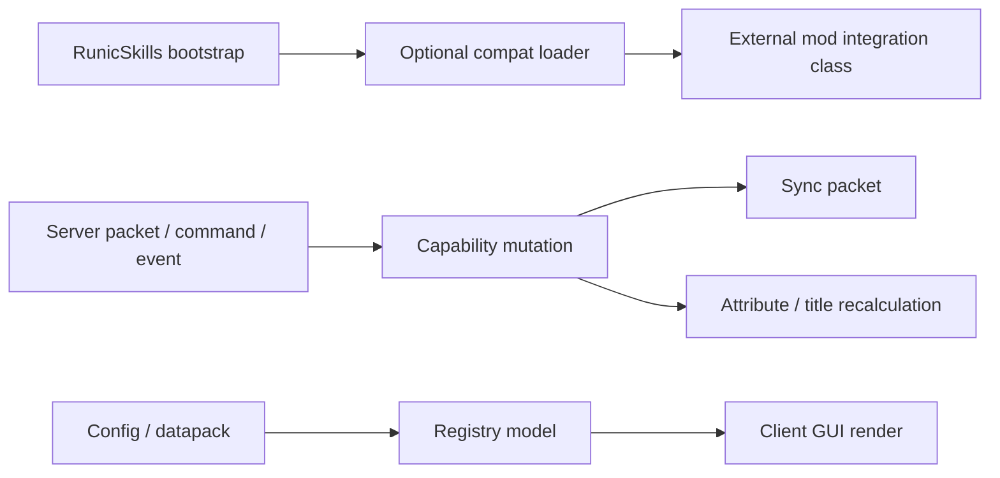
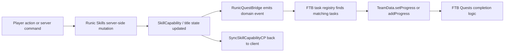
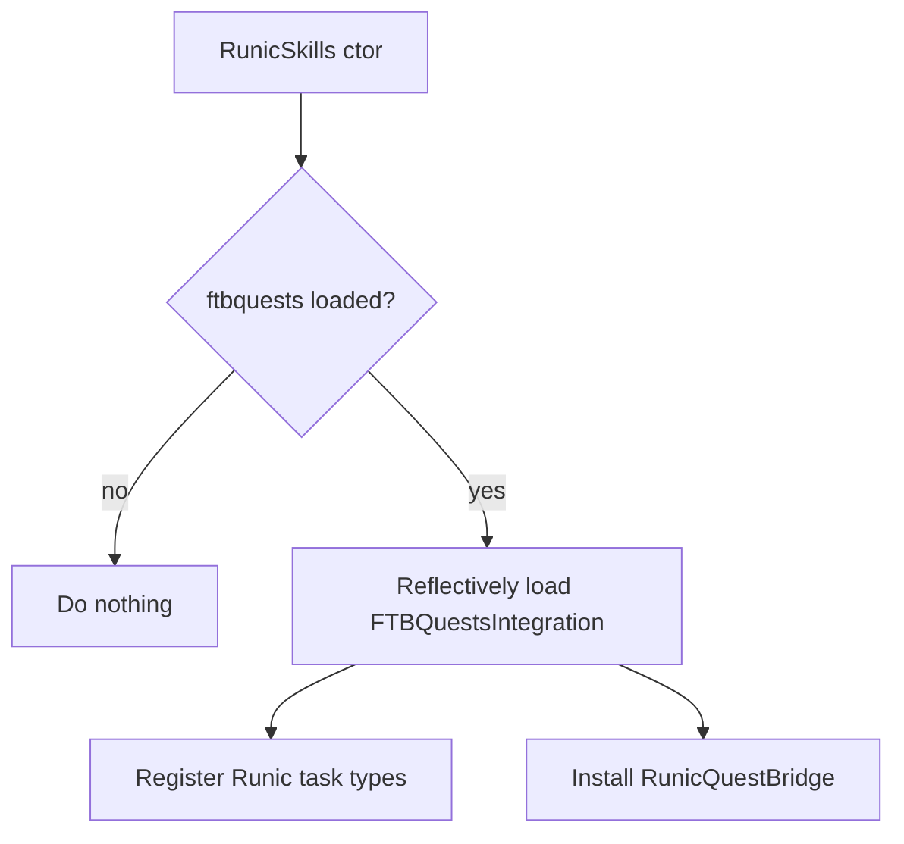

# Runic Skills implementation review and Claude Code plan

## Executive summary

`otectus/runic-skills` is a Forge 1.20.1 mod with a fairly clean separation between bootstrap, registries, player capability state, network packets, event handlers, and client UI. The mod initializes config, registries, networking, and optional integrations from `RunicSkills`, while `RunicSkillsClient` owns keybinds, overlays, and tab integrations; player state is attached as a capability and synchronized on login/join via packet handlers and lifecycle events. That architecture is good news: both requested features can be added without invasive rewrites if they are implemented as isolated compat/data layers rather than more hardcoded branches. fileciteturn58file0 fileciteturn48file0 fileciteturn24file0 fileciteturn30file0

The biggest high-confidence finding is that **custom icons are only partially supported today**. Perks and passives already have code-level constructors that accept a texture path string, but those paths are forced through `HandlerResources.create(...)`, which hardcodes the `runicskills` namespace. By contrast, the **skill menu’s core skill icons and backgrounds are still hardcoded** in `RegistrySkills` and `HandlerResources`, and the screen renders them directly from `Skill.getLockedTexture()` and `skill.background`; I did not find an equivalent data-driven or script-facing `Skill.add(...)` path in the audited code. In plain English: pack authors can effectively replace existing assets, and code can define perk/passive textures, but the actual skill-menu card icons/backgrounds are not currently author-configurable in a first-class way. fileciteturn21file0 fileciteturn22file0 fileciteturn77file0 fileciteturn19file0 fileciteturn20file0 fileciteturn72file0 fileciteturn73file0

For **FTB Quests integration**, the safest and most maintainable implementation is an **optional compat module** that registers dedicated Runic Skills quest task types with FTB Quests and updates task progress on the **server thread** when Runic Skills state changes. FTB Quests’ own extension points are built around `TaskType` registration, `Task` subclasses, and `TeamData` progress updates, with progress/completion events flowing through `QuestProgressEventData`. That maps very naturally onto Runic Skills state mutations such as “skill level changed,” “passive rank changed,” “perk rank changed,” and “title unlocked/selected.” citeturn13view0turn14view0turn15view0turn15view1turn16view1turn17view0

I could **not verify the exact public JustLevelingFork implementation from “last week.”** What I *could* verify is that Runic Skills was originally forked from JustLevelingFork, and that FTB Quests’ official API strongly supports the integration style proposed below. So the plan here is rigorous and idiomatic, but it is not a line-by-line reproduction of a fork diff I could confirm. fileciteturn62file0

## Codebase audit

Runic Skills currently targets **Minecraft 1.20.1 Forge 47.3.0+** and organizes most runtime behavior around a central player capability, registry-backed skill/perk/passive/title models, packet-driven state changes, and domain-specific Forge event handlers. Optional integrations are already treated carefully: external-mod APIs are either isolated behind reflection or split into separate compat classes to avoid `NoClassDefFoundError`, which is exactly the pattern the FTB Quests feature should follow. fileciteturn62file0 fileciteturn58file0 fileciteturn47file0 fileciteturn48file0

### File and class responsibility map

| File / class | Responsibility | Why it matters for A and B | Evidence |
|---|---|---|---|
| `RunicSkills.java` | Main bootstrap: config init, registry load, event bus registration, optional integration loading, networking init | Add optional `ftbquests` compat here using the same guarded-loading pattern already used for other mods | fileciteturn58file0 |
| `RunicSkillsClient.java` | Client setup, keybind, overlays, YACL screen orchestration, optional tab registration | If icon customization adds client-only validation or caching, this is the right entry point | fileciteturn48file0 |
| `RegistrySkills.java` | Registers the ten core skills and binds each one to locked/unlocked icon arrays and background texture | This is the primary hardcoded choke point for skill-menu icon customization | fileciteturn19file0 |
| `registry/skill/Skill.java` | Skill data model with icon/background arrays and level/rank helpers | Extend this model for configurable skill visuals and, optionally, quest-facing identifiers/helpers | fileciteturn20file0 |
| `RegistryPassives.java` | Registers passives, associates them with skills, textures, attributes, disable checks | Useful for FTB task types like `passive_level`, and already shows texture-based passive visuals | fileciteturn71file0 |
| `registry/passive/Passive.java` | Passive data model; includes `add(...)` helper taking a texture path | Confirms partial custom-icon support already exists for passives, albeit namespace-limited | fileciteturn22file0 |
| `RegistryPerks.java` | Massive perk registry, gating, integration-aware perk inclusion, caps/group logic | Useful for FTB task types like `perk_rank` / `perk_enabled`; also demonstrates current visual hardcoding style | fileciteturn37file0 fileciteturn38file0 fileciteturn42file0 |
| `registry/perks/Perk.java` | Perk data model; includes `add(...)` helper taking a texture path | Confirms partial custom-icon support already exists for perks, again namespace-limited | fileciteturn21file0 |
| `HandlerResources.java` | Central texture path registry and resource helper methods | Current `create(...)` forces the `runicskills` namespace; this should be changed for true custom icon support | fileciteturn74file0 fileciteturn77file0 |
| `RunicSkillsScreen.java` | Skill overview/detail/title GUI rendering, tooltip behavior, page layout, icon blits | The actual render points for skill/perk/passive icons and detail backgrounds live here | fileciteturn72file0 fileciteturn73file0 |
| `SkillCapability.java` plus lifecycle sync | Stores per-player state; attached on players, copied on clone, synchronized on join/login | Best long-term place to centralize quest-bridge notifications or at least to anchor them conceptually | fileciteturn24file0 fileciteturn36file7 |
| `ServerNetworking.java` | Registers client↔server packets for skill, passive, perk, title mutations and sync | FTB progress updates should be triggered after successful authoritative mutations here or in the mutation service behind them | fileciteturn30file0 |
| `SkillLevelUpSP`, `PassiveLevelUpSP`, `PassiveLevelDownSP`, `TogglePerkSP`, `SetPlayerTitleSP` | Server-authoritative mutation entry points | These are the clearest existing hook points for quest progress updates if you do not refactor capability mutation into a single service first | fileciteturn64file0 fileciteturn65file0 fileciteturn66file0 fileciteturn67file0 fileciteturn68file0 |
| `RegistryCommonEvents` and event handlers | Domain-specific hooks for interaction, combat, crafting, tick, lifecycle | Important for compatibility review and for any future quest task types based on gameplay-side triggers | fileciteturn59file0 fileciteturn54file0 fileciteturn55file0 fileciteturn56file0 fileciteturn57file0 |
| `HandlerConditions.java` | External condition registration for title requirements | Confirms the mod already has a “register-by-extension-point” mindset; good precedent for quest bridge abstractions | fileciteturn33file0 |
| `KubeJSIntegration.java` and `kubejs/Plugin.java` | Script integration and level-up event bridge | Shows existing optional integration design and lazy reflection caching approach | fileciteturn29file0 fileciteturn27file0 |

### Architectural extension points

The repo already has three extension patterns worth reusing instead of inventing new chaos:



The first is **optional compat isolation**. `RunicSkills` reflectively loads integrations for mods whose APIs would otherwise leak into the constant pool, and the client side uses companion integration classes for L2Tabs/Legendary Tabs for the same reason. FTB Quests should be added in that same style, not wired directly into always-loaded classes. fileciteturn58file0 fileciteturn47file0 fileciteturn48file0

The second is **authoritative server-side mutation via packets**. Skills, passives, perks, and titles are changed in explicit server packet handlers, then synchronized back to clients. That is exactly where quest completion logic naturally belongs. fileciteturn64file0 fileciteturn65file0 fileciteturn67file0 fileciteturn68file0

The third is **registry-backed content plus client rendering**. Skills, passives, perks, and titles are all model objects; the missing piece for icons is not “how do we render textures?” but “how do we stop hardcoding all skill visuals at registration time?” fileciteturn19file0 fileciteturn20file0 fileciteturn71file0 fileciteturn72file0 fileciteturn73file0

## Current icon handling

### What exists today

The GUI’s **overview page** and **detail page** render skill icons by calling `skill.getLockedTexture()` and the detail page background by reading `skill.background`. Those values come from the `Skill` model, which stores `lockedTexture`, `unlockedTexture`, and `background` as `ResourceLocation` fields/arrays. fileciteturn20file0 fileciteturn72file0 fileciteturn73file0

`RegistrySkills` constructs each core skill with hardcoded icon arrays and background textures sourced from `HandlerResources`, where each skill has its own `*_LOCKED_ICON` array and related resources under paths like `textures/skill/<skill>/locked_0.png`. `HandlerResources.create(...)` always wraps paths in the `runicskills` namespace. So the **core skill menu visuals are code-defined, not pack-author-defined** in any first-class way. fileciteturn19file0 fileciteturn74file0 fileciteturn77file0

Perks and passives are better, but still not fully there. `Perk.add(...)` and `Passive.add(...)` both accept a `String texture` argument and convert it via `HandlerResources.create(texture)`. That means there is *some* custom-texture support already in the data model layer, but it is **namespace-locked** to `runicskills`. A pack author cannot cleanly specify something like `my_pack:textures/gui/skills/magic.png` or `botania:textures/item/lexicon.png` through those helpers today, because `create(...)` always prepends `runicskills`. fileciteturn21file0 fileciteturn22file0 fileciteturn77file0

### Bottom-line answer on custom icons

**Current state:**
- **Core skill menu icons/backgrounds:** **not supported as a first-class configurable feature**. They are hardcoded in `RegistrySkills` and `HandlerResources`, then rendered directly in `RunicSkillsScreen`. fileciteturn19file0 fileciteturn72file0 fileciteturn73file0
- **Perk/passive icons:** **partially supported in code**, but only through path strings that still resolve into the `runicskills` namespace because of `HandlerResources.create(...)`. fileciteturn21file0 fileciteturn22file0 fileciteturn77file0

So the feature request is not imaginary. The repo already has the *shape* of customizable textures, but the skill menu itself is still painfully hardcoded.

### Exact code locations to change

| Change target | Why change it | Evidence |
|---|---|---|
| `handler/HandlerResources.java` | Replace `create(String path)` with a namespace-aware parser/helper so texture strings can be `namespace:path` or plain paths | fileciteturn77file0 |
| `registry/skill/Skill.java` | Add first-class configurable visual fields and accessors for overview/detail/background rendering | fileciteturn20file0 |
| `registry/RegistrySkills.java` | Stop baking every skill’s visual state directly into code; apply defaults plus override data | fileciteturn19file0 |
| `client/screen/RunicSkillsScreen.java` | Render through new accessors and optionally support item-icon mode or alternate texture sizes | fileciteturn72file0 fileciteturn73file0 |
| `registry/perks/Perk.java` and `registry/passive/Passive.java` | Switch from namespace-forced `create(...)` to flexible parsing so existing partial support becomes real support | fileciteturn21file0 fileciteturn22file0 fileciteturn77file0 |

### Recommended implementation for custom skill-menu icons

The cleanest solution is a **data-driven visual override layer** with stable defaults.

```java
// new helper in HandlerResources
public static ResourceLocation parseTexture(String value) {
    if (value == null || value.isBlank()) {
        return NULL_PERK; // or throw / fallback
    }

    // Accept namespaced ids directly
    if (value.contains(":")) {
        return new ResourceLocation(value);
    }

    // Back-compat: old path-only values remain in runicskills namespace
    return new ResourceLocation(RunicSkills.MOD_ID, value);
}
```

```java
// suggested new model
public record SkillVisuals(
    ResourceLocation overviewIcon,
    ResourceLocation detailIcon,
    ResourceLocation background
) {}
```

```java
// suggested extension to Skill
public class Skill {
    private SkillVisuals visuals;

    public ResourceLocation getOverviewIcon() {
        return visuals != null ? visuals.overviewIcon() : getLockedTexture();
    }

    public ResourceLocation getDetailIcon() {
        return visuals != null ? visuals.detailIcon() : getLockedTexture();
    }

    public ResourceLocation getBackgroundTexture() {
        return visuals != null ? visuals.background() : background;
    }

    public void setVisuals(SkillVisuals visuals) {
        this.visuals = visuals;
    }
}
```

```java
// suggested JSON5 / datapack-like override
{
  "skill": "magic",
  "overview_icon": "my_pack:textures/gui/runicskills/magic_overview.png",
  "detail_icon": "my_pack:textures/gui/runicskills/magic_detail.png",
  "background": "my_pack:textures/gui/runicskills/magic_background.png"
}
```

Then change `RunicSkillsScreen` to render `skill.getOverviewIcon()` on overview, `skill.getDetailIcon()` on detail, and `skill.getBackgroundTexture()` in the detail background path rather than using the old hardwired fields directly. That preserves all legacy defaults while giving pack authors an actual hook. The current render calls make those swap points very obvious. fileciteturn72file0 fileciteturn73file0

### Important implementation caveat

Because the current rendering path is purely **client-side `ResourceLocation` rendering**, any new icon path must point to assets that the **client actually has**. In practice, that means the feature is perfect for **modpacks** or bundled resource packs, but it will not magically allow a dedicated server to invent client textures out of thin air. That is an implementation inference from the existing client-only GUI/resource path design. fileciteturn72file0 fileciteturn73file0 fileciteturn77file0

## FTB Quests integration plan

### What the official FTB Quests API supports

FTB Quests’ current public codebase is split into `common`, `fabric`, and `neoforge` modules, and its latest visible release on the repo page for the 1.20.1 line is `2001.4.9` from October 16, 2024. The mod exposes quest tasks through `TaskType` registration and concrete `Task` subclasses, while progress is stored on `TeamData` and flows through `QuestProgressEventData`; `CustomTask` exists too, but dedicated task subclasses are the cleaner fit for Runic Skills’ threshold-style objectives. citeturn11view0turn13view0turn14view0turn14view1turn15view0turn15view1turn16view1turn17view0

That matters because the integration should not be a hacky “fire a command” bridge. FTB Quests already gives you the real extension points:
- `TaskTypes.register(...)` to create a namespaced task type. citeturn16view1turn14view0
- `Task` subclasses with serialized fields, icons, config UI hooks, and progress semantics. citeturn13view0turn14view0turn17view0
- `TeamData.setProgress(...)` / `addProgress(...)` to mark progress against a task. That capability is visible in `CustomTask.Data`. citeturn14view1turn15view1

### Recommended objective types

Runic Skills should ship these FTB task types first:

| Task type | Semantics | Best Runic hook |
|---|---|---|
| `runicskills:skill_level` | Complete when a named skill reaches or exceeds a target level | Skill level-up path |
| `runicskills:global_level` | Complete when total/global level reaches threshold | Skill level-up path |
| `runicskills:perk_rank` | Complete when a named perk reaches a target rank, or rank ≥ 1 for enabled-state semantics | Perk toggle/rank packet |
| `runicskills:passive_level` | Complete when a named passive reaches a target level | Passive up/down packets |
| `runicskills:title_unlocked` | Complete when a specific title becomes unlocked | Title requirement recalculation |
| `runicskills:title_selected` | Optional bonus task: complete when player actively selects a title | `SetPlayerTitleSP` |

That set covers the obvious pack-author use cases without bloating the API surface. It also maps tightly to state transitions the mod already handles authoritatively. fileciteturn64file0 fileciteturn65file0 fileciteturn66file0 fileciteturn67file0 fileciteturn68file0 fileciteturn32file0

### Recommended data flow



This should be implemented as a **bridge service**, not as duplicated inline logic everywhere. The minimum viable version can call the bridge directly from the packet handlers after successful mutation. The better version centralizes player progression mutation behind one service or capability-aware helper and fires the bridge from there, so commands and future content do not bypass quests. The repo already has enough mutation touchpoints that this centralization will pay for itself. fileciteturn64file0 fileciteturn65file0 fileciteturn67file0 fileciteturn68file0

### Registration approach

Because Runic Skills already isolates optional integrations carefully, FTB Quests should follow the same pattern:



This avoids another optional-mod classloading faceplant. The repo has already been burned by optional-dependency verifier issues with YACL, L2Tabs, and Legendary Tabs, and the current code explicitly isolates those cases. Do not undo that lesson. fileciteturn58file0 fileciteturn47file0 fileciteturn48file0 fileciteturn63file0

### Example registration code

Below is the **right shape**, with the deliberate caveat that exact type names can differ slightly by mapping/version branch. FTB Quests’ common code today uses `Identifier`/Architectury-era naming in places, while Runic Skills is on Forge 1.20.1. So treat this as **pseudocode aligned to the official API model**, not copy-paste final source. citeturn11view0turn14view0turn16view1

```java
public final class RunicQuestTasks {
    public static TaskType SKILL_LEVEL;
    public static TaskType GLOBAL_LEVEL;
    public static TaskType PASSIVE_LEVEL;
    public static TaskType PERK_RANK;
    public static TaskType TITLE_UNLOCKED;
    public static TaskType TITLE_SELECTED;

    public static void register() {
        SKILL_LEVEL = TaskTypes.register(
            new Identifier("runicskills", "skill_level"),
            RunicSkillLevelTask::new,
            () -> Icon.getIcon("runicskills:textures/skill/magic/locked_0.png")
        );

        GLOBAL_LEVEL = TaskTypes.register(
            new Identifier("runicskills", "global_level"),
            RunicGlobalLevelTask::new,
            () -> Icon.getIcon("runicskills:textures/gui/container/skill_panel_1.png")
        );

        PASSIVE_LEVEL = TaskTypes.register(
            new Identifier("runicskills", "passive_level"),
            RunicPassiveLevelTask::new,
            () -> Icon.getIcon("runicskills:textures/skill/magic/passive_magic_resist.png")
        );

        PERK_RANK = TaskTypes.register(
            new Identifier("runicskills", "perk_rank"),
            RunicPerkRankTask::new,
            () -> Icon.getIcon("runicskills:textures/skill/strength/berserker.png")
        );

        TITLE_UNLOCKED = TaskTypes.register(
            new Identifier("runicskills", "title_unlocked"),
            RunicTitleUnlockedTask::new,
            () -> Icons.STAR
        );
    }
}
```

### Example task class

```java
public final class RunicSkillLevelTask extends Task {
    private String skill = "magic";
    private int requiredLevel = 10;

    public RunicSkillLevelTask(long id, Quest quest) {
        super(id, quest);
    }

    @Override
    public TaskType getType() {
        return RunicQuestTasks.SKILL_LEVEL;
    }

    @Override
    public long getMaxProgress() {
        return 1L;
    }

    public void evaluate(ServerPlayer player) {
        SkillCapability cap = SkillCapability.get(player);
        Skill model = RegistrySkills.getSkill(skill);
        if (cap == null || model == null) return;

        TeamData teamData = TeamData.get(player);
        long progress = cap.getSkillLevel(model) >= requiredLevel ? 1L : 0L;
        teamData.setProgress(this, progress);
    }

    @Override
    public void writeData(CompoundTag nbt, HolderLookup.Provider provider) {
        super.writeData(nbt, provider);
        nbt.putString("skill", skill);
        nbt.putInt("required_level", requiredLevel);
    }

    @Override
    public void readData(CompoundTag nbt, HolderLookup.Provider provider) {
        super.readData(nbt, provider);
        skill = nbt.getString("skill");
        requiredLevel = nbt.getInt("required_level");
    }
}
```

The important bit is not the boilerplate. The important bit is that this follows FTB Quests’ actual task model instead of trying to fake quest completion externally. citeturn13view0turn14view0turn14view1turn17view0

### Example quest object format

FTB Quests stores/passes type identifiers through task NBT/SNBT, and `TaskType.makeExtraNBT()` writes a `type` field. So the practical authored object will look like an SNBT/JSON-ish task block like this: citeturn14view0

```json
{
  "type": "runicskills:skill_level",
  "skill": "magic",
  "required_level": 20
}
```

Equivalent examples for other tasks:

```json
{
  "type": "runicskills:perk_rank",
  "perk": "berserker",
  "required_rank": 1
}
```

```json
{
  "type": "runicskills:passive_level",
  "passive": "spell_power",
  "required_level": 5
}
```

```json
{
  "type": "runicskills:title_unlocked",
  "title": "administrator"
}
```

### Event mapping

| Runic event | Current source | Bridge action |
|---|---|---|
| Skill level increased | `SkillLevelUpSP.handle(...)` after `capability.addSkillLevel(...)` | Re-evaluate `skill_level` and `global_level` tasks for that player/team |
| Passive increased | `PassiveLevelUpSP.handle(...)` after `addPassiveLevel(...)` | Re-evaluate `passive_level` tasks |
| Passive decreased | `PassiveLevelDownSP.handle(...)` after `subPassiveLevel(...)` | Re-evaluate `passive_level` tasks so progress can be reset if task is non-sticky |
| Perk rank changed | `TogglePerkSP.handle(...)` after `setPerkRank(...)` | Re-evaluate `perk_rank` tasks |
| Title selected | `SetPlayerTitleSP.handle(...)` after `setPlayerTitle(...)` | Re-evaluate `title_selected` tasks |
| Title unlock state changed | `RegistryTitles.serverPlayerTitles(...)` / `syncTitles(...)` | Re-evaluate `title_unlocked` tasks |
| Login / clone / command backfill | `PlayerLifecycleHandler` and command handlers | Call `refreshAll(player)` to catch stale or pre-existing progress |

This is the step where many mod integrations become spaghetti. Don’t let that happen. Build **one bridge** with **one `refreshAll(ServerPlayer)` path** and small domain-specific helper methods. fileciteturn24file0 fileciteturn32file0 fileciteturn64file0 fileciteturn65file0 fileciteturn66file0 fileciteturn67file0 fileciteturn68file0

### Step-by-step implementation checklist

1. Add an **optional compile-time dependency** on the matching 1.20.1 FTB Quests artifact and mark `ftbquests` as an optional dependency in `mods.toml`.
2. Add `tryLoadIntegration("ftbquests", "com.otectus.runicskills.integration.ftbquests.FTBQuestsIntegration")` in `RunicSkills`.
3. Create a dedicated `integration/ftbquests/` package so no FTB classes leak into always-loaded code.
4. Register task types for `skill_level`, `global_level`, `perk_rank`, `passive_level`, `title_unlocked`, and optionally `title_selected`.
5. Add `RunicQuestBridge` with:
   - `onSkillLevelChanged(...)`
   - `onPassiveLevelChanged(...)`
   - `onPerkRankChanged(...)`
   - `onTitleUnlockedChanged(...)`
   - `onTitleSelected(...)`
   - `refreshAll(ServerPlayer)`
6. Wire those bridge calls into existing packet handlers first.
7. Add backfill hooks on login/join/clone and all commands that mutate progression state.
8. Decide task semantics:
   - **sticky completion** only, or
   - **live threshold** completion that can reset when values go down.
9. Add task docs/examples to README and ship at least one sample quest definition.
10. Add absence-of-FTBQ smoke tests so the mod still boots cleanly without the dependency.

### Testing plan

| Test | Goal |
|---|---|
| Boot without `ftbquests` installed | Verify no classloading crash; this is non-negotiable |
| Boot with matching `ftbquests` version | Verify task registration succeeds |
| Skill level-up completes quest | Validate `skill_level` task path |
| Passive add/remove updates quest consistently | Validate live-threshold semantics or sticky semantics exactly as documented |
| Perk enable/rank-up completes quest | Validate `perk_rank` path |
| `/skills`, `/skills reload`, respec, title commands | Verify command-driven mutations also update tasks |
| Login with already-qualified player | Validate `refreshAll(player)` catches existing progress |
| Multiplayer team progression | Validate `TeamData` behavior matches intended team quest semantics |
| Mixed optional-mod environment | Validate no conflict with KubeJS, L2Tabs, Legendary Tabs, YACL optionality patterns |

### Migration and backward compatibility

For worlds that do **not** use FTB Quests, this feature can be entirely no-op if the dependency is absent. For worlds that **do** use FTB Quests, the safest migration is additive: new task types, no change to existing Runic Skills NBT, and a login-time `refreshAll(player)` pass to reconcile old player saves with new quest definitions. That preserves existing saves and avoids brittle one-time migration logic. The mod’s changelog already shows a strong emphasis on save compatibility and protocol/version explicitness, so this direction matches the repo’s existing philosophy. fileciteturn63file0

### Compatibility with the Just Leveling fork approach

I could not verify the exact fork implementation you referenced, so I won’t pretend otherwise. The best high-confidence compatibility claim I can make is this: **if** that fork implemented FTB Quests by registering namespaced custom task types and updating official `TeamData` task progress on authoritative skill changes, the plan above is aligned with the official FTB Quests extension model and should be compatible in spirit and structure. citeturn13view0turn14view0turn14view1turn15view1turn16view1

## Additional corrections and compatibility considerations

### Performance and threading

The mod is already careful about some networking concerns, like packet rate limiting and server-thread packet work enqueuing. Keep that discipline for FTB Quests. Do **not** complete quest progress from async tasks or client callbacks. Runic Skills’ mutation packets already enqueue work on the authoritative server side; the quest bridge should run there too. fileciteturn31file0 fileciteturn64file0 fileciteturn65file0 fileciteturn67file0

There is also some low-hanging UI/render optimization. `RunicSkillsScreen` builds detail page state in both `drawDetailBackground(...)` and `drawDetail(...)` during the same render cycle, and the screen repeatedly sorts/builds collections during render paths. That is not catastrophic, but it is the kind of death-by-a-thousand-cuts code that becomes annoying once more dynamic icon/config layers are added. Cache per-frame `DetailPageState` and precompute sorted lists when page state changes instead of every render call. fileciteturn72file0 fileciteturn73file0

On the server tick side, `TickEventHandler` continuously re-applies some attribute/effect state every tick. That may be fine for the current scope, but once more compat logic is added, it is worth moving more cases to **state-change-driven reconciliation** or coarse throttles instead of per-tick recreation. The mod already uses throttling/conditional patterns in other places; apply that same restraint here. fileciteturn57file0 fileciteturn63file0

### Resource loading and asset validation

Right now, missing or bad icon paths are mostly going to surface at render time. That is survivable, but ugly. Once icon overrides exist, add a startup/reload validator that logs clear warnings for invalid/missing texture identifiers rather than letting users discover pink-black boxes in the menu. The changelog already documents how bad texture paths caused visible missing-texture failures in prior integration work; codifying validation would stop that class of bug from recurring. fileciteturn63file0 fileciteturn77file0

I also strongly recommend one subtle backwards-compatibility rule: **path-only strings remain interpreted as `runicskills:<path>`**, while namespaced values are parsed verbatim. That way existing partial support in `Perk.add(...)` and `Passive.add(...)` keeps working while new flexibility is unlocked. fileciteturn21file0 fileciteturn22file0 fileciteturn77file0

### Localization and config UX

If you add new FTB tasks, document both the **task IDs** and the **field names**. If you add icon overrides, ship at least one worked example and explicitly explain that the assets must exist client-side. The current README is already thorough about controls, integrations, commands, and configuration, so the bar is set. Match that standard; do not dump a silent power-user feature into the code and call it a day. fileciteturn62file0

For the icon feature specifically, prefer a **small dedicated visual override file** over cramming more texture strings into the giant common config. The repo already has separate config surfaces and some datapack-oriented content patterns; that separation is cleaner for pack authors and less likely to rot. fileciteturn60file0 fileciteturn61file0 fileciteturn34file0

### Mod compatibility best practices

The codebase has already accumulated battle scars from optional dependencies, and the changelog reads like a museum of “the JVM verifier will absolutely ruin your day if you are careless.” So the compatibility rule for FTB Quests is simple: **keep all direct FTB references in a compat island**, and call into that island only when the mod is present. Do not let FTB types appear in `RunicSkills`, `RunicSkillsClient`, or the always-loaded packet/event classes. fileciteturn58file0 fileciteturn47file0 fileciteturn48file0 fileciteturn63file0

Also, because the user explicitly asked not to assume a specific loader/version, the implementation should be described and structured as **version-gated**:
- Current audited Runic Skills repo: Forge 1.20.1. fileciteturn62file0
- Current FTB Quests repo architecture: common/fabric/neoforge cross-loader. citeturn11view0

That means Claude Code should add a short **version matrix** in the docs and keep the FTB compat layer compact enough that future porting to newer branches is not a blood ritual.

## Deliverables for Claude Code

### Prioritized task list

| Priority | Task | Effort | Concrete TODOs |
|---|---|---:|---|
| High | Add namespace-aware texture parsing | Low | Change `HandlerResources.create(...)` or add `parseTexture(...)`; update `Perk.add(...)` and `Passive.add(...)` to use it |
| High | Add first-class skill visual overrides | Medium | Extend `Skill`, add override model/loader, update `RegistrySkills`, update `RunicSkillsScreen` render paths |
| High | Add optional FTB Quests compat bootstrap | Medium | Update `RunicSkills`, `mods.toml`, Gradle dependency, isolated compat package |
| High | Register Runic FTB task types | Medium | Add `RunicQuestTasks` plus task subclasses for skill/global/perk/passive/title |
| High | Add authoritative quest bridge | Medium | Add `RunicQuestBridge`, call it from packet handlers and command paths |
| Medium | Add login/backfill refresh | Low | Hook `PlayerLifecycleHandler` join/login/clone and relevant commands |
| Medium | Add icon path validation/logging | Low | Validate override IDs during load and warn cleanly |
| Medium | Cache screen detail state per frame/page | Low | Refactor `RunicSkillsScreen` to avoid duplicate state builds in render |
| Medium | Add docs and sample configs | Low | README section for FTB tasks, icon overrides, assets caveat, version matrix |
| Medium | Add tests | Medium | See test matrix below |
| Low | Refactor mutation routing into one service | High | Centralize state changes behind a `SkillProgressService` or capability wrapper so future integrations do not duplicate logic |

### Function and class-level TODOs

| File | TODO |
|---|---|
| `RunicSkills.java` | Add `tryLoadIntegration("ftbquests", "...FTBQuestsIntegration")` |
| `HandlerResources.java` | Add `parseTexture(String)`; keep backwards-compatible path-only behavior |
| `Perk.java` | Replace `HandlerResources.create(texture)` with `parseTexture(texture)` |
| `Passive.java` | Replace `HandlerResources.create(texture)` with `parseTexture(texture)` |
| `Skill.java` | Add `SkillVisuals` support plus getters for overview/detail/background |
| `RegistrySkills.java` | Apply visual overrides after default registration |
| `RunicSkillsScreen.java` | Replace direct `getLockedTexture()` / `background` usage with new visual accessors |
| `PlayerLifecycleHandler.java` | Call `RunicQuestBridge.refreshAll(serverPlayer)` on login/join/clone if FTBQ compat active |
| `SkillLevelUpSP.java` | Emit `onSkillLevelChanged(...)` after successful mutation |
| `PassiveLevelUpSP.java` | Emit `onPassiveLevelChanged(...)` |
| `PassiveLevelDownSP.java` | Emit `onPassiveLevelChanged(...)` or explicit reset-aware variant |
| `TogglePerkSP.java` | Emit `onPerkRankChanged(...)` |
| `SetPlayerTitleSP.java` | Emit `onTitleSelected(...)` |
| Command classes | Ensure `/skills`, title, respec, and any direct mutation commands also refresh bridge state |

### Unit and integration test cases

| Test case | Type | Expected result |
|---|---|---|
| `parseTexture("textures/skill/magic/x.png")` | Unit | Resolves to `runicskills:textures/skill/magic/x.png` |
| `parseTexture("my_pack:textures/gui/foo.png")` | Unit | Resolves to the namespaced resource unchanged |
| Missing icon override | Unit/integration | Warns and falls back to default icon |
| Boot without FTB Quests | Integration | No `NoClassDefFoundError`, mod loads normally |
| Boot with FTB Quests | Integration | Task types register successfully |
| Skill hits threshold | Game/integration | `skill_level` task completes |
| Global level threshold | Game/integration | `global_level` task completes |
| Passive rank increases and decreases | Game/integration | Task progress matches documented semantics |
| Perk toggled on | Game/integration | `perk_rank` completes |
| Title unlocked via condition reevaluation | Game/integration | `title_unlocked` completes |
| Existing qualified player logs in | Game/integration | `refreshAll` backfills quest progress |
| Resource-pack override of default skill icon path | Manual regression | Legacy asset replacement still works |

### Documentation and README updates

Add three concrete sections:
- **FTB Quests integration**: dependency/version notes, task IDs, task field reference, sample quest snippets.
- **Custom skill visuals**: override file format, namespaced texture syntax, client-asset caveat, fallback behavior.
- **Compatibility notes**: optional-dependency loading policy, tested version pairs, and migration/backfill behavior.

The existing README already documents integrations, commands, and config thoroughly, so extending it is the right move rather than stuffing this knowledge into commit messages nobody will read. fileciteturn62file0

## Open questions and limitations

I could confirm from the Runic Skills README that the project was forked from JustLevelingFork, but I could **not** verify the exact “Just Leveling fork implemented it last week” public code reference or PR during this research pass. So I have not cited a fork diff, only the official FTB Quests extension model and the audited Runic Skills codebase. fileciteturn62file0

The version story is also slightly awkward in the abstract request. The audited Runic Skills repo is clearly Forge 1.20.1, while the current FTB Quests repo is cross-loader and uses a modern shared/common architecture. The implementation plan above is therefore intentionally **version-aware and mapping-tolerant**: the design is solid, but exact imported type names may need adjustment depending on the final chosen FTB Quests artifact for the 1.20.1 pack line. fileciteturn62file0 citeturn11view0turn14view0turn16view1

The blunt verdict: **feature A is very feasible and should be implemented as an isolated, official FTB Quests task bridge; feature B needs real work because the current skill menu visuals are still hardcoded.** If Claude Code sticks to that framing instead of duct-taping more special cases into the screen class, the result should be clean, maintainable, and genuinely useful for modpack authors.